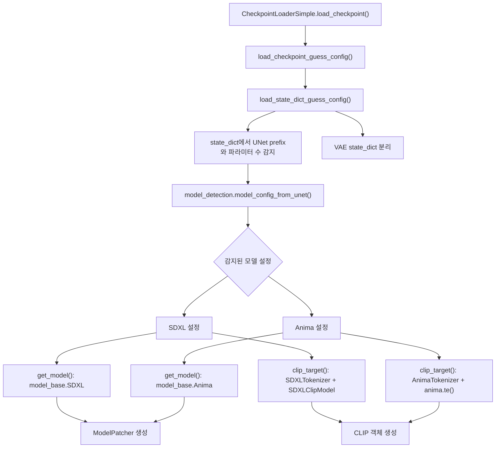
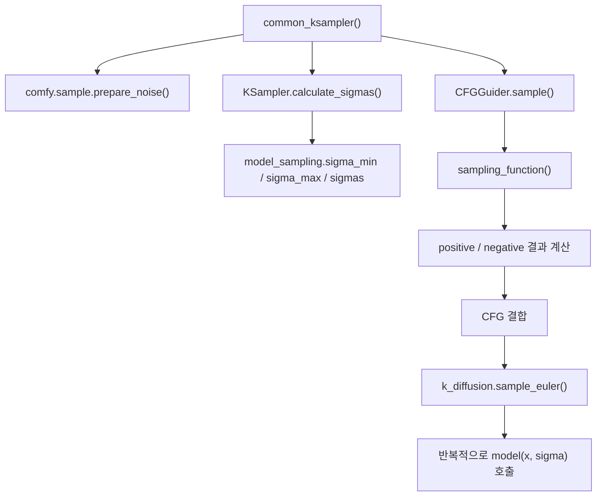

# ComfyUI 로딩과 샘플링 함수의 동작: SDXL와 Anima

## 범위

이 문서는 `test/ComfyUI-0.18.2/ComfyUI-0.18.2` 기준으로, ComfyUI가 모델을 읽고 샘플링을 수행할 때 내부 함수가 어떻게 움직이는지 정리한다.

- 대상 모델: SDXL, Anima
- 대상 주제: 체크포인트 로딩, 텍스트 조건 준비, 샘플링 함수 내부 동작
- 기준 샘플러: `Euler`

## 한눈에 보기

쉽게 말하면 둘 다 겉으로는 비슷하다.

1. 체크포인트를 읽는다.
2. 모델 종류를 감지한다.
3. 텍스트를 조건 정보로 바꾼다.
4. latent에서 시작해 여러 번 모델을 호출한다.
5. 마지막 latent를 VAE로 이미지로 바꾼다.

하지만 안쪽 수학은 다르다.

- SDXL은 전형적인 latent diffusion 계열이라서, "노이즈를 얼마나 빼야 하는가" 쪽에 가깝다.
- Anima는 flow 계열이라서, "현재 상태를 다음 상태로 어떻게 이동시킬 것인가" 쪽에 가깝다.

그래서 ComfyUI는 같은 `KSampler`와 같은 `Euler` 루프를 써도, 모델별로 다른 `model_sampling` 클래스를 끼워 넣어 전혀 다른 방식으로 움직이게 만든다.

## 공통 로딩 구조

체크포인트 로딩의 핵심은 `comfy/sd.py`의 `load_checkpoint_guess_config()`와 `load_state_dict_guess_config()`이다.



이 함수들이 하는 일은 크게 세 가지다.

- 체크포인트에서 어떤 모델 계열인지 감지한다.
- 그 계열에 맞는 본체 모델 클래스와 텍스트 인코더 클래스를 고른다.
- 나중에 샘플링할 때 쓸 `model_sampling` 규칙까지 함께 정한다.

핵심은 "모델 로딩"이 단순히 가중치를 메모리에 올리는 작업이 아니라는 점이다.  
ComfyUI는 로딩 단계에서 이미 "이 모델은 diffusion으로 다뤄야 하는가, flow로 다뤄야 하는가"를 결정한다.

## SDXL 로딩: U-Net 기반 diffusion 경로

SDXL 설정은 `comfy/supported_models.py`의 `SDXL` 클래스에 들어 있다.

- `model_channels = 320`
- `transformer_depth = [0, 0, 2, 2, 10, 10]`
- `context_dim = 2048`
- `adm_in_channels = 2816`
- `latent_format = SDXL`

쉽게 말하면 SDXL은 "U-Net 뼈대 + 중간중간 Transformer attention + 텍스트 조건 + 이미지 크기 조건" 구조다.

ComfyUI는 SDXL 체크포인트를 읽을 때 `model_type()`로 샘플링 의미를 먼저 판별한다.

- `edm_mean`, `edm_std`가 있으면 `EDM`
- `edm_vpred.sigma_max`가 있으면 `V_PREDICTION_EDM`
- `v_pred`가 있으면 `V_PREDICTION`
- 아니면 `EPS`

즉 SDXL이라고 해서 항상 같은 출력 의미를 갖는 것은 아니다.  
같은 SDXL 계열이어도 모델이 `epsilon`을 예측할 수도 있고, `v`를 예측할 수도 있다.

그 다음 `model_base.py`의 `model_sampling()`이 이 정보를 받아 샘플링 규칙을 묶는다.

- `EPS`면 `ModelSamplingDiscrete + EPS`
- `V_PREDICTION`이면 `ModelSamplingDiscrete + V_PREDICTION`

이 조합이 중요한 이유는 두 가지다.

- 시간축을 어떤 sigma 스케줄로 볼지 정한다.
- 모델 출력값을 "최종 denoised latent"로 어떻게 해석할지 정한다.

### SDXL의 텍스트 조건과 ADM

SDXL는 텍스트만 받지 않는다.  
`model_base.SDXL.encode_adm()`는 다음 정보를 한 벡터로 묶는다.

- pooled CLIP 임베딩
- 현재 이미지 높이, 너비
- crop 위치
- target 높이, 너비

이 벡터가 바로 ADM 계열 조건이다.

쉽게 말하면 SDXL은 "무슨 그림을 그릴지"뿐 아니라 "어떤 캔버스 조건에서 그릴지"도 같이 받는다.  
그래서 같은 프롬프트라도 해상도와 target size가 조건 벡터 안으로 들어간다.

## Anima 로딩: Transformer 기반 flow 경로

Anima 설정은 `comfy/supported_models.py`의 `Anima` 클래스에 들어 있다.

- `image_model = "anima"`
- `sampling_settings = {"multiplier": 1.0, "shift": 3.0}`
- `latent_format = Wan21`

쉽게 말하면 Anima는 SDXL처럼 "표준 SD 계열 U-Net"으로 취급되지 않는다.  
ComfyUI는 이 모델을 `model_base.Anima(model_type=FLOW)`로 만든다.

이 한 줄 때문에 샘플링 의미가 확 바뀐다.

- 출력 해석은 `EPS`가 아니라 `CONST`
- 시간 스케줄은 `ModelSamplingDiscrete`가 아니라 `ModelSamplingDiscreteFlow`

또 텍스트 인코더도 다르다.  
`clip_target()`은 `AnimaTokenizer`와 `anima.te()`를 사용한다.

`AnimaTokenizer`는 두 갈래 토큰을 만든다.

- `qwen3_06b`
- `t5xxl`

그리고 `AnimaTEModel.encode_token_weights()`는 T5 토큰 ID와 가중치를 conditioning metadata에 넣는다.

이후 `model_base.Anima.extra_conds()`는 다음 정보를 모델 쪽으로 넘긴다.

- `cross_attn`
- `t5xxl_ids`
- `t5xxl_weights`

실제 모델 본체 `comfy/ldm/anima/model.py`의 `Anima` 클래스는 `MiniTrainDIT`를 상속한다.  
즉 구조적으로는 SDXL의 U-Net형보다 DiT, Transformer형에 가깝다.

또 `preprocess_text_embeds()`에서 `LLMAdapter`를 사용해 텍스트 임베딩을 다시 가공한다.

- `text_embeds`와 `text_ids`를 결합해 새 context를 만든다.
- 필요하면 `t5xxl_weights`를 곱한다.
- 길이가 512보다 짧으면 512 토큰 길이로 패딩한다.

쉽게 말하면 Anima는 "CLIP 문장 임베딩 하나"로 끝나는 구조가 아니라,  
Qwen 계열 표현과 T5 계열 토큰 정보를 함께 써서 Transformer 본체가 읽기 좋은 문맥으로 바꾼다.

## 공통 샘플링 진입점

샘플링의 공통 진입점은 `nodes.py`의 `common_ksampler()`와 `KSampler.sample()`이다.

그 안에서 실제 핵심은 다음 순서로 진행된다.

1. 초기 latent와 노이즈를 준비한다.
2. `calculate_sigmas()`로 시간표를 만든다.
3. `CFGGuider`가 positive, negative conditioning을 정리한다.
4. 선택한 샘플러 함수, 여기서는 `sample_euler()`를 반복 실행한다.



## Euler 샘플러의 공통 수학

`comfy/k_diffusion/sampling.py`의 `sample_euler()`는 매우 단순한 형태다.

1. 현재 상태 `x`와 현재 sigma `σ`를 잡는다.
2. 모델로부터 `denoised`를 얻는다.
3. 이를 미분값처럼 바꾼다.
4. 다음 sigma까지 한 번 전진한다.

코드 기준 핵심 식은 다음 두 줄이다.

```text
d = (x - denoised) / sigma
x_next = x + d * (sigma_next - sigma)
```

쉽게 말하면 "모델이 지금 상태를 어느 방향으로 고쳐야 하는지 알려주면, 그 방향으로 한 칸 이동한다"는 뜻이다.

이때 `CFGGuider`가 중간에 끼어든다.

- positive 조건 결과를 계산한다.
- negative 조건 결과를 계산한다.
- 두 결과를 CFG 스케일로 섞는다.

그래서 `sample_euler()`가 직접 프롬프트를 다루는 것이 아니라,  
`sampling_function()`이 만든 "조건이 반영된 모델 출력"을 받아서 적분만 한다고 보면 된다.

## SDXL에서 Euler가 동작하는 방식

SDXL 쪽 핵심은 `ModelSamplingDiscrete + EPS` 또는 `ModelSamplingDiscrete + V_PREDICTION` 조합이다.

### 1. sigma 시간표

`ModelSamplingDiscrete`는 beta schedule에서 `alphas_cumprod`를 만들고, 거기서 sigma를 계산한다.

```text
sigma = sqrt((1 - alpha_bar) / alpha_bar)
```

쉽게 말하면 diffusion 논문에서 쓰는 "노이즈 세기 표"를 그대로 따르는 방식이다.

### 2. 모델 입력 정규화

`EPS.calculate_input()`은 latent를 그대로 넣지 않고 다음처럼 나눈다.

```text
x_in = x / sqrt(sigma^2 + sigma_data^2)
```

즉 현재 노이즈 세기에 맞춰 입력 스케일을 조정한다.

### 3. 모델 출력 해석

`EPS`일 때는 모델 출력이 노이즈 예측에 가깝고, denoised 계산은 다음 형태다.

```text
denoised = x - sigma * model_output
```

`V_PREDICTION`일 때는 같은 SDXL라도 식이 달라진다.

```text
denoised =
  x * sigma_data^2 / (sigma^2 + sigma_data^2)
  - model_output * sigma * sigma_data / sqrt(sigma^2 + sigma_data^2)
```

즉 SDXL는 "모델이 무엇을 예측한다고 가정하는가"에 따라,  
같은 Euler 적분기를 써도 denoised를 만드는 방식이 달라진다.

### 4. SDXL에서 모델 본체가 받는 조건

`BaseModel._apply_model()`은 대략 이 순서로 움직인다.

1. `calculate_input()`으로 입력 latent를 바꾼다.
2. `model_sampling.timestep()`으로 sigma를 timestep으로 바꾼다.
3. cross attention 문맥과 ADM 조건을 dtype에 맞게 정리한다.
4. diffusion model 본체를 호출한다.
5. `calculate_denoised()`로 최종 denoised latent를 만든다.

쉽게 말하면 SDXL 쪽 모델 호출은 "정규화된 latent + 텍스트 + 해상도 조건"을 넣고,  
그 결과를 다시 diffusion 수식으로 해석하는 구조다.

## Anima에서 Euler가 동작하는 방식

Anima 쪽 핵심은 `ModelSamplingDiscreteFlow + CONST` 조합이다.

### 1. sigma 시간표

Anima는 diffusion beta schedule을 쓰지 않는다.  
`ModelSamplingDiscreteFlow.sigma()`는 다음 함수로 sigma를 만든다.

```text
sigma(t) = time_snr_shift(shift, t / multiplier)
```

그리고 `time_snr_shift(alpha, t)`는 다음 형태다.

```text
alpha * t / (1 + (alpha - 1) * t)
```

Anima 기본 설정은 `shift = 3.0`, `multiplier = 1.0`이다.

쉽게 말하면 Anima는 "1000개의 beta 단계"를 따라가는 대신,  
0에서 1 사이의 연속 시간축을 flow 쪽 성질에 맞게 휘어 놓은 시간표를 쓴다.

### 2. 모델 입력 정규화가 거의 없다

`CONST.calculate_input()`은 입력을 그대로 반환한다.

```text
x_in = x
```

즉 SDXL처럼 `sqrt(sigma^2 + sigma_data^2)`로 나누는 정규화가 없다.

### 3. 초기 latent 섞는 방식이 다르다

`CONST.noise_scaling()`은 초기 상태를 이렇게 만든다.

```text
x0 = sigma * noise + (1 - sigma) * latent_image
```

diffusion 계열은 보통 "latent 위에 노이즈를 더한다"는 느낌이 강한데,  
flow 계열은 "노이즈 상태와 latent 상태 사이를 sigma 비율로 섞는다"는 해석에 더 가깝다.

### 4. 모델 출력 해석

`CONST.calculate_denoised()`도 식 자체는

```text
denoised = x - sigma * model_output
```

로 보이지만, 여기서 중요한 것은 식보다 "model_output의 의미"다.

SDXL의 `EPS` 출력은 보통 노이즈 예측 의미를 갖는다.  
반면 Anima의 `FLOW` 출력은 코드 구조상 latent를 다음 상태로 이동시키는 방향값처럼 다루도록 설계되어 있다고 보는 편이 맞다.

그래서 겉으로는 같은 `Euler` 업데이트를 써도 실제로는 전혀 다른 상태 해석을 적분하는 셈이다.

### 5. Anima에서 모델 본체가 받는 조건

`model_base.Anima.extra_conds()`와 `comfy/ldm/anima/model.py`를 합쳐 보면, 대략 다음처럼 흐른다.

1. Qwen 기반 텍스트 임베딩이 `cross_attn`으로 들어온다.
2. T5 토큰 ID와 가중치가 별도로 들어온다.
3. `preprocess_text_embeds()`가 `LLMAdapter`로 둘을 다시 결합한다.
4. 필요하면 512 토큰 길이로 맞춘다.
5. Transformer 본체가 이 문맥을 읽고 다음 latent 이동 방향을 계산한다.

쉽게 말하면 Anima는 텍스트를 그냥 한 번 인코딩해서 끝내는 모델이 아니라,  
샘플링 직전에도 텍스트 문맥을 다시 조립해서 본체가 읽기 좋은 형태로 맞춘다.

## 왜 같은 Euler인데 결과가 다르게 움직이는가

핵심은 `Euler`가 본질적으로 "적분기"일 뿐이라는 점이다.  
적분기는 공통이지만, 아래 요소들이 모델마다 다르다.

| 항목 | SDXL | Anima |
| --- | --- | --- |
| 본체 구조 | U-Net 중심 latent diffusion | `MiniTrainDIT` 기반 Transformer형 flow |
| 텍스트 조건 | SDXL CLIP + pooled 조건 + size/crop ADM | Qwen + T5XXL + `LLMAdapter` |
| 시간표 | beta schedule에서 만든 discrete sigma | `time_snr_shift()` 기반 flow sigma |
| 입력 스케일 | `x / sqrt(sigma^2 + sigma_data^2)` | `x` 그대로 |
| 초기 혼합 | 노이즈를 latent에 더하는 diffusion식 | 노이즈와 latent를 비율로 섞는 flow식 |
| 출력 의미 | `epsilon` 또는 `v` 예측 | flow 방향에 가까운 출력 |

즉 "샘플러가 다르다"기보다,  
"같은 샘플러 안에 들어가는 시간축, 입력 정규화, 출력 해석, 조건 구조가 다르다"가 더 정확한 설명이다.

## 함수 기준 읽는 순서

이 주제를 코드로 다시 따라가려면 아래 순서가 가장 보기 쉽다.

1. `comfy/sd.py`
2. `comfy/supported_models.py`
3. `comfy/model_base.py`
4. `comfy/model_sampling.py`
5. `comfy/samplers.py`
6. `comfy/k_diffusion/sampling.py`
7. `comfy/text_encoders/anima.py`
8. `comfy/ldm/anima/model.py`

## 한 문장 요약

SDXL는 "정규화된 latent에 대해 노이즈를 제거하는 diffusion U-Net"이고,  
Anima는 "시간이 흐르며 latent를 이동시키는 flow Transformer"이며,  
ComfyUI는 이 차이를 `model_sampling`과 conditioning 처리 방식에 담아 같은 `KSampler`와 같은 `Euler` 루프 안에서 실행한다.
