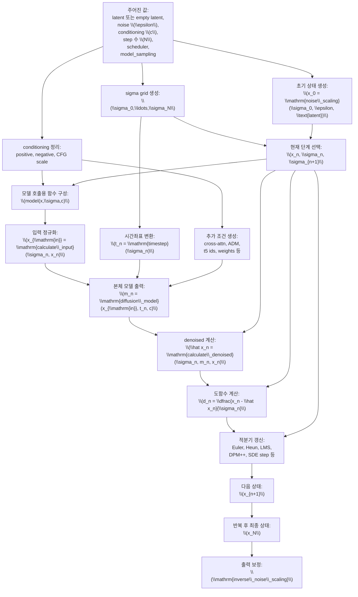
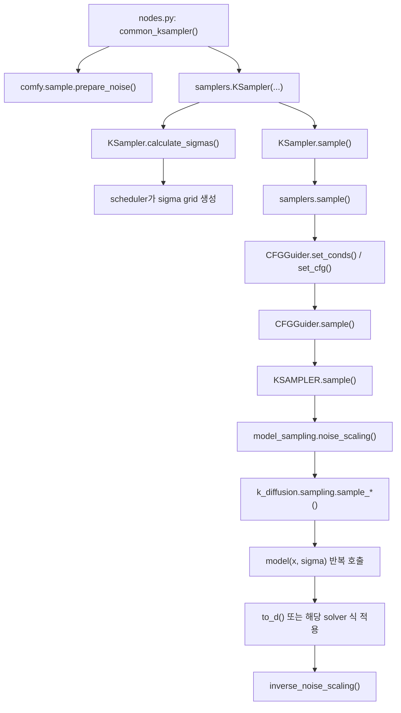

# ComfyUI 샘플링 수학 ver2: ODE, PDE, SDE에서 코드까지

## 범위

이 문서는 `test/ComfyUI-0.18.2/ComfyUI-0.18.2` 기준으로, ComfyUI의 샘플링을 다음 순서로 설명한다.

1. ODE, PDE, SDE 이론
2. 수치해석 기법
3. ComfyUI 코드 순서

설명 수준은 물리학과 또는 수학과 학부에서 상미분방정식, 확률미분방정식, 기초적인 함수해석 또는 편미분방정식 관점을 배운 독자를 상정한다.

## 읽기 전에

쉽게 말하면 diffusion 또는 flow 샘플링은 "노이즈에서 시작한 점 하나를 점점 데이터 분포 쪽으로 되돌리는 일"이다.

조금 더 기술적으로 말하면, 이 과정은 세 층으로 나뉜다.

- 분포 $p_t$ 자체의 시간 진화
- 개별 샘플 경로 $X_t$의 시간 진화
- 시간 진화를 근사하는 수치적분기

ComfyUI 코드는 이 셋 중에서 마지막 두 층, 즉 샘플 경로와 그 수치적분을 직접 다룬다.

## 표기 원칙

이 문서에서는 기호를 미리 한꺼번에 고정하지 않는다.  
각 수식이 처음 등장할 때, 그 수식에 필요한 기호만 바로 아래에서 설명한다.

## 1. 이론: PDE, SDE, ODE

### 1.1 분포의 진화와 PDE

확률과정 $X_t$가 있을 때, 그 밀도 $p_t(x)$는 보통 Fokker-Planck 방정식으로 진화한다.  
가장 단순한 등방 확산을 생각하면

$$
dX_t = f(X_t,t)\,dt + g(t)\,dW_t
$$

여기서 $X_t$는 시간 $t$에서의 latent 상태를 값으로 갖는 확률과정이고, $W_t$는 브라운 운동이다.  
$f(\cdot,t)$는 drift 항, $g(t)$는 확산 세기다.

에 대응하는 밀도 방정식은

$$
\partial_t p_t(x)
= - \nabla \cdot \bigl(f(x,t)\,p_t(x)\bigr)
+ \frac{1}{2} g(t)^2 \Delta p_t(x)
$$

이다. 여기서 $p_t$는 $X_t$의 시간 $t$에서의 분포 밀도이고, $x$는 latent 공간의 점이다.

함수해석 관점에서는 생성자

$$
\mathcal{L}_t \phi
= f(\cdot,t)\cdot \nabla \phi
+ \frac{1}{2} g(t)^2 \Delta \phi
$$

를 생각할 수 있고, Fokker-Planck 방정식은 대략 $\mathcal{L}_t^\*$가 밀도에 작용하는 형태라고 볼 수 있다.  
여기서 $\phi$는 적당한 test function이다.

중요한 점은 ComfyUI가 이 PDE를 직접 풀지는 않는다는 점이다.  
이 PDE는 배경 이론이고, 실제 구현은 샘플 경로를 적분한다.

### 1.2 확산 과정과 reverse-time SDE

score-based 관점에서 forward noising은 보통 점점 노이즈가 커지는 SDE로 본다.

예를 들어

$$
dX_t = f(X_t,t)\,dt + g(t)\,dW_t
$$

를 forward 과정으로 두면, reverse-time 생성 과정은 score $\nabla_x \log p_t(x)$를 사용해

$$
dX_t
= \Bigl(f(X_t,t) - g(t)^2 \nabla_x \log p_t(X_t)\Bigr)\,dt
+ g(t)\,d\bar W_t
$$

꼴의 reverse SDE로 쓸 수 있다.

여기서 $\nabla_x \log p_t(x)$는 score function이고, $\bar W_t$는 reverse-time 쪽의 브라운 운동 기호다.

쉽게 말하면 "분포를 흐리게 만드는 식"을 뒤집을 때는, 단순히 부호만 바꾸는 것이 아니라 score 항이 추가된다.

### 1.3 probability flow ODE

같은 주변분포 $p_t$를 갖는 결정론적 ODE도 만들 수 있다. 이를 probability flow ODE라고 부른다.

$$
\frac{dX_t}{dt}
= f(X_t,t) - \frac{1}{2} g(t)^2 \nabla_x \log p_t(X_t)
$$

즉 SDE의 무작위 항을 제거한 대신 drift를 조정해 같은 주변분포를 따라가게 만든다.

이 관점이 중요한 이유는 많은 샘플러가 실제로는 이 ODE를 적분하는 형태로 이해될 수 있기 때문이다.

여기서 중요한 것은 PF ODE가 "SDE의 generator가 직접 만들어낸 ODE"라는 식으로 이해되면 곤란하다는 점이다.  
더 정확한 연결은 다음과 같다.

1. 먼저 SDE

$$
dX_t = f(X_t,t)\,dt + g(t)\,dW_t
$$

가 주어진다.

2. 이 SDE는 함수공간 위의 generator

$$
\mathcal L_t \phi
= f(\cdot,t)\cdot \nabla \phi
+ \frac12 g(t)^2 \Delta \phi
$$

를 만든다.

3. 그 adjoint $\mathcal L_t^\*$가 밀도 $p_t$에 작용하면 Fokker-Planck 방정식

$$
\partial_t p_t
= \mathcal L_t^\* p_t
= -\nabla\cdot(f\,p_t) + \frac12 g(t)^2 \Delta p_t
$$

를 얻는다.

4. 한편 결정론적 ODE

$$
\frac{dX_t}{dt} = v(X_t,t)
$$

의 밀도는 continuity equation

$$
\partial_t p_t = -\nabla\cdot(v\,p_t)
$$

를 만족한다.

5. 따라서 PF ODE는

$$
-\nabla\cdot(v_{\mathrm{PF}}\,p_t)
= -\nabla\cdot(f\,p_t) + \frac12 g(t)^2 \Delta p_t
$$

가 되도록 정한 벡터장 $v_{\mathrm{PF}}$를 갖는 ODE다.

즉 PF ODE는 `generator -> adjoint -> 분포 진화 PDE`를 거쳐, 그 PDE와 같은 밀도 흐름을 주도록 역으로 맞춘 결정론적 ODE라고 보는 편이 맞다.

### 1.4 denoiser와 score의 관계

실전 코드에서는 보통 score를 직접 쓰지 않고, denoiser 또는 noise predictor를 사용한다.  
가우시안 noising 설정에서는 score와 denoiser는 서로 바꿔 쓸 수 있다.

대표적으로 노이즈 예측 $\epsilon_\theta$를 쓰면

$$
\hat x_0 = x_t - \sigma_t \,\epsilon_\theta(x_t,t,c)
$$

같은 재구성이 가능하다. 여기서 $x_t$는 noisy latent, $\sigma_t$는 그 시각의 noise level, $\epsilon_\theta$는 모델이 예측한 노이즈, $c$는 conditioning이다.

ComfyUI는 내부적으로 이 $\hat x_0$ 또는 이에 준하는 `denoised`를 만든 다음, 그것을 적분기에 넣는다.

### 1.5 flow matching 관점

flow 계열에서는 생성 과정을 아예 ODE로 두는 시각이 자연스럽다.

$$
\frac{dX_t}{dt} = v_\theta(X_t,t,c)
$$

즉 diffusion처럼 확률 확산을 뒤집는 대신, 처음부터 "데이터로 가는 속도장" $v_\theta$를 학습한다고 보는 것이다.

ComfyUI에서 Anima 같은 모델이 `ModelType.FLOW`와 `ModelSamplingDiscreteFlow`를 쓰는 이유가 여기에 있다.  
코드가 직접 위 식을 그대로 쓰는 것은 아니지만, 시간축과 출력 해석이 이 ODE형 관점에 맞춰져 있다.

## 1.6 벡터장, generator, 정확한 흐름사상

여기서부터는 "연속계"와 "수치근사"를 엄밀하게 구분한다.

연속시간 ODE

$$
\frac{dx}{dt} = f(x,t)
$$

에서 $f$는 상태공간에서 자기 자신으로 가는 사상이 아니라, 각 시각마다 상태공간 위의 벡터장을 주는 사상이다.  
유한차원 latent 공간을 $\mathcal X = \mathbb R^d$로 보면

$$
f : \mathcal X \times \mathcal T \to \mathcal X
$$

이다.

이 $f$는 일반적으로 선형사상이 아니다.  
선형이라는 말은 $f(x,t)=A(t)x$ 같은 특별한 경우에만 성립한다.

반면 함수공간 위에서는 $f$로부터 선형연산자

$$
\mathcal L_t \phi = f(\cdot,t)\cdot \nabla \phi
$$

를 만들 수 있다.  
여기서 $\phi$는 적당한 함수공간의 원소이고, $\mathcal L_t$는 그 함수공간에서 자기 자신으로 가는 선형사상이다.

즉 "선형연산자"라는 말이 자연스러운 대상은 보통 $f$ 자체가 아니라 $\mathcal L_t$ 쪽이다.

한편 ODE의 해가 존재한다고 하면, 각 $s,t \in \mathcal T$에 대해 정확한 흐름사상

$$
\varphi_{t,s} : \mathcal X \to \mathcal X
$$

를 정의할 수 있다.  
이는 시각 $s$의 초기값 $x_s$를 시각 $t$의 정확한 해 $x_t$로 보내는 사상이다.

즉

$$
\varphi_{t,s}(x_s)=x_t
$$

이다.

수학적으로 보면:

- $f$는 벡터장
- $\mathcal L_t$는 함수공간 위의 generator
- $\varphi_{t,s}$는 상태공간 위의 정확한 흐름사상

이다.

ComfyUI의 샘플러는 이 정확한 흐름사상 $\varphi_{t,s}$ 또는 sigma 좌표로 바꾼 $\varphi_{\sigma',\sigma}$를 직접 계산하지 않고, 그것을 근사하는 이산 사상을 계산한다.

## 2. 이론에서 수치해석으로

### 2.1 결국 필요한 것은 적분기다

쉽게 말하면 ODE나 SDE가 있더라도, 컴퓨터는 연속시간을 직접 다루지 못한다.  
그래서 시간 구간을

$$
t_0 > t_1 > \cdots > t_N
$$

또는 ComfyUI 식으로는

$$
\sigma_0 > \sigma_1 > \cdots > \sigma_N
$$

처럼 나눈 뒤, 각 구간을 근사한다. 여기서 $N$은 전체 step 수다.

### 2.2 명시적 Euler

가장 단순한 ODE 적분기는 Euler다.

$$
x_{n+1} = x_n + h_n f(x_n,t_n)
$$

여기서 $x_n$은 $n$번째 근사 상태, $t_n$은 $n$번째 시간점, $h_n=t_{n+1}-t_n$은 step size다.  
지역오차는 $O(h_n^2)$, 전역오차는 보통 $O(h)$ 수준으로 이해하면 된다.

장점은 단순성과 속도다. 단점은 정확도가 낮고 큰 step에서 불안정할 수 있다는 점이다.

### 2.3 Heun과 2차 Runge-Kutta

Heun은 predictor-corrector 방식의 2차 방법이다.

$$
\tilde x_{n+1} = x_n + h_n f(x_n,t_n)
$$

$$
x_{n+1}
= x_n
+ \frac{h_n}{2}\Bigl(f(x_n,t_n) + f(\tilde x_{n+1},t_{n+1})\Bigr)
$$

즉 한 번 예측하고, 그 예측점의 기울기로 다시 보정한다.

### 2.4 Euler-Maruyama와 SDE

SDE

$$
dX_t = f(X_t,t)\,dt + g(X_t,t)\,dW_t
$$

를 가장 단순하게 근사하면 Euler-Maruyama형 식이 된다.

$$
X_{n+1}
= X_n + f(X_n,t_n)\Delta t_n
+ g(X_n,t_n)\Delta W_n
$$

여기서 $\Delta W_n := W_{t_{n+1}}-W_{t_n}$이고, $\Delta W_n \sim \mathcal{N}(0,\Delta t_n)$이다.

Ancestral sampler나 SDE sampler에서 "결정론적 이동 + 노이즈 재주입"이 보이는 이유가 바로 이 구조 때문이다.

### 2.5 다단계법

Adams-Bashforth, LMS 같은 다단계법은 현재 기울기만 보지 않고 과거 기울기까지 사용한다.

전형적으로

$$
x_{n+1}
= x_n + h_n \sum_{j=0}^{k-1} \beta_j f_{n-j}
$$

형태를 가진다. 여기서 $\beta_j$는 다단계 계수이고, $f_{n-j}$는 과거 시점에서 평가한 미분값이다.

장점은 같은 함수평가 횟수 대비 효율이 좋다는 점이다.  
단점은 초기화가 필요하고, step 간격 변화에 민감할 수 있다는 점이다.

### 2.6 지수 적분기와 log-SNR 좌표

Diffusion 샘플링에서는 시간좌표를 그냥 $t$로 두기보다

$$
\lambda = - \log \sigma
$$

또는 flow 계열에서는

$$
\lambda = -\operatorname{logit}(\sigma)
= \log \frac{1-\sigma}{\sigma}
$$

로 두는 것이 유리한 경우가 많다. 여기서 $\lambda$는 재매개변수된 시간좌표다.

이 좌표에서는 방정식 일부를 정확히 적분하고 나머지를 근사하는 지수 적분기(exponential integrator) 계열이 자연스럽게 나온다.  
ComfyUI의 DPM-Solver와 DPM++ 계열이 여기에 가깝다.

### 2.7 적응적 step size

고전 ODE 수치해석에서는 저차 근사와 고차 근사를 동시에 구해 오차를 추정하고, 그 오차에 따라 step을 줄이거나 늘린다.

대략

$$
\text{error}_n \approx \|x_{n+1}^{\text{low}} - x_{n+1}^{\text{high}}\|
$$

를 기준으로 제어한다. 여기서 $x_{n+1}^{\text{low}}$, $x_{n+1}^{\text{high}}$는 같은 step에서 얻은 저차 근사와 고차 근사다.

ComfyUI의 `sample_dpm_adaptive()`는 이 아이디어를 직접 구현하고, 심지어 `PIDStepSizeController`까지 사용한다.

## 3. ComfyUI가 쓰는 공통 수학적 인터페이스

### 3.1 `sigma`를 시간좌표로 쓰기

ComfyUI는 `sampler`와 `scheduler`를 분리한다.

- scheduler: $\sigma_0,\dots,\sigma_N$를 만든다
- sampler: 이 점들 사이를 적분한다

Diffusion 계열에서는 보통

$$
\sigma = \sqrt{\frac{1-\bar\alpha}{\bar\alpha}}
$$

를 쓰고, flow 계열에서는 `time_snr_shift()`로 만든 $\sigma(t)$를 쓴다.  
여기서 $\bar\alpha$는 누적된 alpha product다.

### 3.2 `denoised`에서 도함수로

`comfy/k_diffusion/sampling.py`의 `to_d()`는 다음 식을 사용한다.

$$
d = \frac{x - \text{denoised}}{\sigma}
$$

코드 주석대로 이것은 Karras ODE derivative로 이해된다.  
여기서 $x$는 현재 latent 상태이고, `denoised`는 모델 출력에서 복원한 노이즈 제거 추정치다.

즉 ComfyUI는 모델이 무엇을 직접 예측하든, 최종적으로는

$$
f_\theta(x,\sigma,c)
$$

꼴의 미분값처럼 바꿔 적분기 안에 넣는다.

여기서 $f_\theta$는 실제 코드의 단일 함수 이름이 아니라, 샘플러가 사용하는 유효 벡터장을 추상적으로 쓴 기호다.

### 3.3 diffusion과 flow의 좌표 차이

`comfy/model_sampling.py`를 보면 모델마다 시간좌표와 출력 해석이 다르다.

#### diffusion 계열

`ModelSamplingDiscrete`는 beta schedule에서 sigma를 만든다.

$$
\sigma_n = \sqrt{\frac{1-\bar\alpha_n}{\bar\alpha_n}}
$$

또 `EPS` 계열은 입력 정규화를

$$
x_{\text{in}} = \frac{x}{\sqrt{\sigma^2 + \sigma_{\text{data}}^2}}
$$

처럼 한다. 여기서 $\sigma_{\text{data}}$는 모델이 가정하는 데이터 쪽 scale parameter다.

#### flow 계열

`ModelSamplingDiscreteFlow`는

$$
\sigma(t) = \frac{\alpha (t/m)}{1 + (\alpha - 1)(t/m)}
$$

형태를 쓴다. 여기서 $\alpha$는 `shift`, $m$은 `multiplier`다.

즉 같은 적분기라도 diffusion과 flow는 서로 다른 좌표계 위에서 움직인다.

## 4. 대표적인 수치적분기와 ComfyUI 함수 대응

### 4.1 Euler: `sample_euler`

`sample_euler()`는 정확히 전진 Euler 방식이다.

$$
d_n = \frac{x_n - \hat x_n}{\sigma_n},
\qquad
x_{n+1} = x_n + d_n(\sigma_{n+1}-\sigma_n)
$$

여기서 $x_n$은 현재 상태, $\hat x_n$은 현재 step의 denoised 추정, $d_n$은 그로부터 만든 derivative 근사다.

### 4.2 Euler ancestral: `sample_euler_ancestral`

이 함수는 결정론적 이동 뒤에 노이즈를 다시 넣는다.

개념적으로는

$$
x_{n+1}
= x_n + d_n \Delta \sigma_n + \sigma_{\mathrm{up},n}\,\xi_n,
\qquad
\xi_n \sim \mathcal{N}(0,I)
$$

형태로 이해할 수 있다. 여기서 $\sigma_{\mathrm{up},n}$은 재주입되는 노이즈의 세기다.

즉 reverse ODE보다 reverse SDE에 더 가까운 움직임이다.

### 4.3 Heun: `sample_heun`

Heun은 2차 predictor-corrector다.

$$
d_n = f(x_n,\sigma_n), \qquad
\tilde x_{n+1} = x_n + d_n \Delta \sigma_n
$$

$$
d_{n+1}^{\mathrm{pred}} = f(\tilde x_{n+1},\sigma_{n+1})
$$

$$
x_{n+1}
= x_n + \frac{\Delta \sigma_n}{2}
\Bigl(d_n + d_{n+1}^{\mathrm{pred}}\Bigr)
$$

여기서 $\tilde x_{n+1}$은 predictor 단계의 임시 상태다.

### 4.4 LMS: `sample_lms`

`sample_lms()`는 과거 도함수들을 저장하고 선형 다단계 계수를 계산한다.

$$
x_{n+1}
= x_n + \sum_{j=0}^{k-1} \beta_{n,j} d_{n-j}
$$

여기서 $\beta_{n,j}$는 균일격자가 아니라 현재 sigma grid에 맞춰 계산되는 다단계 계수다.

### 4.5 DPM-Solver: `sample_dpm_fast`, `sample_dpm_adaptive`

이 계열은 $\lambda = -\log \sigma$ 또는 half-log-SNR 좌표에서 지수 적분기 형태를 사용한다.

핵심은 선형 부분을 어느 정도 해석적으로 처리하고, score 또는 denoiser에 해당하는 비선형 부분만 근사한다는 점이다.

적응형 버전은

$$
\text{error}_n
\approx
\left\|
\frac{x_{n+1}^{\text{low}} - x_{n+1}^{\text{high}}}{\delta_n}
\right\|
$$

식의 오차 추정을 사용해 step을 조절한다. 여기서 $\delta_n$은 상대오차와 절대오차 기준을 합친 정규화 인자다.

### 4.6 DPM++ SDE: `sample_dpmpp_sde`, `sample_dpmpp_2m_sde`, `sample_dpmpp_3m_sde`

이 계열은 deterministic drift와 stochastic diffusion을 함께 갖는다.

코드상 특징:

- half-log-SNR 변환
- `BrownianTreeNoiseSampler`
- 중간 stage
- $\eta > 0$에서 noise 재주입

즉 단순 ODE solver가 아니라, SDE 해석을 더 직접적으로 반영한 적분기다.

### 4.7 ER-SDE와 SA-Solver

`sample_er_sde()`는 코드 주석부터 `Extended Reverse-Time SDE solver`라고 적혀 있다.  
`sample_sa_solver_pece()`는 PECE predictor-corrector 확률 적분기다.

즉 ComfyUI에는 "샘플링"이라는 이름 아래 ODE형, SDE형, 다단계형, predictor-corrector형이 모두 들어 있다.

## 5. 수식 관점의 변수 의존성 그래프

쉽게 말하면 실제 샘플링 식은 한 줄처럼 보이지만, 안쪽에서는 여러 함수가 차례대로 합성된다.

예를 들어 Euler 계열 한 스텝은 겉으로는

$$
x_{n+1} = x_n + \Delta \sigma_n \, d_n
$$

처럼 짧게 보이지만, 실제로는 $x_n$이 현재 상태, $\Delta \sigma_n := \sigma_{n+1}-\sigma_n$이 현재 step 간격, $d_n$이 유효 derivative다.  
그리고 $d_n$도 바로 주어지지 않는다.  
$d_n$은 `denoised`에서 나오고, `denoised`는 다시 모델 출력과 `model_sampling` 규칙에서 나온다.

이를 변수 의존성 그래프로 그리면 다음과 같다.

### 5.1 합성함수 형태로 쓰면

한 스텝을 아주 추상적으로 쓰면 다음과 같이 볼 수 있다.

$$
x_{n+1}
= \Phi_n\!\Bigl(
x_n,\sigma_n,\sigma_{n+1},
\hat x_n
\Bigr)
$$

여기서 $\Phi_n$는 "$n$번째 step에서 정확한 흐름사상을 근사하는 이산 사상"을 뜻하는 기호다.  
현재 문맥에서는

$$
\Phi_n : \mathcal X \times \Sigma \times \Sigma \times \mathcal X \to \mathcal X
$$

로 생각하면 된다. 즉

$$
(x_n,\sigma_n,\sigma_{n+1},\hat x_n)\longmapsto x_{n+1}
$$

라는 사상이다.  
즉 $\Phi_n$는 미분방정식 그 자체가 아니라, 정확한 흐름사상을 한 step에서 근사하는 사상이다.  
실제 샘플러가 Euler인지 Heun인지 DPM++인지에 따라 $\Phi_n$의 구체적인 정의식이 달라진다.

보다 정확하게는, 조건 $c$를 고정하고 유효 벡터장을 $f_\theta(\cdot,\cdot,c)$라 두면, 연속계는 정확한 흐름사상

$$
\varphi_{\sigma_{n+1},\sigma_n}^{\theta,c} : \mathcal X \to \mathcal X
$$

를 만든다.  
ComfyUI 샘플러가 실제로 계산하는 것은 보통

$$
\Phi_n^{\theta,c} \approx \varphi_{\sigma_{n+1},\sigma_n}^{\theta,c}
$$

라는 의미의 수치근사다.

여기서

$$
\hat x_n
= D_\theta(x_n,\sigma_n,c)
$$

에서 $D_\theta$는 denoiser 전체를 하나의 함수로 묶어 쓴 기호이고, $\theta$는 모델 파라미터, $c$는 conditioning이다.

이고, 다시

$$
D_\theta(x,\sigma,c)
= \mathrm{calculate\_denoised}
\Bigl(
\sigma,\,
M_\theta(\mathrm{calculate\_input}(\sigma,x),\,\mathrm{timestep}(\sigma),\,c),\,
x
\Bigr)
$$

처럼 볼 수 있다.  
여기서 $M_\theta$는 본체 모델의 원시 출력 함수를 뜻한다.

즉 한 단계 갱신은 사실상

$$
x_{n+1}
= \Phi_n\Bigl(
x_n,\sigma_n,\sigma_{n+1},
D_\theta(x_n,\sigma_n,c)
\Bigr)
$$

라는 합성함수이며, 이 이산 사상이 정확한 흐름사상을 근사한다고 보는 것이 수학적으로 더 정확하다.

### 5.2 diffusion 계열에서의 의존성

diffusion 계열에서는 특히 다음 의존성이 중요하다.

$$
x_n
\xrightarrow{\ \mathrm{calculate\_input}\ }
x_{\mathrm{in},n}
\xrightarrow{\ M_\theta\ }
m_n
\xrightarrow{\ \mathrm{calculate\_denoised}\ }
\hat x_n
\xrightarrow{\ \mathrm{to\_d}\ }
d_n
\xrightarrow{\ \Phi_n\ }
x_{n+1}
$$

여기서 $x_{\mathrm{in},n}$은 모델에 실제로 들어가는 정규화된 입력이고, $m_n$은 본체 모델의 원시 출력이다.  
또 $\Phi_n$는 마지막 적분 단계에서 쓰이는 이산 사상이다.

여기서

$$
x_{\mathrm{in},n}
= \frac{x_n}{\sqrt{\sigma_n^2+\sigma_{\mathrm{data}}^2}}
$$

같은 정규화가 들어갈 수 있다.

### 5.3 flow 계열에서의 의존성

flow 계열도 틀은 같지만, 함수가 달라진다.

$$
x_n
\xrightarrow{\ \mathrm{calculate\_input}\ }
x_{\mathrm{in},n}=x_n
\xrightarrow{\ M_\theta\ }
m_n
\xrightarrow{\ \mathrm{calculate\_denoised}\ }
\hat x_n
\xrightarrow{\ \Phi_n\ }
x_{n+1}
$$

그리고 시간좌표도

$$
\sigma_n = \sigma(t_n)
= \frac{\alpha (t_n/m)}{1+(\alpha-1)(t_n/m)}
$$

처럼 별도 변환을 거친다. 여기서 $t_n$은 내부 시간좌표다.

즉 합성함수의 뼈대는 같아도, 그 안쪽 함수들의 정의가 diffusion과 flow에서 달라진다.

### 5.4 샘플러별로 달라지는 것은 어디인가

이 관점에서 보면 샘플러 차이는 거의 전부 "정확한 흐름사상을 어떤 이산 사상 $\Phi_n$로 근사하느냐"에 들어 있다.

- Euler는 현재 $d_n$만 사용한다.
- Heun은 예측점에서 한 번 더 모델을 평가하는 다른 이산 사상 $\Phi_n$를 쓴다.
- LMS는 과거 $d_{n-j}$까지 사용한다.
- DPM++ 계열은 $\lambda = -\log \sigma$ 또는 half-log-SNR 좌표에서 그 이산 사상을 정의한다.
- SDE 계열은 결정론적 사상 대신 확률입력을 함께 받는 사상을 쓴다.

즉 같은 모델 $D_\theta$를 두고도, 정확한 흐름사상을 어떤 방식으로 근사하느냐에 따라 샘플러가 갈라진다.

## 6. ComfyUI 코드 순서

이제 이론과 수치해석을 실제 코드 순서로 내려오면 다음과 같다.

### 6.1 프롬프트와 CFG 준비

`samplers.sample()`은 `CFGGuider`를 만든다.

- positive conditioning
- negative conditioning
- CFG scale

을 설정한 뒤 `CFGGuider.sample()`로 넘긴다.

즉 실제 적분기 앞단에는 이미 classifier-free guidance가 정리되어 있다.

### 6.2 sigma grid 만들기

`KSampler.calculate_sigmas()`는 `scheduler`와 `model_sampling`을 조합해 sigma grid를 만든다.

이때 중요한 것은:

- scheduler는 점 배치를 정하고
- model_sampling은 sigma의 의미를 정한다

는 점이다.

예를 들어 같은 `karras` scheduler를 써도 diffusion 모델과 flow 모델은 sigma 해석이 다르다.

### 6.3 모델 입력 만들기

`KSAMPLER.sample()`는 먼저

$$
x_0 = \text{noise\_scaling}(\sigma_0,\epsilon,\text{latent})
$$

에 해당하는 초기 상태를 만든다.

diffusion과 flow는 여기서 이미 달라진다.

- diffusion은 "latent 위에 노이즈를 얹는" 느낌
- flow는 "노이즈 상태와 latent 상태 사이를 섞는" 느낌

### 6.4 적분기 호출

그 다음 `ksampler(name)`이 실제 함수 `sample_euler`, `sample_heun`, `sample_dpmpp_sde` 같은 구현을 고른다.

이 함수들은 공통적으로

1. 현재 $\sigma_n$에서 모델을 평가하고
2. `denoised` 또는 derivative를 만들고
3. 수치적분 공식을 적용해
4. 다음 $\sigma_{n+1}$로 간다

는 구조를 따른다.

### 6.5 모델 호출의 안쪽

적분기가 호출하는 `model(x,\sigma)`는 결국 `BaseModel._apply_model()` 쪽으로 내려간다.

여기서:

- diffusion은 `calculate_input`, `timestep`, `calculate_denoised`
- flow는 다른 `model_sampling` 규칙

을 사용한다.

즉 적분기 바깥 껍데기는 같아도, 내부 벡터장 $f_\theta$는 모델 종류마다 달라진다.

## 7. diffusion과 flow를 같은 문법으로 감싸는 이유

ComfyUI 설계의 핵심은 "서로 다른 생성 수학을 공통 샘플러 인터페이스로 감싼다"는 점이다.

쉽게 말하면:

- 이론적으로는 diffusion, probability flow ODE, reverse SDE, flow matching ODE가 다르고
- 수치해석적으로는 Euler, Heun, multistep, adaptive solver가 다르며
- 코드에서는 이것을 `sigma`, `denoised`, `model_sampling`, `sample_*` 함수 조합으로 통일한다

고 볼 수 있다.

이 통일 덕분에 같은 `KSampler` UI 안에서 서로 다른 모델 계열을 거의 같은 방식으로 다룰 수 있다.

## 코드 읽기 순서

이 주제를 직접 소스에서 확인하려면 아래 순서가 가장 좋다.

1. `comfy/model_sampling.py`
2. `comfy/samplers.py`
3. `comfy/k_diffusion/sampling.py`
4. `comfy/sample.py`
5. `comfy/model_base.py`

## 한 문장 요약

ComfyUI 샘플링은 PDE 수준의 분포 진화를 직접 푸는 것이 아니라, 그 배경 위에서 얻어지는 reverse ODE 또는 reverse SDE를 $\sigma$ 좌표계로 옮겨 수치적분하는 구조이며, 실제 구현은 `model_sampling + scheduler + sample_*`의 조합으로 이루어진다.
