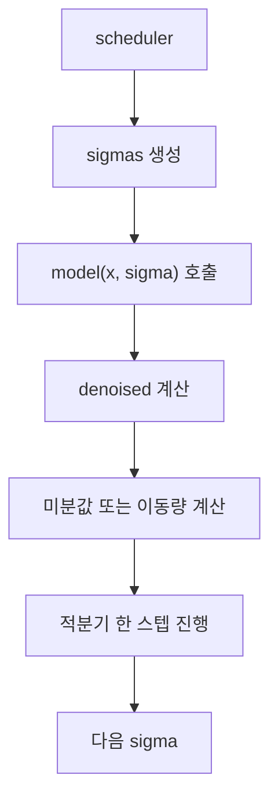

# ComfyUI 샘플링 수학: ODE, SDE, PDE와 수치해석 관점

## 범위

이 문서는 `test/ComfyUI-0.18.2/ComfyUI-0.18.2` 기준으로, ComfyUI 샘플링 코드를 수학과 수치해석 관점에서 정리한다.

- 공통 진입점: `comfy/samplers.py`
- 실제 구현: `comfy/k_diffusion/sampling.py`
- 모델별 차이: `comfy/model_sampling.py`
- 대표 예시: `Euler`, `Euler ancestral`, `Heun`, `LMS`, `DPM-Solver`, `DPM++ SDE`, `ER-SDE`, `SA-Solver`

## 먼저 큰 그림

쉽게 말하면 샘플링은 "노이즈에서 이미지로 가는 길을 조금씩 따라가는 계산"이다.

그 길을 수학적으로 보면 세 층으로 볼 수 있다.

1. 확률분포가 시간에 따라 어떻게 변하는가
2. 개별 샘플 하나가 시간에 따라 어떻게 움직이는가
3. 그 움직임을 컴퓨터가 어떤 수치해석 공식으로 근사하는가

여기서 각각이 보통 이렇게 대응된다.

- 분포의 시간 변화: PDE
- 샘플 경로의 시간 변화: ODE 또는 SDE
- 실제 코드 구현: Euler, Heun, DPM-Solver 같은 수치적분기

## PDE, ODE, SDE를 구분해서 보기

### 1. PDE: 분포 전체의 진화

가장 추상적인 층에서는 "데이터 분포가 시간이 흐르며 어떻게 퍼지고 다시 모이는가"를 본다.

이때 떠올릴 수 있는 것이 Fokker-Planck 같은 PDE다.

쉽게 말하면 "개별 점 하나"가 아니라 "점 구름 전체"가 어떻게 변하는지 보는 식이다.

중요한 점은 ComfyUI가 PDE를 직접 푸는 것은 아니라는 점이다.  
PDE는 배경 이론이고, 실제 추론 코드는 개별 샘플 경로를 푼다.

### 2. ODE: 결정론적 경로

ODE 관점에서는 샘플 하나가 시간에 따라 이렇게 움직인다고 본다.

```text
dx / dt = f(x, t)
```

즉 현재 상태 `x`와 시간 `t`를 알면 다음 방향이 정해진다.

이 경우 같은 시작점이면 같은 결과가 나온다.

### 3. SDE: 확률적 경로

SDE 관점에서는 방향뿐 아니라 랜덤 노이즈도 들어간다.

```text
dx = f(x, t) dt + g(x, t) dW_t
```

여기서 `dW_t`는 브라운 운동 같은 확률 항이다.

즉 같은 시작점이어도 중간에 노이즈를 다시 섞으면 결과가 달라질 수 있다.

## ComfyUI는 이걸 어떻게 코드로 바꾸는가

ComfyUI는 이 복잡한 이론을 `sigma`라는 공통 축으로 정리한다.



핵심은 `sigma`가 시간의 다른 표현이라는 점이다.

- diffusion 계열에서는 노이즈 세기
- flow 계열에서는 변형된 시간 비율

처럼 쓴다.

## `model_sampling.py`: 모델마다 시간축이 다른 이유

ComfyUI는 샘플러 함수와 별도로 `model_sampling` 객체를 둔다.  
이 객체가 "현재 모델의 시간과 출력 의미"를 정의한다.

### 1. diffusion 계열: `ModelSamplingDiscrete`

`ModelSamplingDiscrete`는 beta schedule에서 `alphas_cumprod`를 만들고 sigma를 정의한다.

```text
sigma = sqrt((1 - alpha_bar) / alpha_bar)
```

즉 전통적인 DDPM 계열 시간표다.

### 2. flow 계열: `ModelSamplingDiscreteFlow`

Anima 같은 flow 계열은 beta schedule 대신 다음 함수를 쓴다.

```text
sigma(t) = time_snr_shift(shift, t / multiplier)
time_snr_shift(alpha, t) = alpha * t / (1 + (alpha - 1) * t)
```

쉽게 말하면 같은 `sigma`라는 이름을 쓰지만,  
SDXL와 Anima는 실제로 서로 다른 시간 좌표계를 걷고 있다.

### 3. 출력 해석도 모델마다 다르다

`model_sampling`은 시간표만 정하지 않는다.  
모델 출력값을 어떻게 읽을지도 정한다.

대표적으로:

- `EPS`: 노이즈 예측 계열
- `V_PREDICTION`: v 예측 계열
- `CONST`: flow 계열에서 쓰는 입력/출력 해석

즉 샘플러가 `denoised`를 사용한다 해도, 그 `denoised`를 만드는 식은 모델마다 다르다.

## 공통 핵심 식: denoiser를 ODE 미분값으로 바꾸기

`comfy/k_diffusion/sampling.py`의 `to_d()`는 아주 중요하다.

```text
d = (x - denoised) / sigma
```

코드 주석도 이것을 "Karras ODE derivative"로 설명한다.

쉽게 말하면 모델이 직접 `dx/dt`를 주는 것이 아니라,  
"노이즈를 덜어 낸 상태"를 주면 그것을 다시 미분값처럼 바꾸는 것이다.

이 식 덕분에 ComfyUI는 다양한 모델 출력 형식을 공통 적분기 안에 넣을 수 있다.

## 샘플러와 스케줄러는 다른 것이다

ComfyUI에서는 이 둘을 분리한다.

- 스케줄러: sigma 점들을 어디에 찍을까
- 샘플러: 찍힌 점 사이를 어떤 적분 공식으로 건널까

`samplers.py`의 예시:

- scheduler: `simple`, `normal`, `karras`, `exponential`, `ddim_uniform`, `beta`, `kl_optimal`
- sampler: `euler`, `heun`, `dpm_2`, `lms`, `dpm_fast`, `dpm_adaptive`, `dpmpp_sde`, `deis`, `ipndm`, `res_multistep`, `er_sde`, `sa_solver` 등

즉 "같은 Euler"라도 `karras` 스케줄을 쓰는지 `normal` 스케줄을 쓰는지에 따라 실제 스텝 위치가 달라진다.

## 1. ODE 1차 적분기: Euler

가장 단순한 샘플러는 `sample_euler()`다.

수학적으로는 전진 Euler와 같다.

```text
d_n = (x_n - denoised_n) / sigma_n
x_{n+1} = x_n + d_n (sigma_{n+1} - sigma_n)
```

쉽게 말하면 "지금 기울기 한 번 보고 바로 다음 점으로 간다"는 뜻이다.

장점:

- 구현이 단순하다
- 빠르다

단점:

- 오차가 상대적으로 크다
- step 수가 적으면 거칠어질 수 있다

## 2. ODE 1차 + 확률 재주입: Euler ancestral

`sample_euler_ancestral()`은 Euler로 내려가되, 중간에 노이즈를 다시 넣는다.

코드 핵심은 두 부분이다.

- `sigma_down`, `sigma_up = get_ancestral_step(...)`
- `x = x + d * dt + noise * sigma_up`

즉 한 스텝을:

1. 결정론적으로 내려가고
2. 확률적으로 다시 퍼뜨린다

라고 볼 수 있다.

쉽게 말하면 ODE만 따르는 길이 아니라, reverse SDE 느낌을 일부 섞는 것이다.

그래서 같은 프롬프트, 같은 step 수여도 Euler보다 결과가 조금 더 다양하거나 거칠게 보일 수 있다.

## 3. 2차 ODE 적분기: Heun

`sample_heun()`은 predictor-corrector 방식의 2차 방법이다.

공식 느낌은 이렇다.

```text
d_1 = f(x_n, sigma_n)
x_predict = x_n + d_1 * h
d_2 = f(x_predict, sigma_{n+1})
x_{n+1} = x_n + (d_1 + d_2)/2 * h
```

쉽게 말하면:

1. 한 번 대충 예측하고
2. 그 예측점에서 기울기를 한 번 더 본 뒤
3. 두 기울기의 평균으로 이동한다

이는 전형적인 2차 Runge-Kutta 계열 해석으로 볼 수 있다.

Euler보다 정확하지만 모델 호출이 더 들어간다.

## 4. 중간점을 쓰는 2차 방법: DPM-Solver-2 계열

`sample_dpm_2()`는 DPM-Solver 아이디어를 섞은 2차 방법이다.

코드상으로는:

- `sigma_mid`를 로그 공간 중간점으로 잡고
- 중간점에서 모델을 한 번 더 호출한 뒤
- 그 기울기로 최종 스텝을 진행한다

즉 단순 RK2와 비슷해 보이지만, sigma의 로그 구조를 더 의식한 중간점 적분기다.

쉽게 말하면 diffusion의 시간축에 더 잘 맞춘 2차 방법이라고 볼 수 있다.

## 5. 다단계 ODE 방법: LMS

`sample_lms()`는 Linear Multistep 방법이다.

이 방식은 "이번 기울기 하나"만 보지 않는다.  
이전 몇 단계에서 계산한 기울기들도 같이 본다.

코드에서도:

- `ds` 버퍼에 과거 `d`를 저장하고
- `linear_multistep_coeff()`로 계수를 계산해
- 여러 `d`의 선형결합으로 다음 점을 만든다

즉 Adams-Bashforth 계열처럼 "과거 기록을 이용해 앞으로 나아가는" 방식이다.

장점:

- 같은 모델 호출 수 대비 효율이 좋을 수 있다

단점:

- 초반 몇 스텝은 쓸 기록이 적다
- 시간축 변화에 민감할 수 있다

## 6. 지수 적분기 계열: DPM-Solver와 DPM++

이 부분이 ComfyUI 샘플링에서 가장 "수치해석 색"이 강한 구간이다.

### 6-1. 왜 `lambda = -log sigma`를 쓰는가

`DPMSolver`는 내부에서:

```text
t = -log(sigma)
sigma = exp(-t)
```

를 쓴다.

또 flow 계열 `CONST`에서는:

```text
lambda = -logit(sigma)
sigma = sigmoid(-lambda)
```

형태로 half-log-SNR 좌표를 사용한다.

쉽게 말하면 시간축을 그냥 `sigma`로 직접 다루기보다,  
적분하기 편한 log-SNR 계열 좌표로 바꿔 푸는 것이다.

### 6-2. DPM-Solver

`DPMSolver` 클래스는:

- 1-step
- 2-step
- 3-step

공식을 따로 가지고 있다.

또:

- `sample_dpm_fast()`: 고정 step
- `sample_dpm_adaptive()`: 적응형 step

을 제공한다.

`sample_dpm_adaptive()`가 재미있는 이유는 `PIDStepSizeController`를 써서 step size를 조절하기 때문이다.

즉 이 코드는 단순한 "AI 샘플러"가 아니라,  
오차 추정과 step 제어가 들어간 진짜 ODE 수치해석 코드다.

### 6-3. DPM++

`sample_dpmpp_2m()`, `sample_dpmpp_sde()`, `sample_dpmpp_2m_sde()`, `sample_dpmpp_3m_sde()`는 DPM++ 계열이다.

이 계열은 `denoised` 중심 식을 쓰며, 여러 경우에:

- 단일 step ODE
- 다단계 ODE
- SDE 확장

으로 나뉜다.

특히 `2M`의 `M`은 multistep이다.  
즉 이전 단계의 `denoised`를 기억해 다음 단계를 더 정확하게 만든다.

## 7. SDE를 더 정면으로 쓰는 샘플러들

### 7-1. BrownianTreeNoiseSampler

`sample_dpmpp_sde()`나 `sample_dpmpp_2m_sde()` 같은 함수는 `BrownianTreeNoiseSampler`를 쓴다.

이 클래스는 `torchsde.BrownianTree`를 사용한다.

쉽게 말하면 랜덤 노이즈를 그냥 `randn()` 한 번 뽑는 수준이 아니라,  
연속 시간 구간에서 브라운 경로를 일관되게 샘플링하는 도구다.

이건 SDE 해석에서 꽤 직접적인 흔적이다.

### 7-2. DPM++ SDE

`sample_dpmpp_sde()`는 이름 그대로 stochastic 버전이다.

핵심 특징:

- half-log-SNR 좌표 사용
- 중간 단계 `lambda_s_1` 계산
- deterministic update
- `eta > 0`일 때 noise 재주입

즉 ODE식 drift와 SDE식 diffusion이 함께 들어간다.

### 7-3. ER-SDE

`sample_er_sde()`는 주석에서 스스로:

`Extended Reverse-Time SDE solver`

라고 밝힌다.

즉 이 함수는 reverse-time SDE를 좀 더 직접적으로 다루는 샘플러다.

### 7-4. SA-Solver

`sample_sa_solver()`와 `sample_sa_solver_pece()`는 Stochastic Adams 계열이다.

`PECE`는:

- Predict
- Evaluate
- Correct
- Evaluate

를 뜻한다.

즉 고전적인 수치해석 predictor-corrector 방법이 확률 샘플링 쪽으로 들어와 있는 예다.

## 8. 다른 다단계 예시: IPNDM, DEIS, Res Multistep

ComfyUI 코드에는 단순 Euler/Heun만 있는 것이 아니다.

### 8-1. IPNDM

`sample_ipndm()`와 `sample_ipndm_v()`는 이전 단계 정보들을 누적해 가는 다단계 계열이다.

쉽게 말하면 이전 기울기 기록을 써서 더 높은 차수로 근사하는 방식이다.

### 8-2. DEIS

`sample_deis()`는 계수표 `coeff_list`를 계산해 과거 도함수들을 섞는다.

즉 다항식 혹은 적분 공식에 맞춘 coefficient-based multistep solver로 볼 수 있다.

### 8-3. Res Multistep

`sample_res_multistep()` 계열은 이름 그대로 residual multistep 계열이다.

즉 최근 여러 단계의 residual, derivative, 또는 denoised 기록을 활용해 다음 점을 만든다.

쉽게 말하면 최근 샘플러들은 대부분 "현재 기울기 한 번"만 보는 것이 아니라,  
이전 단계 정보를 적극적으로 재활용한다.

## 9. DDPM, DDIM, LCM은 어디쯤에 놓이는가

ComfyUI에는 `ddpm`, `ddim`, `lcm`도 있다.

- `ddpm`: 확률적 reverse diffusion에 가까운 전통 경로
- `ddim`: 확률 항을 줄인 결정론적 경로
- `lcm`: 적은 step에서 빠르게 수렴하도록 만든 특수 목적 경로

흥미로운 점은 `sampler_object("ddim")`이 내부적으로 `euler` 기반 래핑을 사용하는 부분이다.  
즉 UI 이름과 내부 구현 계층이 완전히 일대일 대응은 아니다.

## 10. diffusion과 flow에서 수학이 왜 달라 보이는가

샘플러 함수만 보면 비슷한 루프가 많다.  
그런데 실제 수학은 `model_sampling` 때문에 달라진다.

### diffusion 계열

- sigma는 beta schedule에서 온다
- 입력 정규화가 들어간다
- 출력은 `epsilon`이나 `v`로 해석된다

### flow 계열

- sigma는 `time_snr_shift()`에서 온다
- 입력을 그대로 쓰는 경우가 많다
- half-log-SNR 변환도 `log` 대신 `logit` 계열을 쓴다

즉 ODE/SDE 적분기 자체는 비슷해도,  
그 적분기가 따라가는 벡터장은 diffusion과 flow에서 다르다.

## 11. 샘플러를 수치해석 분류로 묶어 보기

| 묶음 | 대표 함수 | 수치해석 관점 |
| --- | --- | --- |
| 1차 ODE | `sample_euler` | 전진 Euler |
| 1차 + 확률 재주입 | `sample_euler_ancestral` | Euler-Maruyama 느낌의 reverse SDE 근사 |
| 2차 predictor-corrector | `sample_heun` | Heun, RK2 |
| 2차 중간점 | `sample_dpm_2` | 중간점 기반 2차 적분 |
| 선형 다단계 | `sample_lms` | Adams류 multistep |
| 지수 적분기 | `sample_dpm_fast`, `sample_dpm_adaptive` | exponential integrator, 적응형 ODE solver |
| DPM++ multistep | `sample_dpmpp_2m` | 다단계 ODE |
| DPM++ SDE | `sample_dpmpp_sde`, `sample_dpmpp_2m_sde`, `sample_dpmpp_3m_sde` | stochastic exponential integrator |
| 전용 reverse SDE | `sample_er_sde` | reverse-time SDE solver |
| Stochastic Adams | `sample_sa_solver`, `sample_sa_solver_pece` | predictor-corrector 확률 적분 |
| 기타 다단계 | `sample_ipndm`, `sample_deis`, `sample_res_multistep` | 고차 multistep / coefficient solver |

## 12. 실제로 코드를 읽을 때의 관찰 포인트

샘플링 코드를 볼 때 아래 질문으로 보면 훨씬 잘 보인다.

1. 이 샘플러는 현재 단계에서 모델을 몇 번 호출하는가
2. 중간점이나 예측점을 만드는가
3. 과거 단계 기록을 쓰는가
4. `eta`나 `noise_sampler`로 확률 항을 넣는가
5. 시간축을 `sigma`로 쓰는가, `log sigma`나 half-log-SNR로 바꾸는가
6. adaptive step size를 쓰는가

이 질문으로 보면:

- Euler는 1회 호출, 1차
- Heun은 2회 호출, 2차
- LMS와 DPM++ 2M은 과거 기록 사용
- DPM adaptive는 오차 제어 포함
- DPM++ SDE와 ER-SDE는 확률 항 포함

이라는 식으로 깔끔하게 분류된다.

## 한 문장 요약

ComfyUI 샘플링은 단순한 "노이즈 제거 반복"이 아니라,  
PDE 배경 위에서 정의된 reverse ODE 또는 SDE를 `sigma` 좌표계로 옮긴 뒤,  
Euler, Heun, multistep, exponential integrator, adaptive solver 같은 수치해석 공식을 실제 코드로 구현한 것이다.
