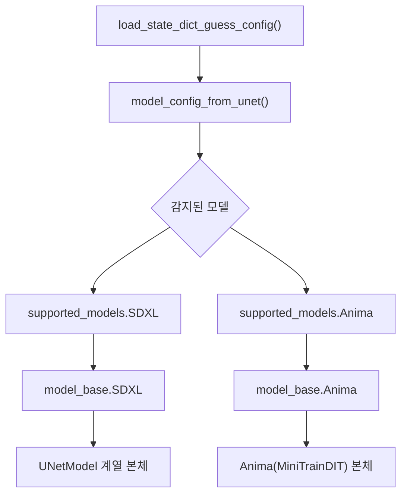
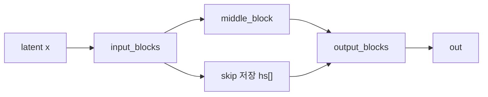
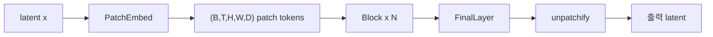

# ComfyUI 코드로 보는 SDXL U-Net과 Anima DiT 구조

## 범위

이 문서는 `test/ComfyUI-0.18.2/ComfyUI-0.18.2` 기준으로, ComfyUI가 SDXL와 Anima를 어떤 본체 구조로 읽고 호출하는지 설명한다.

- SDXL: U-Net 계열 latent diffusion 구조
- Anima: DiT, Transformer 계열 flow 구조
- 초점: 모델 본체의 블록 구성, 텍스트 조건이 들어가는 방식, forward 때 데이터가 흐르는 경로

## 한눈에 보기

쉽게 말하면 두 모델의 차이는 "이미지를 처리하는 몸체"가 다르다는 점이다.

- SDXL는 CNN 기반 U-Net 위에 attention을 끼운 구조다.
- Anima는 patch 단위 Transformer를 여러 층 쌓은 DiT 구조다.

그래서 SDXL는 "해상도를 줄였다 늘리며 특징을 모으는 방식"이고,  
Anima는 "patch 토큰들을 attention으로 계속 섞는 방식"이라고 보면 된다.

## 공통 상위 경로

ComfyUI는 둘 다 비슷한 자리에서 시작하지만, 모델 본체 선택에서 갈라진다.



핵심은 `supported_models.py`가 "설정표" 역할을 하고, `model_base.py`가 "실제 본체 클래스와 샘플링 의미"를 묶는다는 점이다.

## SDXL: U-Net 기반 구조

### 1. ComfyUI가 읽는 SDXL 설정

`comfy/supported_models.py`의 `SDXL` 클래스는 SDXL를 이렇게 설명한다.

- `model_channels = 320`
- `transformer_depth = [0, 0, 2, 2, 10, 10]`
- `context_dim = 2048`
- `adm_in_channels = 2816`
- `latent_format = SDXL`

쉽게 말하면 SDXL는 "완전한 순수 CNN"은 아니다.  
기본 뼈대는 U-Net이지만, 중간중간 text conditioning을 위한 transformer attention이 들어간다.

### 2. SDXL 본체 클래스가 하는 일

`model_base.SDXL`는 `BaseModel` 위에 SDXL 전용 조건 처리를 얹는다.

가장 중요한 부분은 `encode_adm()`이다.

- pooled CLIP 임베딩
- `height`, `width`
- `crop_h`, `crop_w`
- `target_height`, `target_width`

이 정보들이 하나의 벡터로 합쳐져 `ADM` 조건이 된다.

쉽게 말하면 SDXL는 "무슨 내용을 그릴지"만 받는 게 아니라,  
"어떤 해상도와 캔버스 조건에서 그릴지"도 같이 받는다.

### 3. 실제 U-Net 본체: `UNetModel`

실제 몸체는 `comfy/ldm/modules/diffusionmodules/openaimodel.py`의 `UNetModel`이다.

큰 구조는 전형적인 U-Net이다.

1. 입력 블록들 `input_blocks`
2. 가운데 병목 블록 `middle_block`
3. 출력 블록들 `output_blocks`
4. 마지막 출력층 `out`



쉽게 말하면 왼쪽에서 점점 정보를 압축하며 내려가고,  
오른쪽에서 다시 해상도를 복원하면서 왼쪽에서 저장해 둔 skip feature를 붙여 준다.

### 4. `input_blocks`: ResBlock과 Attention의 반복

`UNetModel` 생성 코드를 보면 각 레벨마다 이런 식으로 쌓인다.

- `ResBlock`
- 필요하면 `SpatialTransformer`
- 레벨이 끝나면 `Downsample` 또는 down용 `ResBlock`

즉 SDXL의 한 층은 단순히 convolution만 있는 게 아니라,  
"지역 특징을 잡는 ResBlock"과 "텍스트를 읽는 attention"이 번갈아 들어갈 수 있다.

### 5. `ResBlock`은 무엇을 하나

`ResBlock`은 다음 구조를 가진다.

- `GroupNorm`
- `SiLU`
- `Conv`
- timestep embedding 선형 투영
- `GroupNorm`
- `SiLU`
- `Dropout`
- `Conv`
- skip connection

핵심은 timestep embedding이 블록 안으로 들어간다는 점이다.  
즉 각 블록은 "지금 몇 번째 denoising 단계인가"를 알고 계산한다.

코드상으로는 다음 식에 가깝다.

```text
h = Conv(SiLU(GroupNorm(x)))
h = h + temb
h = Conv(Dropout(SiLU(GroupNorm(h))))
out = skip(x) + h
```

`use_scale_shift_norm`이 켜진 경우에는 단순 덧셈 대신 FiLM처럼 scale/shift로 modulation한다.

### 6. `SpatialTransformer`: 이미지 특징을 토큰처럼 보고 attention

`SpatialTransformer`는 이미지 feature map을 바로 attention에 넣지 않는다.

1. `GroupNorm`
2. `proj_in`으로 채널 투영
3. `(B, C, H, W)`를 `(B, H*W, D)` 토큰열로 펼침
4. `BasicTransformerBlock` 여러 개 실행
5. 다시 `(B, C, H, W)`로 복원
6. residual 더하기

쉽게 말하면 CNN feature map을 잠깐 "문장처럼" 펼쳐서 attention을 돌린 다음 다시 이미지 모양으로 접는다.

### 7. `BasicTransformerBlock`의 내부

`BasicTransformerBlock`은 대략 다음 순서다.

1. `attn1`
2. `attn2`
3. `ff`

여기서 중요한 점은:

- `attn1`은 보통 self-attention이다.
- `attn2`는 `context`가 들어오는 cross-attention이다.
- `context`가 바로 텍스트 인코더 출력이다.

즉 SDXL에서 텍스트 프롬프트는 U-Net 밖에서만 쓰이지 않는다.  
중간 attention 블록마다 들어가서 이미지 특징을 계속 수정한다.

### 8. `UNetModel.forward()` 실제 흐름

`UNetModel._forward()`는 이렇게 움직인다.

1. `timestep_embedding()`으로 시간 임베딩을 만든다.
2. `time_embed` MLP로 확장한다.
3. 클래스 조건이 있으면 `label_emb(y)`를 더한다.
4. `input_blocks`를 돌며 중간 feature를 `hs`에 저장한다.
5. `middle_block`을 지난다.
6. `output_blocks`에서 `hs.pop()`으로 skip을 붙인다.
7. 마지막 `out`으로 출력 채널을 맞춘다.

SDXL에서는 `y`가 일반 class label이 아니라, 사실상 ADM 조건 벡터 역할을 한다.  
`UNetModel` 생성 시 `num_classes == "sequential"` 경로를 타면 `adm_in_channels`를 받아 선형층으로 time embedding 공간에 올린다.

쉽게 말하면 SDXL U-Net은 "시간 정보"와 "해상도/pooled text 조건"을 전역적으로 받고,  
"토큰화된 text context"를 cross-attention으로 중간중간 읽는다.

## Anima: DiT 기반 구조

### 1. ComfyUI가 읽는 Anima 설정

`comfy/supported_models.py`의 `Anima` 클래스는 구조적으로 매우 다르게 설정된다.

- `image_model = "anima"`
- `sampling_settings = {"multiplier": 1.0, "shift": 3.0}`
- `latent_format = Wan21`

그리고 `get_model()`은 `model_base.Anima`를 만든다.

쉽게 말하면 ComfyUI는 Anima를 "SDXL의 변형 U-Net"이 아니라,  
처음부터 다른 계열 본체로 취급한다.

### 2. Anima 본체 클래스

`model_base.Anima`는 `BaseModel`을 상속하지만, 실제 본체로 `comfy.ldm.anima.model.Anima`를 넣는다.

이 `Anima` 클래스는 `MiniTrainDIT`를 상속한다.  
즉 몸체의 기본 철학이 CNN U-Net이 아니라 DiT다.

### 3. `MiniTrainDIT`의 큰 구조

`comfy/ldm/cosmos/predict2.py`의 `MiniTrainDIT`를 보면 흐름이 아주 선명하다.

1. `PatchEmbed`
2. 시간 임베딩 `t_embedder`
3. 여러 개의 `Block`
4. `FinalLayer`
5. `unpatchify`



쉽게 말하면 U-Net처럼 "내려갔다 올라오는" 구조가 아니라,  
patch로 쪼갠 뒤 같은 해상도 공간에서 transformer block을 여러 번 반복하는 구조다.

### 4. `PatchEmbed`: latent를 patch 토큰으로 바꾸기

`PatchEmbed`는 입력 `(B, C, T, H, W)`를 바로 convolution으로 줄이지 않는다.

코드상으로는:

- 시간축 `t`
- 세로 patch `m`
- 가로 patch `n`

을 묶어서 `(B, T, H, W, patch_vector)`로 재배열한 뒤 선형층으로 `model_channels` 차원으로 보낸다.

즉 patchify 공식은 대략 다음 생각과 같다.

```text
patch token = Linear(flatten(local 3D patch))
```

쉽게 말하면 작은 공간 조각 하나하나를 "단어"처럼 바꾸는 과정이다.

### 5. 위치 정보: 3D RoPE

`MiniTrainDIT.build_pos_embed()`는 `rope3d` 계열 위치 임베딩을 만든다.

- 높이 축
- 너비 축
- 시간 축

을 함께 다루는 RoPE다.

즉 Anima는 2D 이미지만 보는 게 아니라, 내부 구조 자체는 시간축까지 포함한 video DiT 설계를 물려받고 있다.

정지 이미지를 만들 때도 이 공통 구조를 재사용한다.

### 6. 시간 조건: AdaLN 방식

`MiniTrainDIT`의 시간 조건은 U-Net의 ResBlock처럼 "그냥 더해 주는 temb"보다 더 강하게 들어간다.

- `Timesteps`
- `TimestepEmbedding`
- `t_embedding_norm`
- 각 Block 안의 `adaln_modulation_*`

즉 시간 임베딩이 각 block에서 self-attention, cross-attention, MLP를 각각 따로 modulation한다.

쉽게 말하면 Anima는 "몇 번째 스텝인지"를 attention과 MLP의 스위치처럼 사용한다.

### 7. `Block`: DiT의 핵심 반복 단위

`Block`은 다음 세 부분으로 구성된다.

1. self-attention
2. cross-attention
3. MLP

각 부분마다:

- 별도 LayerNorm
- 별도 AdaLN modulation
- 별도 residual gate

가 있다.

SDXL의 `BasicTransformerBlock`과 비슷해 보일 수 있지만, 역할이 다르다.

- SDXL에서는 attention이 U-Net 중간 부품이다.
- Anima에서는 이 block 자체가 모델 본체의 주 반복 단위다.

### 8. Anima 전용 `Attention`

`comfy/ldm/anima/model.py`의 `Attention`은 다음 특징을 가진다.

- `q_proj`, `k_proj`, `v_proj`
- `RMSNorm`으로 Q/K 정규화
- `apply_rotary_pos_emb()`
- `F.scaled_dot_product_attention()`
- `o_proj`

쉽게 말하면 최신 LLM/DiT 계열에서 자주 보이는 형태에 가깝다.

- Q/K에 RMSNorm
- RoPE 위치 임베딩
- PyTorch 기본 scaled dot-product attention

즉 Anima는 SDXL의 `SpatialTransformer`보다 더 "언어 모델식 transformer 감각"에 가깝다.

### 9. `LLMAdapter`: Qwen 표현을 T5 토큰 쪽 문맥으로 맞추기

Anima의 아주 중요한 특징은 텍스트 전처리가 한 번 더 있다는 점이다.

`AnimaTokenizer`는:

- `qwen3_06b`
- `t5xxl`

두 토큰 흐름을 만든다.

그리고 `AnimaTEModel.encode_token_weights()`는:

- `t5xxl_ids`
- `t5xxl_weights`

를 conditioning metadata에 넣는다.

이후 `Anima.preprocess_text_embeds()`는 `LLMAdapter`를 사용해:

1. Qwen 쪽 hidden states를 source context로 쓰고
2. T5 token ids를 target sequence로 쓰며
3. 여러 `TransformerBlock`을 통과시켜
4. 필요하면 512 길이로 패딩한다

쉽게 말하면 텍스트를 한 번 인코딩해서 끝내는 것이 아니라,  
"이미 만들어진 텍스트 표현을 모델 본체가 읽기 좋은 형식으로 다시 번역"한다.

### 10. `FinalLayer`와 `unpatchify`

DiT 블록 반복이 끝나면 `FinalLayer`가 각 patch token을 다시 patch 픽셀 블록으로 바꾸는 선형 투영을 한다.

그 뒤 `unpatchify()`가:

```text
(B, T, H, W, patch_output) -> (B, C, T, H_full, W_full)
```

로 되돌린다.

즉 Anima의 출력은 U-Net처럼 업샘플링 블록을 거쳐 복원되는 게 아니라,  
patch token을 다시 원래 격자 구조로 펴서 복원된다.

## SDXL와 Anima의 핵심 차이

| 항목 | SDXL | Anima |
| --- | --- | --- |
| 본체 철학 | U-Net + attention | DiT, transformer stack |
| 기본 데이터 형태 | feature map | patch token grid |
| 공간 처리 | downsample / upsample + skip | 같은 토큰 격자에서 반복 |
| 시간 조건 | timestep embedding을 ResBlock과 U-Net 전역에 주입 | AdaLN modulation으로 block 내부를 직접 조절 |
| 텍스트 조건 | CLIP context를 cross-attention에 주입 | Qwen/T5 기반 context를 adapter로 가공 후 cross-attention |
| 위치 정보 | CNN 구조와 2D feature map 중심 | RoPE 기반 3D positional embedding |
| 출력 복원 | output blocks와 conv out | FinalLayer + unpatchify |

## 왜 이 구조 차이가 샘플링 방식과 연결되는가

쉽게 말하면 구조와 샘플링은 따로 노는 것이 아니다.

- SDXL의 U-Net은 전통적인 diffusion latent 복원 문제에 아주 잘 맞는다.
- Anima의 DiT는 flow 계열처럼 연속적인 상태 이동을 attention 중심으로 모델링하기에 잘 맞는다.

그래서 ComfyUI는:

- SDXL에는 diffusion식 `model_sampling`
- Anima에는 flow식 `model_sampling`

을 붙인다.

즉 "샘플러만 다르다"가 아니라,  
"본체 구조와 샘플링 수학이 서로 맞물려 있다"가 더 정확하다.

## 코드 읽기 순서

이 주제를 직접 따라가려면 아래 순서가 가장 보기 쉽다.

1. `comfy/supported_models.py`
2. `comfy/model_base.py`
3. `comfy/ldm/modules/diffusionmodules/openaimodel.py`
4. `comfy/ldm/modules/attention.py`
5. `comfy/text_encoders/anima.py`
6. `comfy/ldm/anima/model.py`
7. `comfy/ldm/cosmos/predict2.py`

## 한 문장 요약

SDXL의 몸체는 "해상도를 줄였다 늘리며 skip을 쓰는 U-Net"이고,  
Anima의 몸체는 "patch 토큰을 attention으로 반복 갱신하는 DiT"이며,  
ComfyUI는 이 둘을 같은 인터페이스로 감싸되 내부 구조는 완전히 다르게 실행한다.
