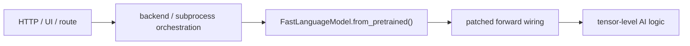
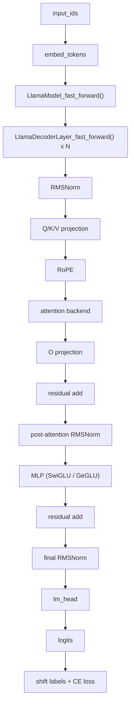

# Unsloth AI Core Logic Deep Dive

## 범위

이 문서는 `test/unsloth-main/unsloth-main` 기준으로, HTTP route나 UI가 아니라 실제 `AI logic`가 시작되는 내부 tensor 경로를 정리한다.

- 기준 모델: text LLM, 특히 `Llama` 계열 fast path
- 대상 파일: `unsloth/models/llama.py`, `unsloth/kernels/*.py`, `unsloth/utils/attention_dispatch.py`, `unsloth/utils/packing.py`
- 목적: "Unsloth가 어디서 빨라지는가"를 함수 수준이 아니라 tensor 흐름 수준에서 이해하기

쉽게 말하면 이 문서는 "버튼을 누르면 어떤 API가 불린다"가 아니라,  
"토큰이 embedding으로 바뀐 다음 어떤 수식과 kernel을 거쳐 logits가 되는가"를 설명하는 문서다.

## AI 로직은 어디서부터 시작되는가

아주 거칠게 나누면 경계는 이렇다.

이 기준에서 보면:

- `route`, `orchestrator`, `worker`는 orchestration
- `from_pretrained()`는 준비 단계
- 실제 AI logic는 `patched forward`가 tensor를 직접 바꾸기 시작하는 순간부터다

text LLM 기준으로는 보통 아래 지점부터가 핵심이다.

- `LlamaModel_fast_forward()`
- `LlamaDecoderLayer_fast_forward()`
- `LlamaAttention_fast_forward()`
- `fast_rope_embedding()`
- `run_attention()`
- `fast_swiglu_inference()` 또는 LoRA MLP 경로
- `CausalLM_fast_forward()`
- `fast_cross_entropy_loss()` 또는 `unsloth_fused_ce_loss()`

## 전체 tensor 흐름

이 그림에서 중요한 점은 Unsloth가 새로운 Transformer 구조를 만든 것이 아니라,  
기존 구조의 거의 모든 hot path를 더 빠른 함수로 바꿔 끼웠다는 점이다.

## 1. `LlamaModel_fast_forward()`: 모델 본체의 중심축

`unsloth/models/llama.py`의 `LlamaModel_fast_forward()`는 text 모델의 중심 루프다.

이 함수가 하는 일은 크게 다섯 단계다.

1. `input_ids` 또는 `inputs_embeds`를 받는다.
2. 길이를 `max_seq_length` 기준으로 정리한다.
3. `embed_tokens`로 토큰을 embedding으로 바꾼다.
4. decoder layer를 순서대로 돈다.
5. 마지막 `RMSNorm`을 적용해 hidden state를 돌려준다.

### 여기서 중요한 세부점

- packed batch가 아니면 `max_seq_length`를 넘어가는 입력을 잘라낸다.
- `Gemma` 계열은 embedding scale을 따로 곱한다.
- training 중이면 보통 `attention_mask`를 끄고 causal path를 단순화한다.
- `gradient_checkpointing`이 켜져 있으면 layer loop가 `torch.utils.checkpoint.checkpoint()` 경로를 탄다.

즉 이 함수는 "모델을 한 층씩 돈다"는 단순한 루프처럼 보이지만,  
실제로는 packed training, sliding window, Gemma 계열 차이, checkpointing까지 모두 여기서 조정된다.

## 2. `LlamaDecoderLayer_fast_forward()`: 한 층의 실제 계산

decoder layer 하나는 구조적으로 아주 익숙하다.

1. pre-attention `RMSNorm`
2. self-attention
3. residual add
4. post-attention `RMSNorm`
5. MLP
6. residual add

하지만 Unsloth는 training과 inference를 같은 구현으로 밀어붙이지 않는다.

### 학습 경로

학습 쪽은 대체로 아래 경로다.

- `fast_rms_layernorm(...)`
- `self.self_attn(...)`
- `self.mlp(...)`

즉 custom kernel은 쓰지만, sequence 전체를 한 번에 처리하는 일반 forward 경로에 가깝다.

### 추론 경로

`use_cache`와 `_flag_for_generation`이 켜져 있으면 더 빠른 decode path로 바뀐다.

- `fast_rms_layernorm_inference(...)`
- `self.self_attn(...)` with KV cache
- `fast_swiglu_inference(...)`

쉽게 말하면 학습은 "긴 문장을 여러 토큰 동시에 계산"하고,  
추론은 "대부분 `q_len = 1`인 다음 토큰 생성"이므로 연산 모양이 다르다.  
Unsloth는 이 둘을 같은 코드로 억지로 통합하지 않고 분리 최적화한다.

## 3. Attention: QKV부터 backend dispatch까지

attention 핵심은 `LlamaAttention_fast_forward()`다.

이 함수는 크게 아래 순서로 움직인다.

1. `apply_qkv()`로 Q, K, V를 만든다.
2. `fast_rope_embedding()`으로 Q, K에 `RoPE`를 적용한다.
3. past KV가 있으면 이어 붙인다.
4. `select_attention_backend()`로 backend를 고른다.
5. `run_attention()`을 호출한다.
6. 결과를 `apply_o()`로 출력 projection한다.

### `apply_qkv()`가 중요한 이유

이 함수는 그냥 `q_proj`, `k_proj`, `v_proj`를 따로 부르는 수준이 아니다.

- 기본 상태에서는 일반 linear projection처럼 동작한다.
- LoRA patch가 걸리면 `apply_lora_qkv()`로 바뀐다.

즉 attention의 첫 단계부터 이미 "기본 linear인가, LoRA가 합쳐진 custom autograd path인가"가 갈린다.

### `run_attention()`이 하는 일

`unsloth/utils/attention_dispatch.py`의 `run_attention()`은 attention backend를 실제로 실행한다.

우선순위는 대략 이렇다.

1. `FlashAttention`
2. `xFormers`
3. PyTorch `SDPA`

packed metadata가 있으면 `flash_varlen`이나 block-diagonal mask를 쓰고,  
padding mask가 있으면 더 안정적인 `SDPA`로 떨어진다.

쉽게 말하면 Unsloth attention의 핵심 아이디어는 "하나의 attention 구현을 고집하지 않고, 현재 입력 모양에 가장 유리한 backend를 dispatch"하는 것이다.

## 4. RoPE: 위치 정보를 넣는 진짜 계산

`RoPE`는 `fast_rope_embedding()`과 `Fast_RoPE_Embedding` Triton kernel에 들어 있다.

수학적으로는 잘 알려진 형태다.

- 앞 절반과 뒤 절반을 서로 회전시킨다
- `Q * cos + rotate_half(Q) * sin`
- `K * cos + rotate_half(K) * sin`

코드에서 중요한 점은 두 가지다.

1. `cos`, `sin` cache를 GPU별로 유지한다.
2. Triton kernel에서 Q, K를 inplace에 가깝게 처리한다.

즉 RoPE는 "토큰 위치를 반영하는 작은 보정"처럼 보이지만,  
전체 attention 앞단에서 모든 토큰과 head에 적용되므로 아주 뜨거운 hot path다.  
그래서 Unsloth는 Python 연산이 아니라 별도 kernel로 빼서 처리한다.

## 5. Inference decode path: 왜 `q_len = 1` 최적화가 큰가

`LlamaAttention_fast_forward_inference()`는 decode 전용 최적화 함수다.

핵심 아이디어는 간단하다.

- 이미 계산한 이전 토큰의 K, V는 다시 만들 필요가 없다.
- 새 토큰 하나에 대한 Q, K, V만 만들고 KV cache에 붙이면 된다.

문서 주석에도 이 생각이 잘 드러난다.

- 이전 K, V는 cache로 보관
- 현재 query row만 계산
- 마지막 row attention만 새로 계산

### 여기서 쓰는 최적화 포인트

- `paged_attention` 버퍼로 KV cache를 관리
- `fast_linear_forward()`로 `q_proj`, `k_proj`, `v_proj`, `o_proj`를 빠르게 계산
- `q_len == 1`이면 `matmul` 대신 `gemv` 스타일 경로를 많이 탄다
- RoPE cache도 필요한 길이만 확장한다

쉽게 말하면 긴 prompt를 한 번 읽는 `prefill` 이후에는,  
추론 대부분이 "길이 1짜리 행렬 곱을 얼마나 싸게 처리하느냐" 문제로 바뀐다.  
Unsloth는 이 지점을 아주 노골적으로 최적화한다.

## 6. `fast_linear_forward()`와 `matmul_lora()`: linear의 공통 hot path

`unsloth/kernels/utils.py`의 `fast_linear_forward()`는 추론에서 자주 쓰이는 핵심 함수다.

이 함수는 상황에 따라 경로를 바꾼다.

- 일반 FP16/BF16 weight면 바로 `matmul`
- `4bit` weight면 `fast_dequantize()` 또는 `fast_gemv()` 사용
- `fp8`면 `fp8_linear()` 사용
- LoRA가 붙어 있으면 base output에 LoRA update를 추가

즉 이 함수는 단순한 `Linear.forward()` 대체품이 아니라,  
"현재 weight format과 batch/sequence shape에 맞는 가장 싼 경로를 고르는 dispatcher"다.

### `q_len == 1`일 때 특별히 빨라지는 이유

일반 matrix multiply는 `(batch * seq_len, hidden)` 크기에서 이득이 난다.  
하지만 decode에서는 대부분 `seq_len = 1`이다.

그래서 Unsloth는 이때:

- `fast_gemv()`를 우선 사용
- 필요할 때만 dequantize
- LoRA update도 `mv` 또는 작은 `mm`로 따로 더함

즉 "한 토큰 생성" 상황에 맞는 연산 모양으로 경로를 바꿔준다.

## 7. MLP: SwiGLU / GeGLU와 custom autograd

MLP 쪽 핵심은 `unsloth/kernels/fast_lora.py`의 `LoRA_MLP`와 `apply_lora_mlp_*()`다.

SwiGLU 기준 흐름은 대략 이렇다.

1. `gate = X @ G`
2. `up = X @ U`
3. `silu(gate) * up`
4. `down = (...) @ W`

LoRA가 붙으면 각 weight가 사실상 이렇게 바뀐다.

- `W = W_base + A @ B`

즉 MLP 전체가 아래 형태로 바뀐다.

- gate projection도 LoRA
- up projection도 LoRA
- down projection도 LoRA

### 왜 custom autograd를 쓰는가

보통 PEFT는 base linear와 LoRA linear를 따로 계산해서 더한다.  
Unsloth는 이걸 `LoRA_MLP` 하나의 autograd 함수 안에서 묶는다.

장점은 다음과 같다.

- 중간 activation 저장을 더 아끼기 쉽다
- backward 때 필요한 값만 직접 관리할 수 있다
- quantized base weight와 LoRA update를 한 흐름 안에서 처리할 수 있다

쉽게 말하면 "PyTorch가 일반적으로 하게 두는 방식"보다 더 낮은 수준에서 메모리와 backward를 직접 통제한다.

## 8. QKV와 O projection의 LoRA backward

attention 쪽 LoRA 핵심은 `LoRA_QKV`와 `LoRA_W`다.

### `LoRA_QKV`

이 함수는 Q, K, V 세 projection을 한꺼번에 다룬다.

- forward에서 `Q`, `K`, `V`를 동시에 계산
- backward에서 `dQ`, `dK`, `dV`를 받아 한 번에 `dX`와 LoRA gradient를 계산

이 구조의 이점은 분명하다.

- Q, K, V를 따로따로 처리하는 것보다 메모리 이동이 줄어든다
- shared input `X`를 여러 번 다시 읽는 비용을 줄일 수 있다

### `LoRA_W`

이 함수는 주로 `o_proj` 같은 단일 projection용이다.

- `X @ W_base`
- `+ X @ A @ B`

forward는 단순해 보이지만, backward에서 `dA`, `dB`, `dX`를 직접 계산한다.

즉 Unsloth LoRA의 핵심은 "adapter를 붙였다"가 아니라,  
"adapter가 붙은 linear를 autograd 함수 수준에서 fused 계산으로 바꿨다"에 있다.

## 9. Loss: logits를 다 만들지 않으려는 설계

`CausalLM_fast_forward()`의 뒷부분을 보면 Unsloth는 loss 계산에서도 메모리를 아끼려 한다.

경로는 크게 두 가지다.

### 일반 경로

- `lm_head(hidden_states)`로 logits 생성
- `shift_labels` 생성
- `fast_cross_entropy_loss()` 호출

### 더 공격적인 경로

조건이 맞으면 `unsloth_fused_ce_loss()`를 사용한다.

이 함수는 `hidden_states -> lm_head -> cross entropy`를 더 fused된 형태로 처리해서  
중간 huge logits tensor를 덜 만들려는 방향이다.

쉽게 말하면 vocabulary가 큰 LLM에서는 `logits` 자체가 메모리 괴물이다.  
Unsloth는 "full logits를 꼭 만들어야 하나?"를 계속 의심하는 구조다.

### packed sequence 경계 처리

`mask_packed_sequence_boundaries()`도 중요하다.

packed batch에서는 여러 sample이 한 sequence 안에 이어 붙기 때문에,  
sample 경계에서 다음 토큰 예측을 해버리면 잘못된 loss가 생긴다.

그래서 Unsloth는 각 packed sample의 마지막 위치를 `-100`으로 마스킹해서  
경계 prediction이 loss에 들어가지 않게 막는다.

## 10. RMSNorm: 작아 보여도 모든 층에서 반복되는 병목

`fast_rms_layernorm()`은 `unsloth/kernels/rms_layernorm.py`에 있다.

이 함수는 `Fast_RMS_Layernorm.apply()`를 타는 custom path다.

중요한 이유는 단순하다.

- decoder layer마다 attention 전후로 반복된다
- final norm에서도 한 번 더 돈다

즉 attention처럼 화려해 보이진 않아도, 전체 모델에서는 호출 횟수가 엄청 많다.  
그래서 Unsloth는 이것도 별도 kernel로 치환한다.

## 11. 학습 최적화: 계산 말고 배치 구조도 바꾼다

Unsloth의 학습 최적화는 kernel만이 아니다.

### smart gradient checkpointing

`apply_unsloth_gradient_checkpointing()`은 sequence 길이에 따라 전략을 바꾼다.

- `max_seq_length < 512`면 일반 checkpointing
- 그 이상이면 `"unsloth"` smart checkpointing patch 사용

즉 checkpointing도 무조건 켜는 게 아니라,  
"짧은 sequence에서는 offloading overhead가 손해"라는 판단을 코드에 넣어 둔 것이다.

### packed / padding-free

`unsloth/utils/packing.py`는 packed batch용 metadata와 mask를 만든다.

핵심은 아래다.

- `packed_seq_lengths`
- `cu_seqlens`
- `build_sdpa_packed_attention_mask()`
- `build_xformers_block_causal_mask()`
- `mask_packed_sequence_boundaries()`

즉 Unsloth는 "padding을 줄이자"에서 멈추지 않고,  
attention mask와 loss mask까지 packed batch 기준으로 다시 설계한다.

## 12. 어디가 가장 Unsloth다운가

Unsloth다운 지점은 세 군데다.

### 1. patch-first 설계

모델을 새로 정의하기보다 Hugging Face 내부 클래스를 직접 갈아 끼운다.

### 2. shape-aware fast path

특히 `q_len = 1` decode, `4bit`, `fp8`, packed batch 같은 실제 사용 패턴에 맞춰  
경로를 강하게 분기한다.

### 3. backward까지 직접 통제

LoRA를 그냥 붙이는 게 아니라 `LoRA_QKV`, `LoRA_MLP`, `LoRA_W`로  
forward/backward를 직접 계산한다.

쉽게 말하면 Unsloth는 "모델 구조를 바꾼 라이브러리"보다  
"Transformer hot path를 아주 세게 재배선한 performance engineering 프로젝트"에 더 가깝다.

## 읽는 순서

이 주제를 더 깊게 읽으려면 아래 순서가 좋다.

1. `unsloth/models/llama.py`
2. `unsloth/utils/attention_dispatch.py`
3. `unsloth/kernels/utils.py`
4. `unsloth/kernels/rope_embedding.py`
5. `unsloth/kernels/fast_lora.py`
6. `unsloth/kernels/rms_layernorm.py`
7. `unsloth/kernels/cross_entropy_loss.py`
8. `unsloth/utils/packing.py`

## 핵심 요약

- AI logic는 `model.generate()`가 아니라 `patched forward`에서 tensor가 움직이기 시작하는 순간부터다.
- attention 핵심은 `QKV -> RoPE -> backend dispatch -> O projection`이다.
- 추론 성능 핵심은 `q_len = 1` decode path와 KV cache 최적화다.
- 학습 성능 핵심은 LoRA custom autograd와 fused loss, packed batch 처리다.
- Unsloth의 본질은 "새 모델"이 아니라 "기존 Transformer 실행 경로의 강한 재배선"이다.

