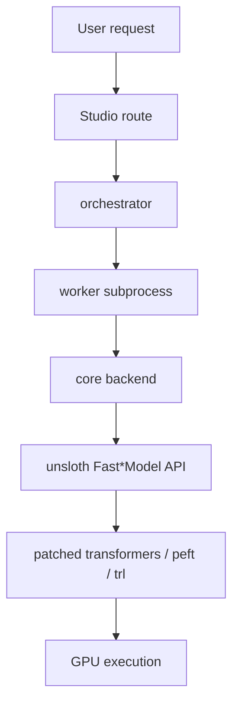
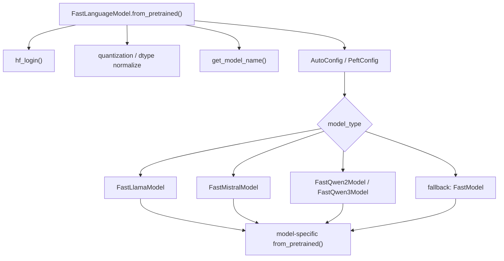
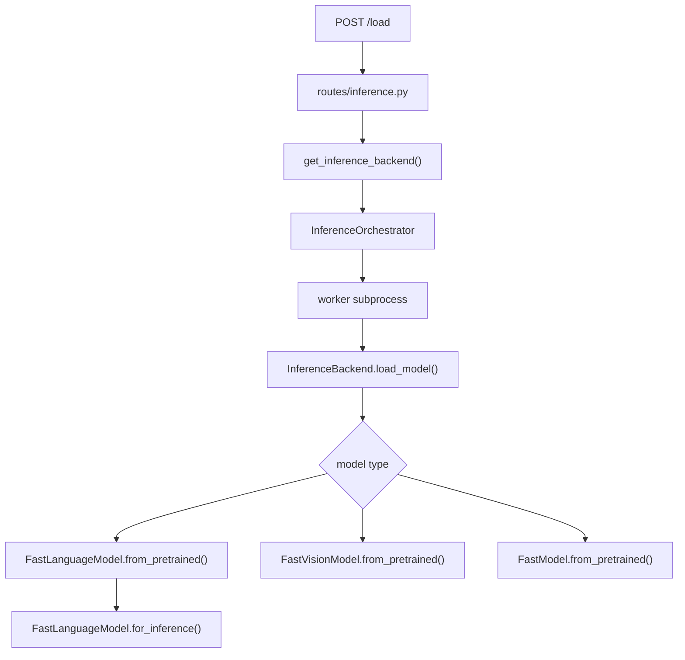
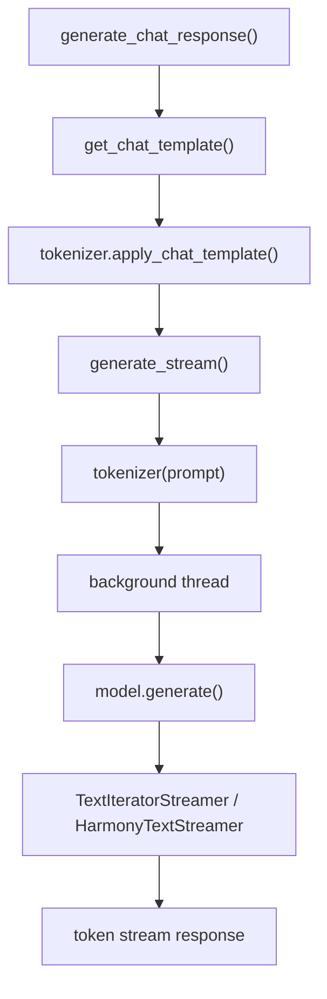
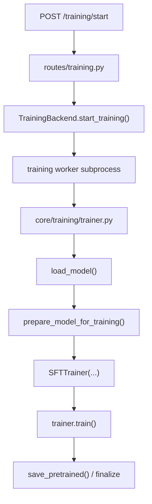

# Unsloth 모델 로딩, 추론, 학습 핵심 흐름

## 범위

이 문서는 `test/unsloth-main.zip`을 풀어 나온 `test/unsloth-main/unsloth-main` 기준으로 정리했다.

- 대상 초점: `model loading`, `inference`, `training`
- 기본 기준: text LLM 경로
- 보조 비교: vision/audio 모델은 어디서 갈라지는지만 짧게 설명
- UI 기준: `Unsloth Studio backend`
- 라이브러리 기준: `unsloth/` 패키지의 실제 fast path

쉽게 말하면 Unsloth는 "새 프레임워크를 처음부터 다시 만든 것"이라기보다, Hugging Face `transformers`, `peft`, `trl` 위에 아주 공격적인 `patch layer`를 올려서 더 빠르게 돌리는 구조에 가깝다.  
그래서 핵심을 읽을 때는 "새 알고리즘이 어디 있나?"보다 "어느 시점에 기존 함수를 바꿔 끼우는가?"를 보는 편이 더 잘 보인다.

## 한눈에 보기

1. `import unsloth`가 먼저 실행되면 import 단계에서 여러 라이브러리를 미리 고친다.
2. `FastLanguageModel.from_pretrained()`가 모델 종류를 감지하고, 적절한 fast model class로 분기한다.
3. model class는 Hugging Face의 `forward`, `generate`, `Trainer` 루프 일부를 patch해서 fast path를 만든다.
4. 추론 때는 `for_inference()`로 모드를 바꾸고, `generate()`는 사실상 `unsloth_fast_generate()`를 타게 된다.
5. 학습 때는 `get_peft_model()`로 LoRA adapter를 붙이거나, `full finetuning`이면 전체 파라미터를 학습 모드로 바꾼다.
6. Studio는 이 라이브러리 위에 `route -> subprocess orchestrator -> worker -> core backend` 껍질을 씌운 구조다.

## 전체 구조

쉽게 말하면 Studio는 교통정리 담당이고, 실제 성능 최적화는 대부분 `unsloth/` 안에서 일어난다.

## 1. 로딩: Unsloth가 진짜로 시작되는 지점

### import 순서가 중요한 이유

가장 먼저 봐야 할 파일은 `unsloth/__init__.py`다.

이 파일은 단순한 package init가 아니다.

- `transformers`, `trl`, `peft`가 먼저 import됐는지 검사한다.
- 너무 먼저 import됐다면 "Unsloth를 먼저 import하라"는 warning을 띄운다.
- `import_fixes.py`에 있는 patch들을 먼저 실행한다.
- `unsloth_zoo`, `torch`, `triton`, `bitsandbytes` 같은 기반 구성요소를 확인한다.

쉽게 말하면 Unsloth는 "나중에 끼어드는 plugin"이 아니라 "맨 앞에서 환경을 세팅하는 bootstrapper"다.  
그래서 import 순서가 꼬이면 fast path 일부가 아예 적용되지 않을 수 있다.

### 실제 모델 로딩 입구

text 모델의 대표 입구는 `unsloth/models/loader.py`의 `FastLanguageModel.from_pretrained()`다.

이 함수는 겉으로는 Hugging Face의 `from_pretrained()`처럼 보이지만, 안에서는 더 많은 결정을 한다.

- `quantization_config`를 읽어 `4bit`, `8bit`, `fp8` 여부를 다시 정리한다.
- distributed 환경이면 rank별 `device_map`을 다시 맞춘다.
- `get_model_name()`으로 Unsloth용 매핑 모델 이름을 찾는다.
- `AutoConfig`와 `PeftConfig`를 둘 다 읽어서 base model인지 adapter repo인지 판별한다.
- 감지된 `model_type`에 따라 `FastLlamaModel`, `FastMistralModel`, `FastQwen2Model`, `FastQwen3Model` 같은 dispatch class를 고른다.

### 왜 `FastLlamaModel`이 중요한가

text 계열 핵심은 `unsloth/models/llama.py`의 `FastLlamaModel.from_pretrained()`다.  
이 함수가 하는 일은 크게 네 덩어리다.

1. `pre_patch()`로 Hugging Face Llama 계열 `forward`를 fast 버전으로 교체한다.
2. `AutoModelForCausalLM.from_pretrained()`로 실제 모델 가중치를 읽는다.
3. tokenizer를 보정하고 저장 함수, `Trainer` 루프, gradient accumulation 관련 patch를 건다.
4. `for_inference`, `for_training`, `generate` 같은 mode-switch 함수를 모델 객체에 붙인다.

특히 `pre_patch()`는 아래처럼 Hugging Face 내부 클래스를 직접 바꾼다.

- `LlamaAttention.forward`
- `LlamaDecoderLayer.forward`
- `LlamaModel.forward`
- `LlamaForCausalLM.forward`
- `fix_prepare_inputs_for_generation()`

쉽게 말하면 Unsloth는 "모델을 새로 만든다"기보다 "기존 Llama 클래스의 심장을 갈아 끼운다"고 보는 게 맞다.

### 로딩 단계에서 이미 학습/추론 스위치가 심어진다

`FastLlamaModel.from_pretrained()`가 끝날 때 모델에는 아래 함수가 붙는다.

- `model.for_inference`
- `model.for_training`
- `model.generate = unsloth_fast_generate`

즉, 로딩이 끝났다는 말은 단순히 가중치가 메모리에 올라왔다는 뜻이 아니다.  
이미 그 시점에 "이 모델을 추론 모드와 학습 모드로 어떻게 바꿀지"까지 wiring이 끝난 상태다.

## 2. 추론: prompt가 실제 생성으로 이어지는 경로

### Studio 기준 요청 흐름

Studio에서는 `studio/backend/routes/inference.py`가 HTTP 요청을 받는다.

모델 로딩은 대략 이렇게 흘러간다.

쉽게 말하면 route는 "요청 접수", orchestrator는 "별도 프로세스 관리", backend는 "실제 모델 객체 제어"를 맡는다.

### 왜 subprocess를 쓰는가

`studio/backend/core/inference/orchestrator.py` 설명이 꽤 직접적이다.

- 무거운 ML 작업을 별도 subprocess에서 돌린다.
- 모델에 따라 필요한 `transformers` major version이 다를 수 있어서, 프로세스를 갈아끼우는 방식으로 충돌을 피한다.

즉 같은 Python 프로세스 안에서 버전을 억지로 섞는 대신, "프로세스를 새로 띄워서 환경 충돌을 격리"하는 구조다.

### 실제 텍스트 생성 경로

텍스트 생성 핵심은 `studio/backend/core/inference/inference.py`다.

1. `generate_chat_response()`가 메시지를 받는다.
2. 필요하면 `get_chat_template()`로 tokenizer template를 교정한다.
3. `tokenizer.apply_chat_template()`로 실제 prompt string을 만든다.
4. `generate_stream()`이 tokenizer로 `input_ids`를 만들고 background thread에서 `model.generate()`를 실행한다.
5. streamer가 토큰을 조금씩 읽어서 SSE 같은 스트림 응답으로 보낸다.

### `model.generate()`를 호출해도 실제로는 Unsloth 경로를 탄다

핵심은 `unsloth/models/llama.py`의 `unsloth_fast_generate()`다.

이 함수는 generation 직전에 다음 일을 한다.

- `FastLlamaModel.for_inference(self)` 호출
- `BatchEncoding` 형태 입력을 풀어서 호환성 보정
- `input_ids + max_new_tokens`가 `max_position_embeddings`를 넘는지 검사
- `cache_implementation = "dynamic"` 설정
- mixed precision `autocast` 적용
- 마지막에 원래 Hugging Face generate 함수인 `self._old_generate()` 호출

즉 겉으로는 `model.generate()`지만, 실제로는 "추론용 세팅을 미리 건 fast wrapper"를 먼저 통과한다.

### `for_inference()`가 실제로 바꾸는 것

`FastLlamaModel.for_inference()`는 꽤 단순하지만 중요하다.

- `gradient_checkpointing = False`
- `training = False`
- tokenizer `padding_side = "left"`
- `_flag_for_generation = True`
- `model.eval()`

쉽게 말하면 학습 때 쓰던 메모리 절약 장치와 padding 방식을 끄고, 생성에 맞는 상태로 모델을 다시 맞춘다.

## 3. 학습: LoRA와 Trainer가 붙는 방식

### Studio 기준 학습 흐름

학습 쪽은 `studio/backend/routes/training.py`에서 시작한다.

추론과 마찬가지로 학습도 subprocess를 쓴다.  
이유도 거의 같다. 모델별 환경 충돌과 VRAM 충돌을 분리하기 위해서다.

### 모델 로딩 뒤 학습 준비

`studio/backend/core/training/trainer.py`의 `load_model()`은 모델 종류에 따라 아래로 갈라진다.

- text: `FastLanguageModel.from_pretrained()`
- vision: `FastVisionModel.from_pretrained()`
- 일부 audio / audio VLM: `FastModel.from_pretrained()`

그리고 `full_finetuning=True`이면 바로 `self.model.for_training()`을 호출한다.

쉽게 말하면 full fine-tuning은 adapter를 붙이지 않고 "원본 모델 전체를 학습 상태로 여는 모드"다.

### LoRA를 붙이는 핵심

그 다음 `prepare_model_for_training()`이 실제 학습 방식을 결정한다.

- `use_lora=False`면 LoRA 없이 전체 학습
- `use_lora=True`면 `get_peft_model()` 계열 함수 호출

text 모델 기준 핵심은 이 줄이다.

- `FastLanguageModel.get_peft_model(...)`

이 함수는 `unsloth/models/llama.py`에 있고, 내부에서 아래를 처리한다.

- 기본 `target_modules` 보정
- `gradient_checkpointing` 값을 `True/False/"unsloth"`로 정규화
- 기존 PEFT adapter가 이미 있으면 설정이 같은지 비교
- LoRA config를 구성하고 adapter를 붙인다
- 필요하면 `patch_peft_model()`로 QKV, O projection, MLP fast path를 다시 연결한다

### `patch_peft_model()`이 중요한 이유

이 함수는 단순히 LoRA를 붙였다는 표시만 하는 게 아니다.

- `prepare_model_for_kbit_training()` 호출
- 모델 타입별 MLP 적용 함수를 고름
- 각 layer를 돌면서 `q_proj`, `k_proj`, `v_proj`, `o_proj`, `gate_proj`, `up_proj`, `down_proj`에 fast LoRA 경로를 다시 꽂는다
- 마지막에 `for_training`, `for_inference`를 다시 모델에 붙인다

쉽게 말하면 LoRA를 붙인 뒤에도 "빠른 forward 경로"를 다시 복구하는 단계다.  
이걸 하지 않으면 그냥 PEFT만 쓴 평범한 경로로 돌아갈 가능성이 커진다.

## 4. Trainer 쪽에서 실제로 학습이 도는 방식

학습용 trainer는 두 층으로 나뉜다.

### 라이브러리 층

`unsloth/trainer.py`에는 `UnslothTrainingArguments`, `UnslothTrainer`, `unsloth_train()`이 있다.

여기서는 주로 다음을 추가한다.

- `embedding_learning_rate` 같은 추가 인자
- `QGaloreConfig`
- optimizer 생성 커스터마이즈
- padding-free / packing 자동 설정

즉 "기본 Hugging Face trainer를 완전히 버린다"보다 "필요한 곳만 확장한다"에 가깝다.

### Studio 학습 층

Studio backend의 실제 기본 SFT 경로는 `studio/backend/core/training/trainer.py`에서 `trl.SFTTrainer`를 직접 만든다.

text 모델이면 대략 이렇게 간다.

1. dataset을 최종 `text` 컬럼 기준으로 준비한다.
2. `SFTConfig`를 만든다.
3. text-only면 `dataset_text_field = "text"`를 사용한다.
4. vision/audio VLM이면 `skip_prepare_dataset = True`와 custom `data_collator`를 쓴다.
5. `self.trainer = SFTTrainer(...)`
6. 필요하면 `train_on_responses_only()`를 한 번 더 감싼다.
7. `self.trainer.train()`

여기서 text-only와 VLM이 갈리는 핵심은 dataset 처리다.

- text는 tokenizer가 `text -> input_ids`를 직접 준비
- VLM은 sample 구조가 더 복잡해서 dataset 전처리를 skip하고 collator 쪽으로 넘김

## 5. 추론 모드와 학습 모드를 오가는 스위치

Unsloth를 읽을 때 자주 보이는 것이 `for_inference()`와 `for_training()`이다.

이 둘은 생각보다 중요하다.

### `for_inference()`

- `gradient_checkpointing` 끔
- `training=False`
- tokenizer left padding
- `_flag_for_generation` 설정

### `for_training()`

- `gradient_checkpointing` 켬
- `training=True`
- tokenizer right padding
- fast inference용 임시 LoRA 상태 제거

쉽게 말하면 Unsloth는 "하나의 모델 객체를 두 모드 사이에서 재사용"하는데,  
그때 필요한 토글을 이 함수 두 개가 담당한다.

## 6. text, vision, audio가 갈라지는 지점

공통 출발점은 비슷하지만, 실제 분기점은 로딩 함수 이름에서 바로 보인다.

- text: `FastLanguageModel`
- vision: `FastVisionModel`
- 일반화 경로 또는 일부 audio: `FastModel`
- embedding: `FastSentenceTransformer`

즉 Unsloth는 "모든 모델을 한 클래스로 처리"하지 않는다.  
대신 비슷한 public API를 유지하면서 내부 구현을 모델 종류별로 나눠 둔다.

이 구조 덕분에 Studio backend도 분기만 다르게 하고, 바깥 사용법은 꽤 통일된 형태로 유지할 수 있다.

## 핵심 포인트 정리

- Unsloth의 시작점은 모델 호출이 아니라 `import unsloth`다.
- 로딩의 핵심은 `FastLanguageModel.from_pretrained()`와 model family dispatch다.
- 추론의 핵심은 `model.generate()` 앞에 붙는 `unsloth_fast_generate()` wrapper다.
- 학습의 핵심은 `get_peft_model()`과 `patch_peft_model()`로 LoRA fast path를 다시 연결하는 과정이다.
- Studio는 자체 UI 서버이지만, 실제 핵심 성능 로직은 `unsloth/` 패키지 안에 있다.
- subprocess 구조는 단순한 우회책이 아니라, 버전 충돌과 VRAM 충돌을 분리하기 위한 설계다.

## 읽는 순서

- `unsloth/__init__.py`: import 시점 patch와 환경 점검
- `unsloth/models/loader.py`: model type 감지와 dispatch
- `unsloth/models/loader_utils.py`: model name mapper, distributed device map, fp8 보조 로직
- `unsloth/models/llama.py`: text LLM fast path, `generate`, `for_inference`, `for_training`, LoRA patch
- `unsloth/trainer.py`: training argument / optimizer 확장
- `studio/backend/routes/inference.py`: 추론 HTTP 진입점
- `studio/backend/core/inference/orchestrator.py`: 추론 subprocess 관리
- `studio/backend/core/inference/inference.py`: prompt formatting과 실제 generate 호출
- `studio/backend/routes/training.py`: 학습 HTTP 진입점
- `studio/backend/core/training/trainer.py`: 모델 준비, LoRA 적용, `SFTTrainer` 생성, 학습 실행
