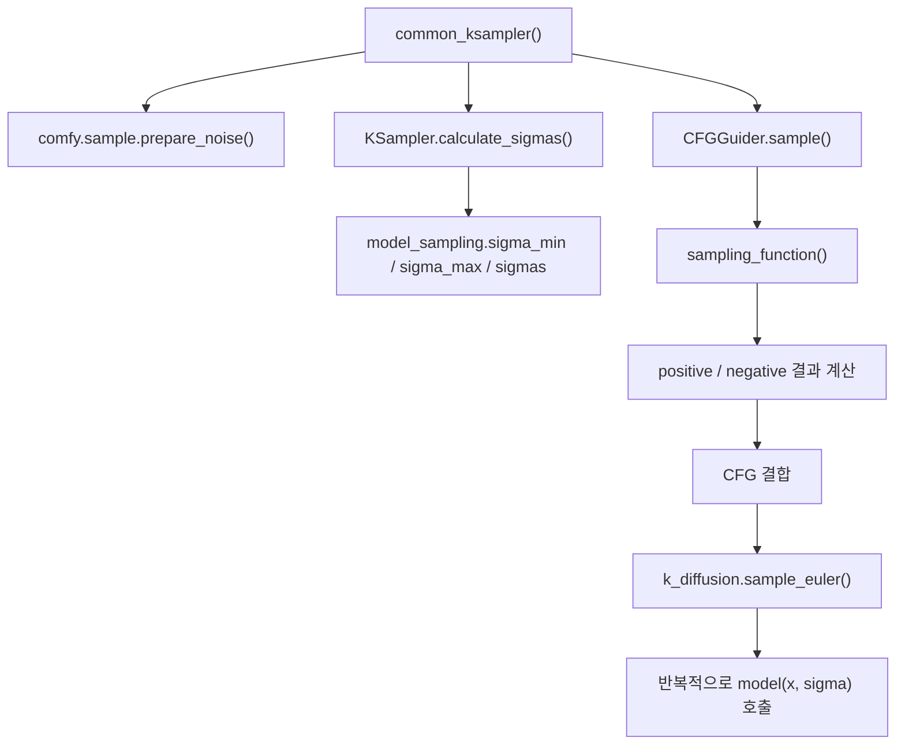

# ComfyUI Euler 샘플링 비교, SDXL와 Anima

이 문서는 로컬 `ComfyUI` 추적 버전 `0.18.2` 기준으로, 같은 `sample_euler()` 함수가 SDXL와 Anima에서 어떻게 다르게 읽혀야 하는지 정리한다.

핵심 질문은 하나다.

겉으로는 같은 `Euler`인데, 왜 SDXL와 Anima는 전혀 다른 모델처럼 움직이는가?

## 공통 샘플링 진입점

샘플링의 공통 입구는 `nodes.py`의 `common_ksampler()`와 `KSampler.sample()`이다.



즉 `common_ksampler()`는 sampler로 들어가는 준비를 하고, 실제 한 step 수학은 `sample_euler()` 쪽에서 일어난다.

## Euler의 공통 껍데기

`sample_euler()`의 핵심은 아래 두 줄로 요약된다.

```python
d = (x - denoised) / sigma
x_next = x + d * (sigma_next - sigma)
```

쉽게 말하면,

- 모델 출력으로부터 `denoised`를 만들고
- 그것을 도함수처럼 바꿔
- 다음 좌표까지 한 칸 전진한다

는 뜻이다.

문제는 여기서 `denoised`와 `sigma`의 의미가 모델마다 다르다는 점이다.

## SDXL에서 Euler가 움직이는 방식

SDXL 쪽 핵심 조합은 다음과 같다.

- `ModelSamplingDiscrete`
- `EPS` 또는 `V_PREDICTION`
- U-Net 본체

### 1. sigma 시간표

SDXL는 beta schedule에서 나온 discrete sigma를 쓴다.

$$
\sigma = \sqrt{\frac{1-\bar\alpha}{\bar\alpha}}
$$

즉 diffusion 문헌에서 보던 noise level 표를 그대로 따라간다.

### 2. 모델 입력 정규화

입력 latent는 보통 현재 sigma에 맞춰 정규화된다.

쉽게 말하면 noisy latent를 그대로 본체에 넣지 않고, 현재 noise level에 맞는 scale로 바꿔 넣는다.

### 3. 모델 출력 해석

SDXL는 `EPS`일 수도 있고 `V_PREDICTION`일 수도 있다.

즉 같은 Euler라도 먼저 "이 출력이 노이즈 예측인가, v 예측인가"를 해석해야 한다.

따라서 SDXL에서 중요한 것은 Euler 공식 자체보다, `denoised`를 만드는 앞단 해석이다.

### 4. 조건 경로

모델 본체로 들어갈 때는 text context와 ADM 조건이 함께 붙는다.

즉 SDXL Euler step은 "정규화된 latent + diffusion sigma + text/size 조건" 위에서 움직이는 step이라고 보면 된다.

## Anima에서 Euler가 움직이는 방식

Anima 쪽 핵심 조합은 다음과 같다.

- `ModelSamplingDiscreteFlow`
- `CONST`
- DiT 본체

### 1. sigma 시간표

Anima는 diffusion beta schedule이 아니라 `time_snr_shift()` 계열 함수를 통해 sigma를 만든다.

즉 같은 `sigma`라는 이름을 써도 시간표의 의미가 다르다.

### 2. 입력 정규화

Anima 쪽은 diffusion처럼 강한 입력 정규화보다, flow 계열 해석에 맞는 경로를 따른다.

즉 "현재 noisy latent를 얼마만큼 정규화해 넣는가"가 SDXL와 다르다.

### 3. 초기 상태 해석

초기 상태도 노이즈를 단순 가산하는 감각보다, latent와 noise를 비율로 섞는 쪽에 가깝다.

즉 시작점 해석부터 transport 쪽 느낌이 더 강하다.

### 4. 모델 출력 해석

겉으로는 같은 `denoised = x - sigma * model_output` 비슷한 식이 보여도, 여기서 `model_output`의 의미가 SDXL와 다르다.

쉽게 말하면 SDXL는 "얼마나 노이즈를 빼야 하는가" 쪽이고, Anima는 "현재 상태를 어느 방향으로 이동시킬 것인가" 쪽에 더 가깝다.

### 5. 조건 경로

Anima는 Qwen/T5 계열 표현과 adapter를 통해 만든 context를 본체에 넣는다.

즉 Euler step에 들어가는 모델 함수 자체가 SDXL와 다른 종류의 본체다.

## 왜 같은 Euler인데 결과가 다르게 움직이는가

핵심은 `Euler`가 적분기일 뿐이라는 점이다.

달라지는 것은 아래다.

- 시간좌표의 의미
- 모델 입력 정규화
- 모델 출력의 의미
- 텍스트 조건 경로
- 본체 구조

즉 같은 `sample_euler()`를 쓴다고 해서 같은 dynamics를 푸는 것이 아니다.

## 비교 표

| 항목 | SDXL | Anima |
| --- | --- | --- |
| 시간좌표 | diffusion sigma | flow sigma |
| 본체 | U-Net | DiT |
| 출력 해석 | `EPS` 또는 `V_PREDICTION` | flow 계열 출력 |
| 시작 상태 | diffusion식 noisy latent | noise-latent 혼합 |
| 텍스트 조건 | CLIP + ADM | Qwen/T5 + adapter |

## 읽는 순서

아래 순서로 보면 이해가 빠르다.

1. `comfy/model_sampling.py`
2. `comfy/samplers.py`
3. `comfy/k_diffusion/sampling.py`
4. `comfy/model_base.py`

## 관련 문서

- [[ComfyUI 로딩과 샘플링 함수의 동작, SDXL와 Anima]]
- [[ComfyUI 체크포인트 로딩과 모델 판별, SDXL와 Anima]]
- [[ComfyUI 샘플러와 solver 함수 대응]]
- [[ComfyUI의 SDXL·Anima 샘플링 경로]]
