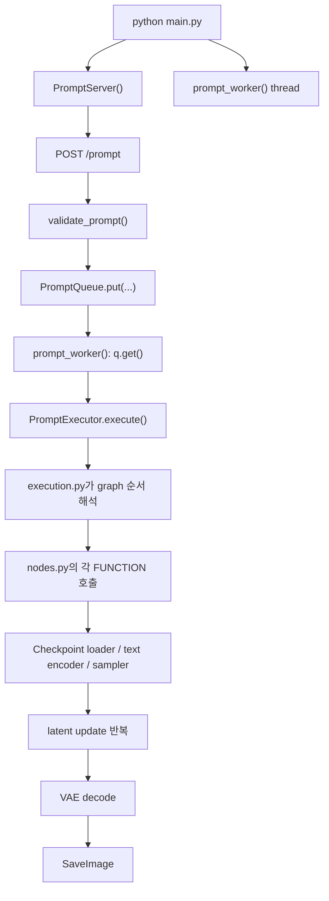
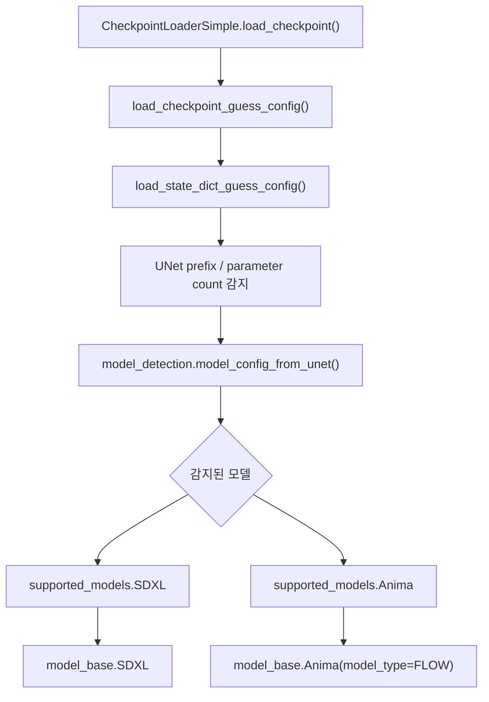
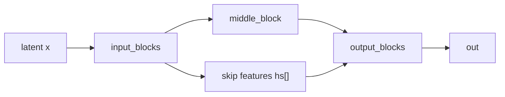
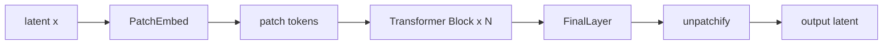
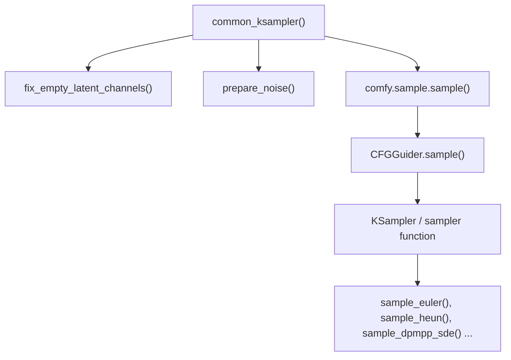

# ComfyUI의 SDXL·Anima 샘플링 경로

이 문서는 로컬 `ComfyUI` 추적 버전 `0.18.2`를 기준으로, 같은 `KSampler` 인터페이스 뒤에서 SDXL diffusion과 Anima flow가 실제로 어떤 코드 경로를 타고 어떤 수학으로 갈라지는지 정리한 공개용 코드 노트다.

중심 질문은 하나다.

같은 `KSampler`와 같은 `Euler`라는 이름 뒤에서, SDXL과 Anima는 정확히 어디서부터 다른 모델이 되는가?

상세 내용은 아래 문서들로 나눠서 읽는 편이 더 낫다.

- [[ComfyUI 시작과 1장 생성 호출 흐름]]
- [[ComfyUI 로딩과 샘플링 함수의 동작, SDXL와 Anima]]
- [[ComfyUI 코드로 보는 SDXL U-Net과 Anima DiT 구조]]
- [[Sampling as Numerical Integration, Scheduler, Sampler, and Sigma Coordinates|ComfyUI 샘플링 수학]]

## 왜 이 문서가 필요한가

겉으로 보면 ComfyUI는 노드 그래프를 실행하는 UI다. 하지만 코드를 따라가면 실제 구조는 세 층으로 나뉜다.

- runtime: 서버, 큐, 그래프 실행 순서
- loading: 체크포인트를 읽고 모델 종류를 판별하는 층
- sampling: sigma 좌표계와 solver를 실제로 적용하는 층

즉 공통 UI가 있다고 해서 공통 생성방정식을 쓰는 것은 아니다. ComfyUI를 코드로 읽을 때는 노드 이름보다 먼저 "어디서 모델 의미가 결정되는가"와 "어디서 적분기가 돈는가"를 봐야 한다.

## 런타임의 큰 흐름

가장 바깥 요청 생명주기는 다음처럼 정리할 수 있다.



핵심 파일은 다음과 같다.

- `main.py`: 서버와 worker thread를 띄운다.
- `server.py`: `/prompt` 요청을 받고 queue를 관리한다.
- `execution.py`: graph 의존성을 풀고 node 실행 순서를 잡는다.
- `nodes.py`: checkpoint loader, text encoder, sampler, decode, save node를 연결한다.
- `comfy/sd.py`: 체크포인트에서 모델, CLIP, VAE를 추출한다.
- `comfy/model_base.py`: 모델 종류에 따라 sampling 의미를 설정한다.
- `comfy/model_sampling.py`: sigma 좌표계와 입력/출력 해석을 정의한다.
- `comfy/k_diffusion/sampling.py`: 실제 수치적분기를 구현한다.

코드 스켈레톤만 잡으면 바깥쪽은 아래처럼 보인다.

```python
# 핵심 흐름만 남긴 축약 스케치
prompt_server = server.PromptServer(...)
prompt_queue = execution.PromptQueue(prompt_server)
add_routes(prompt_server)

def prompt_worker(q, server_instance):
    executor = execution.PromptExecutor(server_instance, ...)
    while True:
        item = q.get()
        executor.execute(item[2], item[3], item[4])
```

즉 runtime은 `main.py -> execution.py -> nodes.py` 순서로 읽으면 되고, 생성 수학은 그 아래 `sd.py -> model_base.py -> model_sampling.py -> k_diffusion/sampling.py` 순서로 읽는 편이 빠르다.

## 로딩 단계에서 모델 의미가 결정된다

체크포인트 로딩의 입구는 `CheckpointLoaderSimple.load_checkpoint()`와 그 아래 `comfy.sd.load_checkpoint_guess_config()`다.



이 단계가 중요한 이유는 단순하다. ComfyUI는 로딩 시점에 이미 다음을 같이 정한다.

- 어떤 본체 클래스를 쓸 것인가
- 어떤 텍스트 인코더를 붙일 것인가
- 모델 출력값을 어떤 방식으로 해석할 것인가
- sigma/time 좌표계를 diffusion식으로 볼지 flow식으로 볼지

핵심 골격만 남기면 로더는 아래와 비슷하다.

```python
def load_state_dict_guess_config(sd, output_vae=True, output_clip=True, ...):
    model_config = model_detection.model_config_from_unet(sd, ...)
    model = model_config.get_model(sd, "model.diffusion_model.")
    clip = CLIP(model_config.clip_target(...)) if output_clip else None
    vae = VAE(sd=vae_sd) if output_vae else None
    return (ModelPatcher(model), clip, vae)
```

즉 "모델을 읽는다"는 말은 단순히 가중치를 메모리에 올린다는 뜻이 아니다. 이후 샘플링 전체를 어떤 수학으로 해석할지 결정하는 일에 더 가깝다.

## SDXL 경로: diffusion식 sigma와 U-Net 본체

SDXL 쪽 중심 조합은 다음과 같다.

- `supported_models.SDXL`
- `model_base.SDXL`
- `ModelSamplingDiscrete`
- `EPS` 또는 `V_PREDICTION`
- `UNetModel`

핵심은 `model_base.py`가 로딩된 모델을 diffusion식 샘플링 규칙과 묶는다는 점이다.

```python
# model_type에 따라 output 의미를 정한다는 점이 중요하다.
if model_type == ModelType.EPS:
    sampling_base = comfy.model_sampling.ModelSamplingDiscrete
    sampling_head = comfy.model_sampling.EPS
elif model_type == ModelType.V_PREDICTION:
    sampling_base = comfy.model_sampling.ModelSamplingDiscrete
    sampling_head = comfy.model_sampling.V_PREDICTION

ModelSampling = comfy.model_sampling.model_sampling(sampling_base, sampling_head)
self.model_sampling = ModelSampling(model_config, model_type)
```

이 조합이 하는 일은 두 가지다.

- 시간축을 어떤 discrete sigma schedule로 읽을지 정한다.
- 모델 출력이 `epsilon`인지 `v`인지에 따라 `denoised` 해석을 바꾼다.

### SDXL 본체는 무엇을 계산하는가

SDXL 본체는 `comfy/ldm/modules/diffusionmodules/openaimodel.py`의 `UNetModel`이다. 큰 구조는 전형적인 U-Net이다.



쉽게 말하면 왼쪽에서 해상도를 줄이며 특징을 모으고, 오른쪽에서 다시 복원하면서 skip feature를 붙인다. 여기에 `SpatialTransformer`가 중간 attention 블록으로 끼어들어 text context를 읽는다.

### SDXL에서 조건은 어떻게 들어가는가

SDXL는 텍스트만 받지 않는다. `encode_adm()`가 pooled text, 해상도, crop, target size를 함께 묶어 ADM 조건 벡터를 만든다.

```python
# 설명용 축약 형태
adm = torch.cat(
    [
        pooled_text,
        height_embed,
        width_embed,
        crop_h_embed,
        crop_w_embed,
        target_height_embed,
        target_width_embed,
    ],
    dim=1,
)
```

즉 SDXL 경로는 "정규화된 latent + text context + size/crop 조건 + U-Net denoiser + diffusion sigma schedule"의 조합으로 읽는 편이 맞다.

## Anima 경로: flow식 sigma와 DiT 본체

Anima 쪽 중심 조합은 다음과 같다.

- `supported_models.Anima`
- `model_base.Anima(model_type=FLOW)`
- `ModelSamplingDiscreteFlow`
- `CONST`
- `comfy.ldm.anima.model.Anima`

핵심은 이 모델이 SDXL의 변형 U-Net이 아니라는 점이다. ComfyUI는 Anima를 처음부터 flow 계열 본체로 읽는다.

```python
class ModelSamplingDiscreteFlow(torch.nn.Module):
    def sigma(self, timestep):
        t = timestep / self.multiplier
        return time_snr_shift(self.shift, t)

class CONST:
    def noise_scaling(self, sigma, noise, latent_image):
        return sigma * noise + (1.0 - sigma) * latent_image
```

위 두 블록만 봐도 diffusion과 차이가 분명하다.

- 시간표는 beta schedule이 아니라 `time_snr_shift()` 기반이다.
- 초기 latent도 "노이즈를 더하는" 방식보다 "노이즈와 latent를 섞는" 방식에 가깝다.

### Anima 본체는 무엇을 계산하는가

Anima 본체는 `MiniTrainDIT` 기반 patch-token Transformer다. 구조는 U-Net보다 DiT에 가깝다.



즉 SDXL처럼 "내려갔다 올라오는" 구조가 아니라, patch token을 attention으로 반복 갱신한 뒤 다시 latent 격자로 되돌린다.

### Anima에서 텍스트는 어떻게 들어가는가

Anima는 `AnimaTokenizer`, `AnimaTEModel`, `LLMAdapter`를 거치며 Qwen 계열 표현과 T5 계열 정보를 함께 다룬다.

```python
# 설명용 축약 스케치
encoded = anima_te.encode_token_weights(tokens)
extra = {
    "cross_attn": encoded["cross_attn"],
    "t5xxl_ids": encoded["t5xxl_ids"],
    "t5xxl_weights": encoded["t5xxl_weights"],
}
context = llm_adapter(extra["cross_attn"], extra["t5xxl_ids"], extra["t5xxl_weights"])
```

쉽게 말하면 "텍스트를 한 번 인코딩하고 끝"이 아니라, 샘플링 직전까지 본체가 읽기 좋은 문맥으로 다시 조립하는 구조다.

## 공통 sampler 껍데기

노드 레벨에서 공통 입구는 `common_ksampler()`다.



하지만 이 함수가 직접 수학을 정하는 것은 아니다. 이 단계는 노이즈, latent, conditioning, scheduler 이름을 정리해 sampler 계층으로 넘긴다. 실제 의미는 그 아래 `model_sampling`과 `sample_*`에서 정해진다.

## 공통 Euler 껍데기에서 실제로 바뀌는 것

`sample_euler()`는 겉으로 보면 아주 단순하다.

```python
def to_d(x, sigma, denoised):
    return (x - denoised) / utils.append_dims(sigma, x.ndim)

denoised = model(x, sigma_hat * s_in, **extra_args)
d = to_d(x, sigma_hat, denoised)
dt = sigmas[i + 1] - sigma_hat
x = x + d * dt
```

겉으로는 SDXL도, Anima도, 둘 다 결국 이 껍데기를 쓴다. 그런데 안쪽 의미는 다르다.

- SDXL은 `denoised`를 diffusion식 출력 해석에서 만든다.
- Anima는 flow식 sigma와 `CONST` 해석을 거쳐 같은 껍데기에 들어온다.

즉 같은 `Euler`를 쓴다고 해서 같은 dynamics를 푸는 것이 아니다. 같은 solver family를 서로 다른 vector field 위에 올려 둔 셈이다.

## 0.18.2에서 눈에 띄는 구현 포인트

이번 추적 버전에서 눈에 띄는 포인트는 세 가지다.

첫째, `comfy/sample.py`의 노이즈 준비는 CPU `float32` 생성 뒤 latent dtype으로 다시 맞추는 흐름이 더 분명하다. 이는 노이즈 준비 단계의 dtype 안정성을 챙기는 방향으로 읽힌다.

둘째, `comfy/samplers.py`의 `CFGGuider.outer_sample()`는 `noise`, `latent_image`, `denoise_mask`를 바깥 경계에서 `float32` 중심으로 정리한다. 즉 sampler 바깥 래퍼에서 dtype 혼선을 줄이려는 의도가 보인다.

셋째, `sample_euler_ancestral()`은 flow 계열에 대해 별도 `sample_euler_ancestral_RF()` 경로를 둔다. 같은 ancestral sampler 이름을 쓰더라도 diffusion과 flow를 완전히 같은 식으로 밀어붙이지 않는다는 뜻이다.

## 무엇이 같고 무엇이 다른가

| 항목 | SDXL | Anima |
| --- | --- | --- |
| 본체 철학 | U-Net + attention | DiT, transformer stack |
| 시간좌표 | `ModelSamplingDiscrete` | `ModelSamplingDiscreteFlow` |
| 출력 해석 | `EPS` 또는 `V_PREDICTION` | `CONST` |
| 초기 상태 | diffusion식 노이즈 스케일링 | noise-latent 혼합 |
| 텍스트 조건 | CLIP + pooled text + ADM | Qwen/T5 + `LLMAdapter` |
| 샘플러 껍데기 | `sample_euler()` 등 공통 | `sample_euler()` 등 공통 |

핵심은 "샘플러가 같다"보다 "샘플러 바깥에서 이미 시간좌표, 출력 해석, 본체 구조가 달라져 있다"가 더 정확한 설명이라는 점이다.

## 코드 읽기 질문

이 문서를 실제 코드 독해로 바꾸려면 아래 질문으로 보면 된다.

1. 이 모델은 `model_base.py`에서 어떤 `model_type`으로 분류되는가?
2. `model_sampling.py`에서 어떤 sigma 좌표계와 출력 해석을 쓰는가?
3. 본체는 U-Net인가, DiT인가?
4. 텍스트 conditioning은 어디서 만들어지고 어디에 주입되는가?
5. 같은 solver 이름 뒤에서 어떤 vector field가 실제로 적분되는가?

이 질문으로 보면 ComfyUI의 많은 분기가 단순한 if-else가 아니라, 각 모델 계열의 생성수학을 runtime에 번역하는 계층이라는 점이 드러난다.

## 읽는 순서

코드를 직접 따라가려면 아래 순서가 가장 보기 쉽다.

1. `main.py`
2. `execution.py`
3. `nodes.py`
4. `comfy/sd.py`
5. `comfy/model_base.py`
6. `comfy/model_sampling.py`
7. `comfy/k_diffusion/sampling.py`
8. `comfy/ldm/modules/diffusionmodules/openaimodel.py`
9. `comfy/ldm/anima/model.py`

## 관련 문서

- [[ComfyUI 시작과 1장 생성 호출 흐름]]
- [[ComfyUI 로딩과 샘플링 함수의 동작, SDXL와 Anima]]
- [[ComfyUI 코드로 보는 SDXL U-Net과 Anima DiT 구조]]
- [[강의 흐름으로 보는 Inference Pipeline]]
- [[Sampling as Numerical Integration, Scheduler, Sampler, and Sigma Coordinates|Sampling as Numerical Integration: Scheduler, Sampler, and Sigma Coordinates]]
- [[Classifier-Free Diffusion Guidance]]
- [[DPM-Solver]]
- [[Flow Matching for Generative Modeling]]
