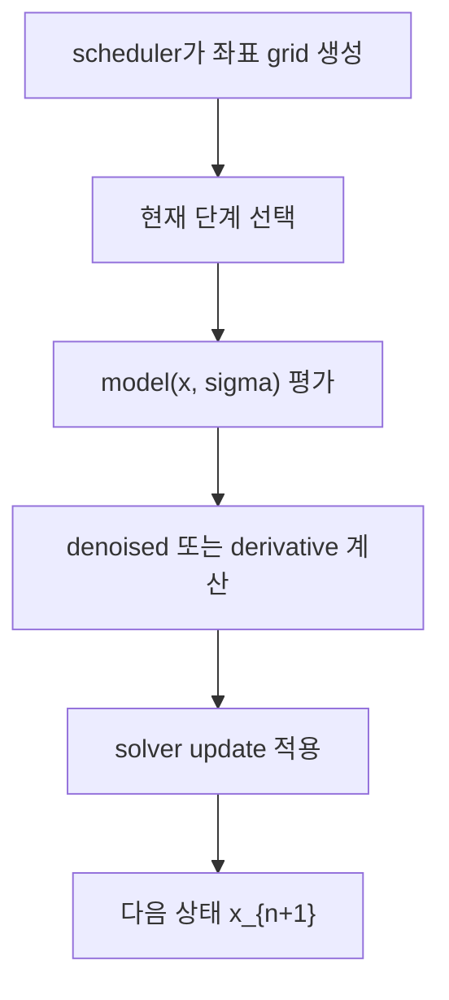

# ComfyUI 샘플러와 solver 함수 대응

이 문서는 로컬 `ComfyUI` 추적 버전 `0.18.2` 기준으로, `comfy/k_diffusion/sampling.py`의 주요 `sample_*` 함수가 어떤 수치적분기 가족에 대응하는지 정리한다.

핵심 질문은 간단하다.

샘플러 이름이 많아 보이는데, 수치해석 언어로 다시 묶으면 실제로 무엇이 다른가?

## 공통 골격

ComfyUI 샘플러는 겉으로는 서로 달라 보여도 공통 껍데기를 갖는다.



즉 차이는 대부분 `E`, 즉 update rule에 들어 있다.

## `sigma`를 시간좌표로 쓴다는 뜻

ComfyUI는 샘플러와 scheduler를 분리한다.

- scheduler는 `sigmas` 배열을 만든다
- sampler는 그 배열의 인접 두 점 사이를 적분한다

즉 `sample_*` 함수는 대개 `sigmas[i]`와 `sigmas[i+1]`를 보고 한 step 갱신을 수행한다.

## `denoised`에서 `d`로 가는 공통 변환

많은 샘플러는 먼저 `denoised`를 만든 뒤, 그것을 유효 도함수로 바꾼다.

```python
def to_d(x, sigma, denoised):
    return (x - denoised) / sigma
```

이 변환은 "모델 출력"을 적분기에서 바로 쓰지 않고, 현재 좌표계에서 읽을 수 있는 derivative-like quantity로 바꾸는 단계라고 보면 된다.

## 1차 계열

### `sample_euler`

가장 단순한 전진 Euler 방식이다.

```python
denoised = model(x, sigma)
d = to_d(x, sigma, denoised)
x = x + d * (sigma_next - sigma)
```

즉 현재 단계의 기울기 한 번만 보고 다음 상태를 만든다.

### `sample_euler_ancestral`

이 함수는 결정론적 이동 뒤에 noise reinjection이 추가된다.

쉽게 말하면 pure ODE step이라기보다 reverse SDE 쪽 성격이 더 강하다.

## 2차 predictor-corrector 계열

### `sample_heun`

Heun은 예측점에서 한 번 더 모델을 평가한다.

```python
d = f(x_n, sigma_n)
x_pred = x_n + d * delta
d_next = f(x_pred, sigma_{n+1})
x_{n+1} = x_n + 0.5 * delta * (d + d_next)
```

즉 Euler보다 계산은 비싸지만, 한 step 정확도는 더 높다.

## 다단계 계열

### `sample_lms`

이 계열은 과거 단계에서 계산한 도함수 기록을 함께 사용한다.

핵심은 "지금 한 번의 모델 평가"만으로 끝내지 않고, 이전 step들의 기울기 기록을 재활용한다는 점이다.

즉 단일 step 공식을 고도화하는 방식이 아니라, 경로 히스토리를 쓰는 방식에 가깝다.

## DPM-Solver 계열

### `sample_dpm_fast`
### `sample_dpm_adaptive`

이 계열은 단순한 Euler/Heun보다 diffusion 구조를 더 직접적으로 이용한다.

핵심 포인트는 다음과 같다.

- `sigma`를 다시 변환한 좌표에서 식을 읽는다
- 일부 구조를 해석적으로 처리하려고 한다
- adaptive 버전은 오차 추정으로 step size를 조절한다

즉 이 계열은 sampling을 "solver design 문제"로 가장 노골적으로 드러낸다.

## DPM++ SDE 계열

### `sample_dpmpp_sde`
### `sample_dpmpp_2m_sde`
### `sample_dpmpp_3m_sde`

이 함수들은 deterministic drift만이 아니라 stochastic term까지 함께 다룬다.

즉 같은 DPM++ 이름이 붙어 있어도, ODE solver로만 보면 안 되고 SDE 적분기 계열로 읽어야 한다.

## ER-SDE와 SA-Solver

`sample_er_sde()`와 `sample_sa_solver_pece()`는 이름 그대로 확률 적분기 성격이 더 강하다.

즉 ComfyUI의 "sampler" 목록은 사실상 아래 가족을 한 화면에 모아 둔 것이라고 볼 수 있다.

- 1차 ODE solver
- 2차 predictor-corrector
- multistep solver
- diffusion 특화 solver
- SDE solver

## 왜 같은 UI에 함께 놓일 수 있는가

ComfyUI는 서로 다른 적분기를 같은 인터페이스로 감싼다.

- 공통 입력: 현재 상태, conditioning, sigma grid
- 공통 출력: 다음 상태
- 차이점: update rule

그래서 사용자는 sampler 이름만 바꾸는 것처럼 보이지만, 실제로는 전혀 다른 적분 공식을 교체하는 셈이다.

## 같이 읽으면 좋은 문서

- [[Sampling as Numerical Integration, Scheduler, Sampler, and Sigma Coordinates|Sampling as Numerical Integration: Scheduler, Sampler, and Sigma Coordinates]]
- [[ComfyUI의 SDXL·Anima 샘플링 경로]]
- [[ComfyUI 로딩과 샘플링 함수의 동작, SDXL와 Anima]]
