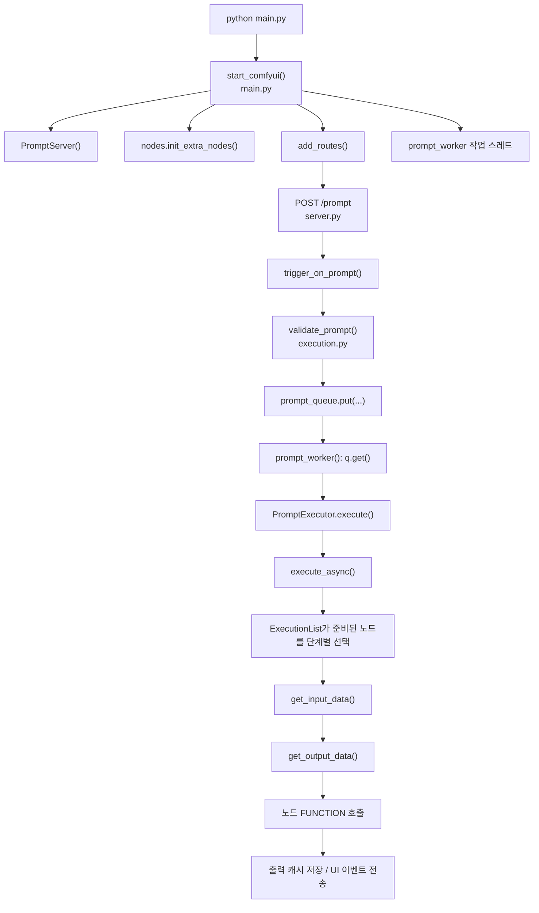
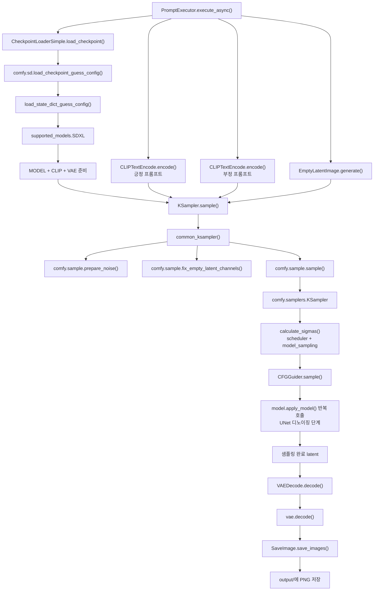
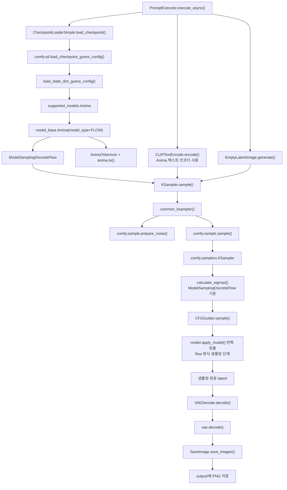
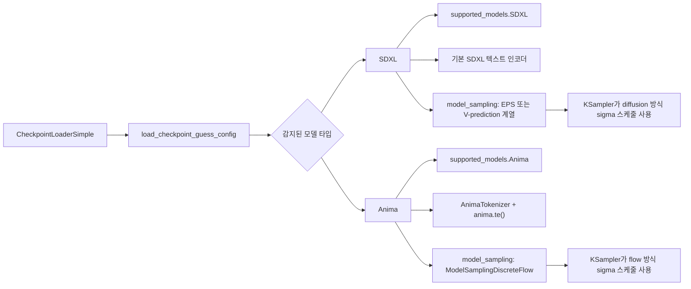

# ComfyUI 시작과 1장 생성 호출 흐름

## 범위

이 문서는 로컬 `ComfyUI` 추적 버전 `0.18.2`에서 확인한 호출 흐름을 정리한다.

- 시작 경로: 서버 부팅, 라우트 등록, 프롬프트 큐 작업 스레드
- 실행 경로: 프롬프트 요청 1회가 이미지 1장으로 끝날 때까지의 흐름
- 모델별 초점: SDXL, Anima

## 공통 요청 생명주기

## SDXL: 시작부터 이미지 1장까지

## Anima: 시작부터 이미지 1장까지

## SDXL과 Anima가 갈라지는 지점

## 읽는 순서

- `main.py`: 서버를 시작하고 프롬프트 작업 스레드를 켠다.
- `server.py`: `/prompt` 요청을 받아 검증한 뒤 큐에 넣는다.
- `execution.py`: 그래프 의존성을 풀고 각 노드 함수를 호출한다.
- `nodes.py`: 기본 로더, 텍스트 인코드, latent, sampler, VAE decode, save 노드가 들어 있다.
- `comfy/sd.py`: 체크포인트 구조를 감지하고 모델, 텍스트 인코더, VAE 객체를 만든다.
- `comfy/model_base.py`: 모델 타입과 그에 맞는 샘플링 동작을 정한다.
- `comfy/model_sampling.py`: 모델 계열마다 쓰는 sigma/time 동작을 정의한다.
