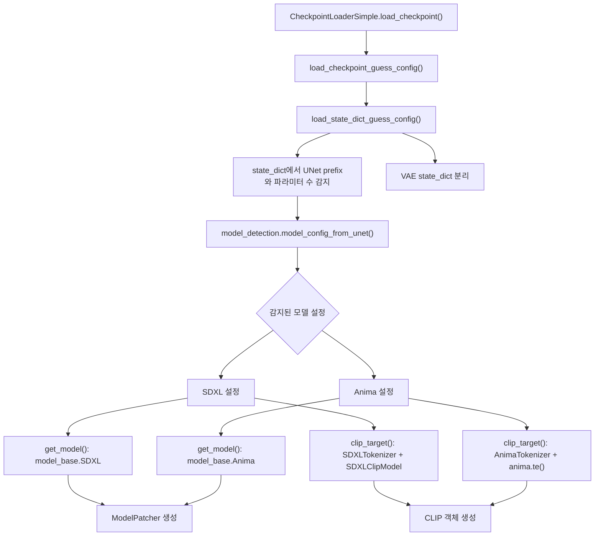

# ComfyUI 체크포인트 로딩과 모델 판별, SDXL와 Anima

이 문서는 로컬 `ComfyUI` 추적 버전 `0.18.2` 기준으로, 체크포인트 로딩 단계에서 SDXL와 Anima가 어떻게 갈라지는지 정리한다.

핵심 질문은 단순하다.

체크포인트를 읽는 순간, ComfyUI는 어디서 "이건 SDXL식 diffusion이고, 이건 Anima식 flow다"라고 결정하는가?

## 공통 로딩 구조

체크포인트 로딩의 핵심 입구는 `comfy/sd.py`의 `load_checkpoint_guess_config()`와 `load_state_dict_guess_config()`다.



쉽게 말하면 이 단계는 가중치만 메모리에 올리는 작업이 아니다. 이후 어떤 본체, 어떤 텍스트 인코더, 어떤 샘플링 해석을 쓸지까지 한꺼번에 정한다.

## 핵심 로더 골격

로딩 함수의 뼈대는 대략 아래처럼 읽으면 된다.

```python
def load_state_dict_guess_config(sd, output_vae=True, output_clip=True, ...):
    model_config = model_detection.model_config_from_unet(sd, ...)
    model = model_config.get_model(sd, "model.diffusion_model.")
    clip = CLIP(model_config.clip_target(...)) if output_clip else None
    vae = VAE(sd=vae_sd) if output_vae else None
    return (ModelPatcher(model), clip, vae)
```

즉 `model_config`가 사실상 "이 체크포인트를 어떤 계열로 읽어야 하는가"를 결정하는 중심 객체다.

## SDXL 쪽에서 결정되는 것

SDXL 설정은 `supported_models.SDXL` 쪽으로 연결된다.

핵심 포인트는 아래 네 가지다.

- 본체는 `model_base.SDXL`
- 텍스트 인코더는 SDXL 계열 CLIP 경로
- latent format도 SDXL 기준
- sampling 의미는 diffusion 계열 `model_type`에 따라 정해진다

특히 `model_type()`이 중요하다. 같은 SDXL 계열이라도 출력 해석은 다를 수 있다.

- `EPS`
- `V_PREDICTION`
- `EDM`
- `V_PREDICTION_EDM`

즉 SDXL라고 해서 항상 같은 출력 의미를 갖는 것은 아니다.

## SDXL에서 텍스트 조건은 어떻게 붙는가

SDXL 쪽은 텍스트만 붙는 구조가 아니다. `model_base.SDXL.encode_adm()`가 pooled text와 해상도, crop, target size를 함께 묶는다.

쉽게 말하면 "무슨 그림인가"와 "어떤 캔버스 조건인가"가 함께 모델 본체로 들어간다.

이 점 때문에 SDXL는 U-Net 본체를 읽을 때도 텍스트 context와 ADM 조건을 같이 봐야 한다.

## Anima 쪽에서 결정되는 것

Anima 설정은 `supported_models.Anima` 쪽으로 연결된다.

핵심 포인트는 아래 네 가지다.

- 본체는 `model_base.Anima(model_type=FLOW)`
- 텍스트 인코더는 `AnimaTokenizer + anima.te()`
- latent format은 Wan 계열
- sampling 의미는 처음부터 flow 계열로 묶인다

즉 Anima는 "SDXL의 다른 체크포인트"가 아니라, 로딩 단계부터 다른 모델 가족으로 취급된다.

## Anima에서 텍스트 조건은 어떻게 붙는가

Anima는 Qwen 계열 표현과 T5 계열 정보를 함께 다룬다.

즉 텍스트 경로도 SDXL보다 더 transformer-native한 방향으로 짜여 있다.

쉽게 말하면,

- SDXL는 CLIP + ADM
- Anima는 tokenizer/TE/adapter를 통한 재구성된 context

로 보는 편이 맞다.

## 로딩 단계에서 이미 sampling 의미가 정해진다

이 단계가 중요한 이유는 단순하다.

ComfyUI는 체크포인트를 읽는 순간 이미 아래를 같이 정한다.

- 어떤 본체 구조를 쓸 것인가
- 어떤 텍스트 인코더를 붙일 것인가
- 어떤 출력 해석을 쓸 것인가
- diffusion식 시간축인지, flow식 시간축인지

즉 샘플링은 로딩 뒤에 시작되지만, sampling의 의미는 로딩 단계에서 절반 이상 정해진다.

## 읽는 순서

아래 순서로 보면 구조가 잘 보인다.

1. `nodes.py`
2. `comfy/sd.py`
3. `comfy/model_detection.py`
4. `comfy/supported_models.py`
5. `comfy/model_base.py`

## 관련 문서

- [[ComfyUI 로딩과 샘플링 함수의 동작, SDXL와 Anima]]
- [[ComfyUI Euler 샘플링 비교, SDXL와 Anima]]
- [[ComfyUI 코드로 보는 SDXL U-Net 구조]]
- [[ComfyUI 코드로 보는 Anima DiT 구조]]
