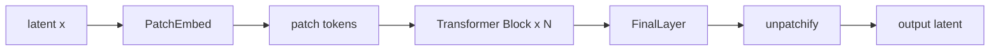

# ComfyUI 코드로 보는 Anima DiT 구조

이 문서는 로컬 `ComfyUI` 추적 버전 `0.18.2` 기준으로, Anima 본체가 어떤 DiT 구조와 어떤 텍스트 경로를 쓰는지 정리한다.

## Anima를 읽는 설정

`supported_models.Anima`는 Anima를 SDXL의 변형이 아니라 별도 계열로 취급한다.

- `image_model = "anima"`
- `sampling_settings = {"multiplier": 1.0, "shift": 3.0}`
- `latent_format = Wan21`

즉 로딩 단계부터 "이 모델은 flow 계열 Transformer 본체다"라는 뜻이 같이 정해진다.

## 본체 클래스

`model_base.Anima`는 실제 본체로 `comfy.ldm.anima.model.Anima`를 사용한다. 이 클래스는 `MiniTrainDIT` 기반이라서, 기본 철학이 CNN U-Net이 아니라 DiT다.

## 큰 구조

Anima 본체의 큰 흐름은 아래처럼 볼 수 있다.

즉 U-Net처럼 내려갔다 올라오는 구조가 아니라, patch token을 attention으로 반복 갱신한 뒤 다시 latent 격자로 돌려놓는다.

## `PatchEmbed`

`PatchEmbed`는 입력 latent를 작은 patch 단위 token으로 바꾼다.

쉽게 말하면 이미지 조각 하나하나를 "단어"처럼 만드는 단계다.

그래서 이후 계산은 feature map CNN보다 token transformer 쪽 감각에 가깝다.

## 위치 정보

Anima 쪽은 3D RoPE 계열 위치 임베딩을 사용한다.

- 높이 축
- 너비 축
- 시간 축

즉 정지 이미지 작업이라도 내부 설계는 video-aware DiT 계열의 흔적을 강하게 갖고 있다.

## 시간 조건

시간 정보는 단순 덧셈보다 AdaLN modulation 쪽으로 주입된다.

즉 현재 step 정보가 attention과 MLP 내부 동작 자체를 조절하는 쪽에 가깝다.

## Transformer Block

핵심 반복 단위는 대체로 아래 세 부분으로 본다.

1. self-attention
2. cross-attention
3. MLP

여기에 각기 별도 norm과 modulation이 붙는다.

즉 attention block이 U-Net 안의 부분이 아니라, 모델 본체 그 자체다.

## Anima 전용 attention

Anima attention은 다음 특징으로 읽으면 된다.

- `q_proj`, `k_proj`, `v_proj`
- Q/K normalization
- rotary positional embedding
- scaled dot-product attention
- output projection

즉 현대 transformer나 LLM 계열에서 자주 보이는 구성과 매우 가깝다.

## 텍스트 경로와 `LLMAdapter`

Anima의 중요한 차이는 텍스트 경로다.

이 경로에서는 다음 요소가 함께 등장한다.

- `AnimaTokenizer`
- `AnimaTEModel`
- `t5xxl_ids`
- `t5xxl_weights`
- `LLMAdapter`

쉽게 말하면 텍스트를 한 번 인코딩해서 끝내는 것이 아니라, 본체가 읽기 좋은 문맥으로 다시 조립하는 단계가 있다.

즉 text conditioning도 SDXL보다 transformer-native한 감각이 더 강하다.

## `FinalLayer`와 `unpatchify`

마지막에는 patch token을 다시 원래 latent 격자로 되돌린다.

즉 Anima의 출력 복원은 U-Net식 upsample block이 아니라, token을 다시 grid로 펴는 방식이다.

## 읽는 순서

아래 순서로 보면 구조가 잘 보인다.

1. `comfy/supported_models.py`
2. `comfy/model_base.py`
3. `comfy/text_encoders/anima.py`
4. `comfy/ldm/anima/model.py`
5. `comfy/ldm/cosmos/predict2.py`

## 관련 문서

- [[ComfyUI 코드로 보는 SDXL U-Net과 Anima DiT 구조]]
- [[ComfyUI 코드로 보는 SDXL U-Net 구조]]
- [[ComfyUI 로딩과 샘플링 함수의 동작, SDXL와 Anima]]
