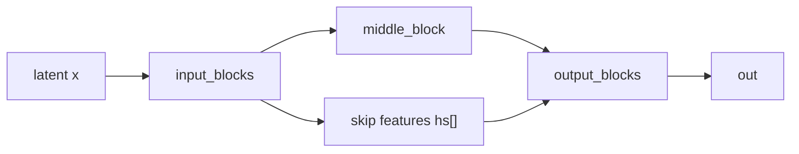

# ComfyUI 코드로 보는 SDXL U-Net 구조

이 문서는 로컬 `ComfyUI` 추적 버전 `0.18.2` 기준으로, SDXL 본체가 어떤 U-Net 구조와 어떤 조건 경로를 쓰는지 정리한다.

## SDXL를 읽는 설정

`supported_models.SDXL`는 대략 다음 축으로 SDXL를 설명한다.

- `model_channels = 320`
- `transformer_depth = [0, 0, 2, 2, 10, 10]`
- `context_dim = 2048`
- `adm_in_channels = 2816`
- `latent_format = SDXL`

쉽게 말하면 SDXL는 순수 CNN이 아니라, U-Net 뼈대 위에 text conditioning용 attention이 섞인 구조다.

## SDXL 본체 클래스가 맡는 일

`model_base.SDXL`는 본체 앞단에서 SDXL 전용 조건을 준비한다.

가장 중요한 것은 `encode_adm()`이다. 여기서 다음 정보가 한 벡터로 묶인다.

- pooled CLIP embedding
- `height`, `width`
- `crop_h`, `crop_w`
- `target_height`, `target_width`

즉 SDXL는 "무슨 그림인가"뿐 아니라 "어떤 캔버스 조건인가"도 함께 입력받는다.

## 실제 몸체: `UNetModel`

실제 본체는 `comfy/ldm/modules/diffusionmodules/openaimodel.py`의 `UNetModel`이다.

큰 구조는 전형적인 U-Net이다.

즉 왼쪽에서 feature를 압축하고, 오른쪽에서 다시 복원하면서 skip connection을 붙인다.

## `input_blocks`의 반복 구조

입력 쪽 블록은 대체로 다음 요소를 반복한다.

- `ResBlock`
- 필요하면 `SpatialTransformer`
- 레벨 경계에서는 `Downsample`

쉽게 말하면 "지역 특징을 모으는 CNN 블록"과 "텍스트를 읽는 attention 블록"이 같이 들어간다.

## `ResBlock`의 역할

`ResBlock`은 대체로 다음 흐름을 가진다.

- `GroupNorm`
- `SiLU`
- `Conv`
- timestep embedding 주입
- 다시 `GroupNorm`, `SiLU`, `Dropout`, `Conv`
- residual 더하기

핵심은 각 블록이 현재 denoising 단계 정보를 알고 계산한다는 점이다.

## `SpatialTransformer`의 역할

`SpatialTransformer`는 feature map을 잠깐 token처럼 펼쳐 attention을 적용한 뒤 다시 map으로 되돌린다.

즉 SDXL는 텍스트를 U-Net 바깥에서만 쓰는 것이 아니라, 중간 블록들에서 계속 cross-attention으로 읽는다.

## `BasicTransformerBlock`이 하는 일

이 블록 안쪽에서는 보통 아래 순서가 보인다.

1. self-attention
2. cross-attention
3. feed-forward

여기서 cross-attention이 텍스트 context를 실제 이미지 feature 쪽으로 주입하는 핵심 지점이다.

## `UNetModel.forward()` 흐름

전체 forward는 대략 이렇게 읽힌다.

1. timestep embedding 생성
2. time MLP 확장
3. ADM 또는 label 쪽 조건 합치기
4. `input_blocks`를 돌며 중간 feature 저장
5. `middle_block` 통과
6. `output_blocks`에서 skip feature 재사용
7. `out`으로 최종 출력 채널 정리

즉 SDXL U-Net은 "시간 정보", "해상도/캔버스 정보", "텍스트 context"를 서로 다른 경로로 받아 하나의 denoising 본체 안에서 합친다.

## 읽는 순서

아래 순서로 보면 구조가 잘 보인다.

1. `comfy/supported_models.py`
2. `comfy/model_base.py`
3. `comfy/ldm/modules/diffusionmodules/openaimodel.py`
4. `comfy/ldm/modules/attention.py`

## 관련 문서

- [[ComfyUI 코드로 보는 SDXL U-Net과 Anima DiT 구조]]
- [[ComfyUI 코드로 보는 Anima DiT 구조]]
- [[ComfyUI 로딩과 샘플링 함수의 동작, SDXL와 Anima]]
