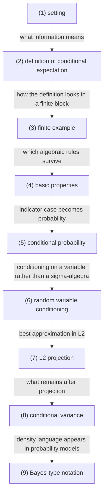

# Conditional Probability, Conditional Expectation, and L2 Projection

## 전체상

고정한 probability space $(\Omega,\mathcal F,\mathbb P)$ 와 부분 정보 $\mathcal G\subset\mathcal F$ 를 둔다. 화살표는 inclusion map으로 읽는다.

## 각 층의 분기 포인트

- $\mathcal G$-measurable한 $L^1$ random variable들의 모임
  - `(1)` 중에서, 값이 $\mathcal G$ 가 구별하는 정보만으로 정해지는 적분가능 random variable만 모아 둔 층이다.
  - 예를 들어 $L^1$ random variable이라도 $\mathcal G$ 가 구별하지 못하는 두 점에 서로 다른 값을 주면 `(1)`에는 들어가도 `(2)`에는 들어오지 못한다.
- $L^2(\Omega, \mathcal G, \mathbb P)$의 모임
  - `(2)` 중에서, 제곱까지 적분가능하여 $L^2$ projection을 쓸 수 있는 경우만 모아 둔 층이다.
  - 예를 들어 $\mathcal G$-measurable이지만 제곱적분가능하지 않은 random variable은 `(2)`에는 들어가도 `(3)`에는 들어오지 못한다.
- $\mathcal G$-사건의 indicator random variable들의 모임
  - `(3)` 중에서, 어떤 $\mathcal G$-사건의 여부만 $0$과 $1$로 적는 random variable만 모아 둔 층이다.
  - 예를 들어 일반 $\mathcal G$-measurable $L^2$ random variable은 `(3)`에는 들어가도 `(4)`에는 들어오지 못한다.

## 문서 로드맵

문서 흐름은 다음 질문을 따라간다.

- 먼저 `(1)`과 `(2)`에서, 조건이 숫자가 아니라 정보 수준으로 주어진다는 말이 무엇인지 본다.
- 그다음 `(3)`과 `(4)`에서, 유한집합에서는 그 정의가 어떻게 실제 평균 계산으로 보이는지 본다.
- 이어서 `(5)`와 `(6)`에서, 사건의 조건부 확률과 random variable에 대한 조건부 기대가 같은 틀에 놓인다는 점을 본다.
- 마지막 `(7)`과 `(8)`에서, 이를 $L^2$ projection과 variance decomposition으로 다시 읽는다.

## (1) setting

$(\Omega,\mathcal F,\mathbb P)$ 를 probability space라 하자. $\mathcal G\subset\mathcal F$ 는 sub-$\sigma$-algebra이고, 현재 알고 있는 정보의 양을 뜻한다.

### (1-a) 정의를 쉬운 말로 읽기

$\mathcal G$ 는 지금까지 구별할 수 있는 사건들의 모음이다.

이 정보를 기준으로 기대값이나 확률을 다시 적는 것이 conditional expectation과 conditional probability의 출발점이다.

> 예시. $\Omega=\{\omega_1,\omega_2,\omega_3,\omega_4\}$ 에서
> $$
> \mathcal G=\{\varnothing,\{\omega_1,\omega_2\},\{\omega_3,\omega_4\},\Omega\}
> $$
> 라 두면 $\mathcal G$ 는 두 정보 블록만 구별하는 정보다.

## (2) conditional expectation의 정의

$X\in L^1(\Omega,\mathcal F,\mathbb P)$ 에 대해 $\mathcal G$ 에 대한 conditional expectation $\mathbb E[X\mid\mathcal G]$ 는 다음을 만족하는 $\mathcal G$-measurable random variable $Y$ 이다.

1. $Y$ 는 $\mathcal G$-measurable.
2. 모든 $A\in\mathcal G$ 에 대해
   $$
   \int_A Y\,d\mathbb P=\int_A X\,d\mathbb P.
   $$

이 $Y$ 는 $\mathbb P$-a.s. 유일하다.

존재는 signed measure
$$
\nu(A):=\int_A X\,d\mathbb P,\qquad A\in\mathcal G
$$
를 $\mathbb P|_{\mathcal G}$ 에 대해 Radon-Nikodym theorem으로 나타내면 얻어진다.

### (2-a) 정의를 쉬운 말로 읽기

$\mathcal G$-measurable이라는 것은 $\mathcal G$ 가 구별하는 정보만으로 값이 정해진다는 뜻이다.

모든 $A\in\mathcal G$ 에서 적분값을 맞춘다는 것은, 그 정보 수준에서 보면 원래 $X$ 와 같은 평균을 주는 함수라는 뜻이다.

이 조건을 두는 이유는 "현재 알고 있는 정보"만으로도 원래 값을 가장 잘 대체하는 함수를 만들기 위해서다.

이 조건이 없으면 현재 정보로는 보이지 않는 차이까지 평균에 섞여 들어온다.

## (3) 유한집합 예시

$\Omega=\{\omega_1,\omega_2,\omega_3,\omega_4\}$ 라 하고 각 원소의 확률을 $1/4$ 로 두자. $\mathcal G$ 를

$$
\mathcal G=
\{
\varnothing,
\{\omega_1,\omega_2\},
\{\omega_3,\omega_4\},
\Omega
\}
$$

로 두면 두 블록만 보는 정보다.

이제

$$
X(\omega_1)=2,\quad X(\omega_2)=4,\quad X(\omega_3)=1,\quad X(\omega_4)=5
$$

라 하면 $\mathbb E[X\mid\mathcal G]$ 는 각 블록에서 평균을 취한 값이므로

$$
\mathbb E[X\mid\mathcal G](\omega_1)
=
\mathbb E[X\mid\mathcal G](\omega_2)
=3,
$$

$$
\mathbb E[X\mid\mathcal G](\omega_3)
=
\mathbb E[X\mid\mathcal G](\omega_4)
=3
$$

이다.

## (4) basic properties

$X,Y\in L^1$ 에 대해 다음이 성립한다.

1. 선형성:
   $$
   \mathbb E[aX+bY\mid\mathcal G]
   =
   a\mathbb E[X\mid\mathcal G]+b\mathbb E[Y\mid\mathcal G]
   $$
2. 보존성:
   $\mathcal G$-measurable $X$ 이면
   $$
   \mathbb E[X\mid\mathcal G]=X.
   $$
3. Tower property:
   $\mathcal H\subset\mathcal G\subset\mathcal F$ 이면
   $$
   \mathbb E[\mathbb E[X\mid\mathcal G]\mid\mathcal H]
   =
   \mathbb E[X\mid\mathcal H].
   $$
4. Taking out what is known:
   bounded $\mathcal G$-measurable $Z$ 에 대해
   $$
   \mathbb E[ZX\mid\mathcal G]=Z\,\mathbb E[X\mid\mathcal G].
   $$
5. Jensen inequality:
   convex $\Phi$ 에 대해
   $$
   \Phi(\mathbb E[X\mid\mathcal G])\le \mathbb E[\Phi(X)\mid\mathcal G].
   $$

## (5) conditional probability

사건 $A\in\mathcal F$ 의 conditional probability는
$$
\mathbb P(A\mid\mathcal G):=\mathbb E[\mathbf 1_A\mid\mathcal G]
$$
로 정의한다. 이는 $[0,1]$-valued $\mathcal G$-measurable random variable이다.

숫자 조건부 확률 $\mathbb P(A\mid B)=\mathbb P(A\cap B)/\mathbb P(B)$ 는 $\mathbb P(B)>0$ 일 때만 정의된다.

조건부 확률을 숫자 $\mathbb P(A\mid B)$ 와 혼동하면 안 된다. $\mathbb E[\mathbf 1_A\mid\sigma(B)]$ 는 $\sigma(B)$-measurable random variable이고, $B$ 와 $B^c$ 위에서 각각 상수인 blockwise constant 함수다.

## (6) random variable에 대한 conditional expectation

$Y:\Omega\to E$ 가 measurable이면 $\sigma(Y)$ 는 $Y$ 가 주는 정보 전체다. 이때
$$
\mathbb E[X\mid Y]
$$
는 $\sigma(Y)$-conditional expectation의 약식이며, 어떤 measurable 함수 $g$ 가 존재하여
$$
\mathbb E[X\mid Y]=g(Y)\quad \mathbb P\text{-a.s.}
$$
로 쓸 수 있다.

이 해석은 입력값을 이미 본 뒤 그 입력에 맞는 예측값을 다시 적는 방식으로 읽을 수 있다.

## (7) $L^2$ projection

$X\in L^2$ 라 하자. $\mathcal G$-measurable $L^2$ random variables의 닫힌 부분공간을
$$
L^2(\mathcal G):=\{Z\in L^2: Z \text{ is } \mathcal G\text{-measurable}\}
$$
라 하자. 그러면 $\mathbb E[X\mid\mathcal G]$ 는 $L^2(\mathcal G)$ 위로의 orthogonal projection이다.

즉
$$
\|X-\mathbb E[X\mid\mathcal G]\|_{L^2}
=
\inf_{Z\in L^2(\mathcal G)}\|X-Z\|_{L^2}
$$
이며, 모든 $Z\in L^2(\mathcal G)$ 에 대해
$$
\mathbb E\left[(X-\mathbb E[X\mid\mathcal G])Z\right]=0
$$
가 성립한다.

위 유한 예시에서 $L^2(\mathcal G)$ 는
$$
Z(\omega_1)=Z(\omega_2)=a,\qquad Z(\omega_3)=Z(\omega_4)=b
$$
형태의 함수들로 이루어진다. 즉 두 숫자 $a,b$ 로 표현되는 2차원 공간이다.

## (8) conditional variance

$X\in L^2$ 라 하면 conditional variance는
$$
\operatorname{Var}(X\mid\mathcal G)
:=
\mathbb E\left[(X-\mathbb E[X\mid\mathcal G])^2\mid\mathcal G\right]
$$
이다. 그리고
$$
\operatorname{Var}(X)
=
\mathbb E[\operatorname{Var}(X\mid\mathcal G)]
+\operatorname{Var}(\mathbb E[X\mid\mathcal G])
$$
를 total variance decomposition이라 한다.

## (9) Bayes-type notation

density가 존재하는 경우
$$
\mathbb E[f(X)\mid Y=y]
=
\int f(x)\,p(x\mid y)\,dx
$$
라고 쓸 수 있다. 하지만 측도론적으로 중요한 객체는 $p(x\mid y)$ 라는 함수가 아니라 regular conditional probability kernel이다.

## 관련 문서

- [[Probability Measures, Random Variables, Pushforward, and Convergence]]
- [[Markov Kernels, Disintegration, and Bayes Formula]]
- [[Normed Spaces, Hilbert Spaces, Operators, and Adjoint]]
- [[Sigma-Algebras, Measurable Maps, and What Measurable Means]]
- [[Variational Objectives and Noise Prediction]]

