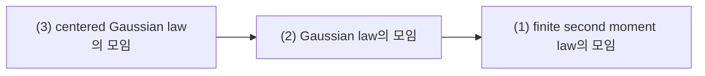
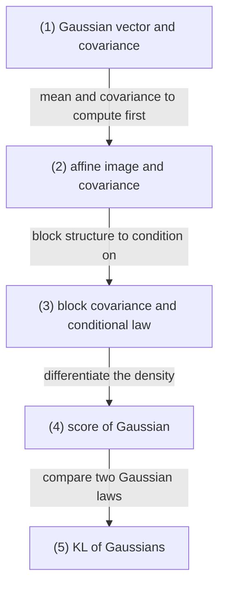

# Gaussian Vectors, Covariance, and Conditional Gaussian Laws

## 전체상

고정한 차원 $\mathbb R^d$ 안에서 law를 비교한다. 화살표는 inclusion map으로 읽는다.

## 각 층의 분기 포인트

- Gaussian law의 모임
  - `(1)` 중에서, 모든 선형결합이 가우시안이 되는 law만 모아 둔 층이다.
  - 예를 들어 분산은 유한해도 어떤 방향으로 보면 가우시안이 아닌 law는 `(1)`에는 들어가도 `(2)`에는 들어오지 못한다.
- centered Gaussian law의 모임
  - `(2)` 중에서, 평균이 $0$인 경우만 모아 둔 층이다.
  - 예를 들어 평균이 $m\neq 0$인 Gaussian law는 `(2)`에는 들어가도 `(3)`에는 들어오지 못한다.

## 문서 로드맵

문서 흐름은 다음 질문을 따라간다.

- 먼저 `(1)`에서 Gaussian vector가 무엇인지, mean과 covariance가 무엇을 담는지 본다.
- 그다음 `(2)`와 `(3)`에서 affine transform과 block conditioning이 Gaussian family를 어떻게 닫는지 본다.
- 마지막 `(4)`와 `(5)`에서는 Gaussian density를 미분해서 score를 얻고, 두 Gaussian law를 KL로 비교하는 공식을 정리한다.

## (1) Gaussian vector and covariance

$X\in\mathbb R^d$가 Gaussian vector라는 것은 모든 $a\in\mathbb R^d$에 대해 scalar random variable $a^\top X$가 1차원 Gaussian이라는 뜻이다.

mean $m\in\mathbb R^d$와 covariance matrix $\Sigma\in\mathbb R^{d\times d}$는

$$
m=\mathbb E[X],
\qquad
\Sigma=\mathbb E[(X-m)(X-m)^\top]
$$

로 둔다. $\Sigma$가 positive definite이면 density는

$$
p(x)=\frac{1}{(2\pi)^{d/2}(\det\Sigma)^{1/2}}
\exp\left(
-\frac12 (x-m)^\top \Sigma^{-1}(x-m)
\right)
$$

로 쓸 수 있다.

### (1-a) 정의를 쉬운 말로 읽기

1. 모든 선형결합이 Gaussian이다.

   좌표 하나하나만 보는 것이 아니라, 어떤 방향으로 눌러 보아도 Gaussian이어야 한다는 뜻이다.

   이 조건을 두는 이유는 basis를 바꾸어도 같은 family로 남게 하려는 것이다.

   이 조건이 없으면 좌표축에서는 Gaussian처럼 보여도 다른 방향으로 보면 Gaussian이 아닌 random vector가 들어온다.

2. mean $m$이 있다.

   이 벡터는 중심이 어디에 있는지를 적는다.

   이 조건을 두는 이유는 Gaussian family를 shift까지 포함해서 한 번에 다루기 위해서다.

   이 조건이 없으면 원점을 기준으로만 말하는 불편한 family가 된다.

3. covariance matrix $\Sigma$가 있다.

   이 행렬은 각 방향으로 얼마나 퍼져 있는지와 서로 어떤 방향으로 함께 움직이는지를 적는다.

   이 조건을 두는 이유는 길이와 방향의 불확실성을 한 번에 기록하기 위해서다.

   이 조건이 없으면 분산과 상관을 따로따로만 적어야 해서 Gaussian law를 압축해서 쓰기 어렵다.

> 예시. $\mathbb R^2$-값 random vector
> $$
> X=
> \begin{pmatrix}
> X_1\\X_2
> \end{pmatrix}
> \sim
> \mathcal N\left(
> \begin{pmatrix}
> 1\\-1
> \end{pmatrix},
> \begin{pmatrix}
> 2 & 1\\
> 1 & 3
> \end{pmatrix}
> \right)
> $$
> 를 생각하자. 그러면 $\mathbb E[X_1]=1$, $\mathbb E[X_2]=-1$, $\operatorname{Var}(X_1)=2$, $\operatorname{Var}(X_2)=3$, $\operatorname{Cov}(X_1,X_2)=1$ 이다.

## (2) affine image and covariance

$X\sim\mathcal N(m,\Sigma)$이고 $Y=AX+b$라 하면

$$
Y\sim\mathcal N(Am+b,A\Sigma A^\top)
$$

이다. Gaussian family는 affine transform 아래 닫혀 있다.

### (2-a) 정의를 쉬운 말로 읽기

1. $AX+b$도 Gaussian이다.

   Gaussian vector에 선형변환과 shift를 해도 여전히 Gaussian이다.

   이 조건을 두는 이유는 좌표계가 바뀌어도 같은 family를 계속 같은 언어로 쓰기 위해서다.

   이 조건이 없으면 한 좌표계에서 Gaussian이던 대상이 다른 좌표계에서는 family 밖으로 밀려난다.

2. mean은 $Am+b$로 바뀐다.

   중심이 선형변환과 shift를 따라 어떻게 옮겨 가는지 적는다.

   이 조건을 두는 이유는 평균이 어떤 방향으로 이동하는지 바로 읽기 위해서다.

   이 조건이 없으면 transform 뒤의 중심 위치를 다시 처음부터 계산해야 한다.

3. covariance는 $A\Sigma A^\top$로 바뀐다.

   퍼짐과 상관관계가 행렬 곱으로 어떻게 바뀌는지 적는다.

   이 조건을 두는 이유는 transform 뒤의 불확실성을 계산하기 위해서다.

   이 조건이 없으면 transform 후의 spread를 다시 직접 적분하거나 다시 정의해야 한다.

> 예시. $Y=X_1+X_2$이면
> $$
> Y\sim\mathcal N(0,7)
> $$
> 이다. affine transform 하나로 새로운 Gaussian law를 바로 계산할 수 있다.

### (2-b) covariance와 independence

Gaussian vector에서는 jointly Gaussian이라는 조건 아래

$$
\operatorname{Cov}(X,Y)=0
$$

이면 independence가 따라온다. 일반 random variables에서는 이 명제가 거짓이므로, Gaussian family 안에서 covariance가 특별히 강한 정보를 가진다.

## (3) block covariance and conditional law

$(X,Y)$가 jointly Gaussian이고

$$
\begin{pmatrix}
X\\Y
\end{pmatrix}
\sim
\mathcal N\left(
\begin{pmatrix}
m_X\\m_Y
\end{pmatrix},
\begin{pmatrix}
\Sigma_{XX} & \Sigma_{XY}\\
\Sigma_{YX} & \Sigma_{YY}
\end{pmatrix}
\right)
$$

라 하자. $\Sigma_{YY}$가 invertible이면 conditional law $X\mid Y=y$는 Gaussian이며

$$
X\mid Y=y
\sim
\mathcal N\left(
m_X+\Sigma_{XY}\Sigma_{YY}^{-1}(y-m_Y),
\Sigma_{XX}-\Sigma_{XY}\Sigma_{YY}^{-1}\Sigma_{YX}
\right).
$$

마지막 covariance는 Schur complement이다.

### (3-a) 정의를 쉬운 말로 읽기

1. 관측된 블록 $Y=y$에 맞추어 평균이 바뀐다.

   조건을 주면 $X$의 중심이 $y$에 맞게 이동한다는 뜻이다.

   이 조건을 두는 이유는 관측값을 반영해 남은 쪽의 평균을 다시 계산하기 위해서다.

   이 조건이 없으면 $Y$를 본 뒤에도 $X$의 평균을 처음 평균 그대로 써야 하는 꼴이 된다.

2. 조건을 주어도 Gaussian family 안에 남는다.

   conditioning이 law를 망가뜨리지 않고 다시 Gaussian으로 닫힌다는 뜻이다.

   이 조건을 두는 이유는 Gaussian family 안에서 posterior를 다시 Gaussian으로 계산하려는 것이다.

   이 조건이 없으면 posterior law를 Gaussian family 밖에서 새로 찾아야 한다.

3. 남는 covariance는 Schur complement이다.

   관측된 블록 때문에 줄어든 불확실성이 정확히 그 행렬로 적힌다는 뜻이다.

   이 조건을 두는 이유는 conditioning 후의 uncertainty를 행렬식으로 계산하기 위해서다.

   이 조건이 없으면 conditioning으로 얼마나 정보가 줄었는지 바로 읽기 어렵다.

> 예시. 2차원 Gaussian에서 $X=X_1$, $Y=X_2$라 두면
> $$
> X_1\mid X_2=y
> \sim
> \mathcal N\left(
> 1+\frac{1}{3}(y+1),
> \frac53
> \right)
> $$
> 이다. 한 좌표를 본 뒤 다른 좌표가 얼마나 보정되는지 바로 보인다.

### (3-b) linear regression 해석

conditional mean

$$
\mathbb E[X\mid Y]
=
m_X+\Sigma_{XY}\Sigma_{YY}^{-1}(Y-m_Y)
$$

는 $X$의 $Y$-generated $L^2$ closed subspace 위로의 orthogonal projection이다. Gaussian의 경우 conditional expectation이 정확히 affine map이 된다.

## (4) score of Gaussian and KL

$X\sim\mathcal N(m,\Sigma)$이면 density의 로그미분은

$$
\nabla_x \log p(x)=-\Sigma^{-1}(x-m)
$$

이다. isotropic case $\Sigma=\sigma^2 I$에서는

$$
\nabla_x \log p(x)=-\frac{1}{\sigma^2}(x-m)
$$

가 된다.

이 식이 자주 나오는 이유는 Gaussian family 안에서의 학습 문제가 mean과 covariance의 비교 문제로 환원되기 때문이다. 특히 covariance를 고정하면 핵심은 quadratic mean error만 남는다.

$\mathcal N(m_1,\Sigma_1)$, $\mathcal N(m_2,\Sigma_2)$에 대해

$$
D_{\mathrm{KL}}(\mathcal N_1\|\mathcal N_2)
=
\frac12\left(
\operatorname{tr}(\Sigma_2^{-1}\Sigma_1)
+(m_2-m_1)^\top\Sigma_2^{-1}(m_2-m_1)
-d+\log\frac{\det\Sigma_2}{\det\Sigma_1}
\right)
$$

이다. reverse Gaussian family를 학습할 때 mean matching 문제가 나오는 이유가 이 식 안에 들어 있다.

## 관련 문서

- [[Probability Measures, Random Variables, Pushforward, and Convergence]]
- [[Conditional Probability, Conditional Expectation, and L2 Projection]]
- [[Markov Kernels, Disintegration, and Bayes Formula]]
- [[Normed Spaces, Hilbert Spaces, Operators, and Adjoint]]
