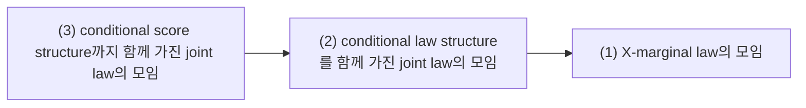
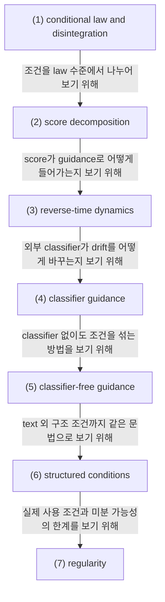

# Guidance as Conditional Score Manipulation

## 전체상

고정한 condition 공간 $C$ 와 상태공간 $X$ 를 둔다. 화살표는 forgetful map으로 읽는다.

## 각 층의 분기 포인트

- conditional law structure를 함께 가진 joint law의 모임
  - `(1)`을 남겨 두는 데서 그치지 않고, condition 변수 $c$를 따로 붙여 $X$의 law를 조건별 family로 나누어 보는 층이다.
  - 예를 들어 $X$의 marginal law만 적어 둔 대상은 `(1)`에는 있어도 `(2)`에는 들어오지 못한다.
- conditional score structure까지 함께 가진 joint law의 모임
  - `(2)` 중에서 conditional density를 $x$에 대해 미분하여 conditional score까지 함께 다루는 층이다.
  - 예를 들어 conditional law family는 있어도 $x$-미분이 불가능한 경우는 `(2)`에는 있어도 `(3)`에는 들어오지 못한다.

## 문서 로드맵

이 문서는 두 질문을 따라간다.

- 조건 $c$가 있을 때 $X_t$의 law와 score를 어떻게 다시 쓰는가.
- 그 score를 reverse dynamics에 넣어 classifier guidance와 classifier-free guidance를 어떻게 적는가.

## (1) conditional law and disintegration

결합 law $\pi_t(dx,dc)$가 있고, 조건 $C=c$에 대한 conditional law $\mu_t^c(dx)$가 있다고 하자. 그러면

$$
\pi_t(dx,dc)=\mu_t^c(dx)\,\nu(dc)
$$

또는 같은 내용을 kernel로

$$
\pi_t(dx,dc)=\kappa_t(dc\mid x)\,\mu_t(dx)
$$

처럼 적을 수 있다.

### (1-a) 정의를 쉬운 말로 읽기

조건 $c$를 붙인다는 것은 $X_t$만 따로 보는 일이 아니라, $X_t$와 $C$를 한꺼번에 보고 그 안에서 $C=c$인 쪽만 다시 떼어 보는 일이다.

이 조건을 두는 이유는 조건부 score나 guidance가 결국 joint law에서 나오는 구조이기 때문이다.

이 조건이 없으면 "조건이 주어졌을 때의 분포"라는 말을 안정적으로 쓸 수 없다.

> 예시. $C\in\{0,1\}$이고 $X_t$가 $C=0$일 때는 왼쪽, $C=1$일 때는 오른쪽으로 치우친다고 하자. 그러면 joint law를 먼저 두지 않으면 "조건 $0$에서의 law"와 "조건 $1$에서의 law"를 같은 문법으로 비교하기 어렵다.

## (2) score decomposition

density $p_t(x)$, $p_t(x\mid c)$가 존재한다고 하자. unconditional score와 conditional score를

$$
s_t(x):=\nabla_x\log p_t(x),
\qquad
s_t(x\mid c):=\nabla_x\log p_t(x\mid c)
$$

로 둔다. Bayes identity

$$
p_t(x\mid c)=\frac{p_t(c\mid x)p_t(x)}{p_t(c)}
$$

로부터

$$
s_t(x\mid c)=s_t(x)+\nabla_x\log p_t(c\mid x)
$$

를 얻는다.

### (2-a) 정의를 쉬운 말로 읽기

conditional score는 unconditional score에 조건이 "이쪽으로 가라"라고 주는 추가 기울기를 더한 것이다.

이 조건을 두는 이유는 guidance가 실제로는 score field를 조건 방향으로 밀어 주는 계산이기 때문이다.

이 식이 없으면 조건이 score에 어떻게 들어가는지 한 줄로 정리되지 않는다.

> 예시. $p_t(c\mid x)$가 $x$에 따라 커지는 쪽은 $\nabla_x\log p_t(c\mid x)$가 그 방향을 가리킨다. 그러면 conditional score는 unconditional score에 그 방향성을 더한 field로 읽힌다.

## (3) reverse-time dynamics

unconditional reverse-time SDE가

$$
dX_t=
\bigl(f(X_t,t)-g(t)^2 s_t(X_t)\bigr)\,dt+g(t)\,d\bar W_t
$$

라면, conditional reverse-time SDE는

$$
dX_t=
\bigl(f(X_t,t)-g(t)^2 s_t(X_t\mid c)\bigr)\,dt+g(t)\,d\bar W_t
$$

가 된다. probability flow ODE는

$$
\frac{dX_t}{dt}
=
f(X_t,t)-\frac12 g(t)^2 s_t(X_t\mid c)
$$

이다.

### (3-a) 정의를 쉬운 말로 읽기

조건부 sampling에서는 조건이 drift 쪽으로 들어가야 한다.

이 조건을 두는 이유는 generation이 단순한 noise trajectory가 아니라, 조건이 반영된 vector field를 따라 움직이는 과정이기 때문이다.

이 식이 없으면 conditional score가 실제 dynamics를 어떻게 바꾸는지 보이지 않는다.

> 예시. unconditional score를 그대로 쓰면 조건 $c$를 반영하지 못한다. conditional score를 쓰면 같은 noise라도 $c$에 맞는 쪽으로 drift가 바뀐다.

## (4) classifier guidance

외부 classifier가 $p_{\phi,t}(c\mid x)$를 근사한다고 하자. 그러면 conditional score를

$$
\widehat s_t(x\mid c)
=
s_\theta(x,t)+\nabla_x\log p_{\phi,t}(c\mid x)
$$

로 근사할 수 있다.

### (4-a) 정의를 쉬운 말로 읽기

classifier guidance는 score network에 classifier가 알려 주는 조건 방향을 더하는 방법이다.

이 조건을 두는 이유는 조건 정보를 score network 하나만으로 직접 학습하지 않아도 되기 때문이다.

이 식이 없으면 classifier가 무엇을 더해 주는지 보이지 않는다.

> 예시. classifier가 "이 샘플은 $c$와 잘 맞는다"라고 말하는 방향이 있으면, 그 방향의 gradient를 score에 더해 sampling을 유도한다.

## (5) classifier-free guidance

classifier-free setting에서는 하나의 network가 unconditional prediction과 conditional prediction을 함께 낸다. score notation으로

$$
\widehat s_t^{(w)}(x,c)
=
s_\theta(x,t,\varnothing)+w\bigl(s_\theta(x,t,c)-s_\theta(x,t,\varnothing)\bigr)
$$

로 둔다. 정리하면

$$
\widehat s_t^{(w)}(x,c)
=(1-w)s_\theta(x,t,\varnothing)+w\,s_\theta(x,t,c).
$$

### (5-a) 정의를 쉬운 말로 읽기

classifier-free guidance는 conditional field와 unconditional field 사이를 섞거나 더 강하게 밀어 주는 방법이다.

이 조건을 두는 이유는 classifier를 따로 쓰지 않고도 조건 방향을 조절할 수 있기 때문이다.

이 식이 없으면 $w$가 무엇을 조절하는지 보이지 않는다.

> 예시. $w=1$이면 conditional field 쪽을 그대로 쓰고, $w>1$이면 conditional field 쪽으로 더 세게 밀어 준다.

## (6) structured conditions

text뿐 아니라 edge map, depth map, pose map도 모두 조건변수 $C$의 값으로 취급할 수 있다. 따라서 구조 조건을 포함한 경우에도 conditional law는

$$
\mu_t^{(c_{\mathrm{text}},c_{\mathrm{struct}})}
$$

처럼 같은 문법으로 쓴다.

### (6-a) 정의를 쉬운 말로 읽기

structured condition은 조건의 종류를 바꾸는 것이 아니라, 조건 공간의 값을 바꾸는 일이다.

이 조건을 두는 이유는 text가 아닌 다른 형태의 정보도 같은 guidance 문법 안에 넣기 위해서다.

이 식이 없으면 text condition과 구조 condition을 같은 언어로 다루기 어렵다.

## (7) regularity

위 식들은 $p_t(x)$, $p_t(x\mid c)$, $p_t(c\mid x)$가 미분 가능하고 해당 로그미분이 존재하는 영역에서 성립한다. 실제 모델은 density를 직접 다루지 않고 score network를 학습하므로, 구현에서는 이 식을 exact identity가 아니라 learned approximation의 목표 형태로 사용한다.

## 관련 문서

- [[Conditional Probability, Conditional Expectation, and L2 Projection]]
- [[Markov Kernels, Disintegration, and Bayes Formula]]
- [[Score Functions, Reverse-Time Dynamics, and Probability Flow ODE]]
- [[CFG, ControlNet, and LoRA Demo Walkthrough]]
- [[ControlNet]]
