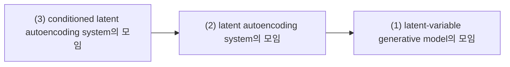
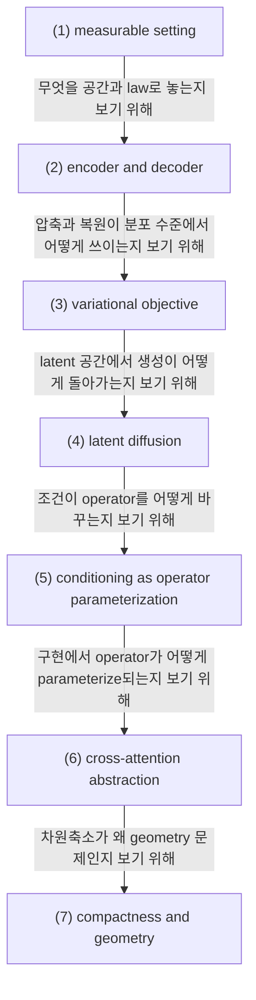

# Latent Variables, Autoencoders, Conditioning

## 전체상

고정한 관측공간 $X$ 와 latent 공간 $Z$ 를 둔다. 화살표는 forgetful map으로 읽는다.

## 각 층의 분기 포인트

- latent autoencoding system의 모임
  - `(1)` 중에서, decoder와 prior만 두지 않고 encoder 또는 posterior 구조를 함께 두어 관측을 latent로 다시 보내는 층이다.
  - 예를 들어 prior와 decoder만 있는 순수 latent generative model은 `(1)`에는 있어도 `(2)`에는 들어오지 못한다.
- conditioned latent autoencoding system의 모임
  - `(2)` 중에서, latent autoencoding 구조 위에 text, class, mask 같은 조건 변수를 붙여 operator family로 다루는 층이다.
  - 예를 들어 조건 입력 없이 하나의 encoder/decoder만 두는 autoencoding system은 `(2)`에는 있어도 `(3)`에는 들어오지 못한다.

## 문서 로드맵

이 문서는 두 질문을 따라간다.

- encoder와 decoder를 map/kernel로 적으면 latent variable model과 autoencoder가 어떻게 하나의 문법으로 보이는가.
- conditioning을 입력 부착이 아니라 operator family의 parameterization으로 보면, latent diffusion과 cross-attention이 어떻게 정리되는가.

## (1) measurable setting

관측공간을 $(\mathcal X,\mathcal B_{\mathcal X})$, latent 공간을 $(\mathcal Z,\mathcal B_{\mathcal Z})$라 하고, 데이터 law를 $\mu\in\mathcal P(\mathcal X)$라 하자. latent variable model은 prior $\nu\in\mathcal P(\mathcal Z)$와 decoder kernel

$$
P_X(dx\mid z)
$$

을 통해

$$
\widehat\mu(A)=\int_{\mathcal Z}P_X(A\mid z)\,\nu(dz),
\qquad A\in\mathcal B_{\mathcal X}
$$

로 관측 law를 다시 적는다.

### (1-a) 정의를 쉬운 말로 읽기

이 설정의 핵심은 데이터 law와 latent law를 둘 다 같은 틀에서 다루는 데 있다.

이 조건을 두는 이유는 encoder와 decoder를 단순 함수가 아니라 law를 옮기는 장치로 보기 위해서다.

이 설정이 없으면 latent model이 "압축된 공간에서 law를 다시 쓰는 구조"라는 점이 드러나지 않는다.

> 예시. $\mathcal X$의 한 점이 latent 점 하나로만 보내지는 경우는 deterministic encoder이고, 한 점이 여러 latent 점으로 퍼지는 경우는 stochastic encoder다. 둘 다 같은 measurable setting 안에서 쓸 수 있다.

## (2) encoder and decoder

encoder는 measurable map $E:\mathcal X\to\mathcal Z$ 또는 posterior kernel

$$
Q_Z(dz\mid x)
$$

로 둔다. deterministic encoder라면 pushforward measure

$$
E_\#\mu(B)=\mu(E^{-1}(B)),
\qquad B\in\mathcal B_{\mathcal Z}
$$

가 latent law가 된다.

decoder가 measurable map $D:\mathcal Z\to\mathcal X$라면 reconstruction operator는 $D\circ E$이다. cost $c:\mathcal X\times\mathcal X\to[0,\infty)$에 대해 reconstruction risk는

$$
\mathcal R(E,D)
=
\int_{\mathcal X}c\bigl(x,D(E(x))\bigr)\,\mu(dx)
$$

이다.

### (2-a) 정의를 쉬운 말로 읽기

encoder는 "어떤 점들을 같은 latent 블록으로 묶을지"를 정한다.

이 조건을 두는 이유는 압축이 단순한 차원 축소가 아니라, 구별 정보를 latent 공간에서 다시 묶는 작업이기 때문이다.

이 식이 없으면 reconstruction이 무엇을 기준으로 나쁜지 말하기 어렵다.

> 예시. $x_1,x_2$가 거의 같은 종류의 입력이라면 encoder는 둘을 같은 latent 근처로 보내고, decoder는 그 latent 블록에서 공통적인 원형을 복원한다.

## (3) variational objective

prior $\nu$, encoder kernel $Q_Z(dz\mid x)$, decoder density $p_\theta(x\mid z)$가 있으면 각 $x$에 대한 ELBO는

$$
\log p_\theta(x)
\ge
\mathbb E_{Q_Z(\cdot\mid x)}[\log p_\theta(x\mid z)]
-D_{\mathrm{KL}}(Q_Z(\cdot\mid x)\|\nu)
$$

이다. 첫 항은 reconstruction term, 둘째 항은 latent law가 prior에서 너무 멀어지지 않도록 하는 regularization term이다.

### (3-a) 정의를 쉬운 말로 읽기

ELBO는 복원과 latent 정규화를 한 번에 보는 식이다.

이 조건을 두는 이유는 latent representation이 맞게 복원되면서도 prior와 너무 어긋나지 않도록 잡기 위해서다.

이 식이 없으면 autoencoder와 variational autoencoder를 같은 목적함수 언어로 비교하기 어렵다.

> 예시. 복원만 잘하는 encoder는 latent space를 제멋대로 찌그러뜨릴 수 있다. KL term은 그 찌그러짐을 prior 쪽으로 되돌리는 역할을 한다.

## (4) latent diffusion

latent diffusion에서는 먼저 encoder로

$$
\mu_Z:=E_\#\mu
$$

를 만들고, 그 다음 $\mathcal Z$ 위에서 noise law $\gamma$에서 $\mu_Z$로 가는 dynamics를 학습한다. decoder $D$를 거치면 최종 law는

$$
\widehat\mu_X:=D_\#\mu_Z
$$

또는 stochastic decoder라면

$$
\widehat\mu_X(A)=\int_{\mathcal Z}P_X(A\mid z)\,\mu_Z(dz)
$$

로 얻는다.

### (4-a) 정의를 쉬운 말로 읽기

latent diffusion은 먼저 쉬운 공간에서 생성 문제를 풀고, 그 결과를 다시 원공간으로 옮기는 방법이다.

이 조건을 두는 이유는 고차원 원공간보다 latent 공간에서 sampling과 denoising이 더 다루기 쉽기 때문이다.

이 식이 없으면 representation error와 latent generative error를 분리해서 보지 못한다.

> 예시. 원공간에서는 복잡한 image law가 latent 공간에서는 더 단순한 blob처럼 보일 수 있고, 그 blob에서 diffusion을 돌린 뒤 decoder로 다시 image로 옮긴다.

## (5) conditioning as operator parameterization

conditioning을 입력을 하나 더 붙이는 일로만 보면 구조가 흐려진다. 실제로는 dynamics를 만드는 operator family가 조건에 따라 달라진다고 보는 편이 맞다.

조건공간을 $(\mathcal C,\mathcal B_{\mathcal C})$라 하고, 조건변수를 $c\in\mathcal C$라 하자. latent dynamics를

$$
\partial_t u_t=\mathcal A_t^c u_t
$$

또는 sample-path 수준에서

$$
\frac{dZ_t}{dt}=v_t(Z_t,c),
\qquad
dZ_t=b_t(Z_t,c)\,dt+\sigma_t\,dW_t
$$

처럼 쓸 수 있다.

### (5-a) 정의를 쉬운 말로 읽기

conditioning은 입력을 옆에 덧붙이는 게 아니라, 같은 상태공간에서도 진화법칙 자체를 바꾸는 일이다.

이 조건을 두는 이유는 text, edge map, depth map, pose map처럼 서로 다른 조건을 같은 문법으로 다루기 위해서다.

이 식이 없으면 조건을 벡터장이나 drift에 어떻게 넣는지 보이지 않는다.

> 예시. text condition은 attention block을 통해, depth condition은 별도 branch를 통해 들어가더라도, 둘 다 결국 $\mathcal A_t^c$ 또는 $v_t(\cdot,c)$의 조건 의존성으로 읽을 수 있다.

## (6) cross-attention abstraction

텍스트 encoder가 $c\mapsto h(c)\in\mathcal H$를 만든다고 하자. 그러면 network block은 latent feature $u\in\mathcal U$에 대해

$$
T_c:\mathcal U\to\mathcal U
$$

라는 조건 의존 연산자를 정의한다.

### (6-a) 정의를 쉬운 말로 읽기

cross-attention은 구현상 query-key-value 연산이지만, 수학적으로는 조건 $c$가 들어오면 latent update operator가 바뀌는 장치다.

이 조건을 두는 이유는 conditioning이 단순한 feature concatenation이 아니라 operator family의 선택으로 작동하기 때문이다.

이 식이 없으면 attention block이 왜 conditioning의 추상화인지 설명하기 어렵다.

> 예시. 같은 latent token이라도 text prompt가 달라지면 attention weight가 달라지고, 그 결과 $T_c$가 달라진다.

## (7) compactness and geometry

$d_z\ll d_x$이면 계산량이 줄어드는 것은 자명하지만, 수학적으로 더 중요한 것은 $\mu$의 질량이 decoder가 안정적으로 복원할 수 있는 저차원 구조 근처에 놓이는가이다.

### (7-a) 정의를 쉬운 말로 읽기

latent representation의 핵심은 단순히 차원을 줄이는 데 있지 않다.

이 조건을 두는 이유는 geometry를 보존해야 reconstruction과 generation이 둘 다 안정해지기 때문이다.

이 관점이 없으면 차원 축소를 단순 압축으로만 오해한다.

> 예시. $d_z$를 줄였는데도 decoder가 원래 데이터의 구조를 잘 복원하면 좋은 representation이고, 반대로 latent가 너무 꼬이면 작은 차원이라도 의미가 없다.

## 관련 문서

- [[Probability Measures, Random Variables, Pushforward, and Convergence]]
- [[Conditional Probability, Conditional Expectation, and L2 Projection]]
- [[Sigma-Algebras, Measurable Maps, and What Measurable Means]]
- [[High-Resolution Image Synthesis with Latent Diffusion Models]]
- [[Guidance as Conditional Score Manipulation]]
- [[CFG, ControlNet, and LoRA Demo Walkthrough]]
