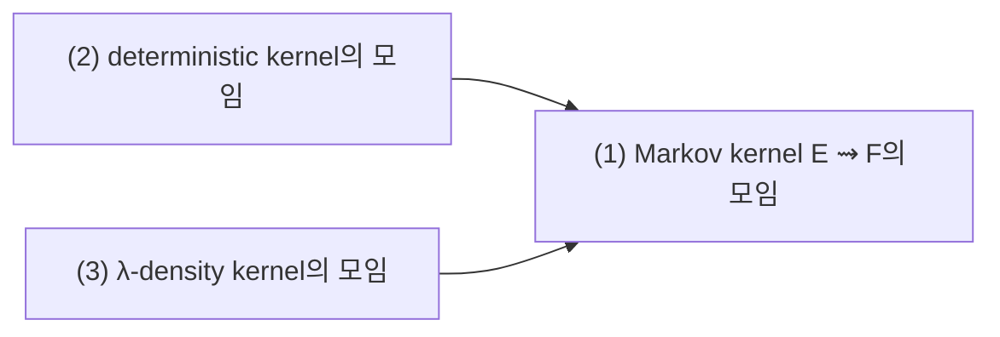
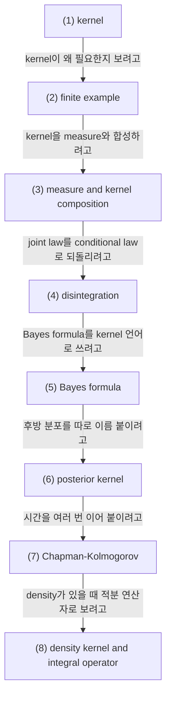

# Markov Kernels, Disintegration, Bayes Formula

## 전체상

고정한 measurable spaces $(E,\mathcal E)$ 와 $(F,\mathcal F)$ 를 둔다. 화살표는 inclusion map으로 읽는다.

## 각 층의 분기 포인트

- deterministic kernel의 모임
  - `(1)` 중에서, 각 $x$ 마다 다음 상태가 확률분포가 아니라 한 점으로만 정해지는 kernel만 모아 둔 층이다.
  - 예를 들어 한 상태에서 두 점에 양의 질량을 나누어 주는 kernel은 `(1)`에는 들어가도 `(2)`에는 들어오지 못한다.
- λ-density kernel의 모임
  - `(1)` 중에서, 고정한 기준측도 $\lambda$ 에 대해 $K(dy\mid x)=k(x,y)\lambda(dy)$ 꼴로 적을 수 있는 kernel만 모아 둔 층이다.
  - 예를 들어 Dirac 질량으로만 주어지는 deterministic kernel은 일반적으로 `(1)`에는 들어가도 `(3)`에는 들어오지 못한다.

## 문서 로드맵

문서의 흐름은 다음 질문을 따라간다.

- 먼저 `(1)`과 `(2)`에서, 현재 상태가 주어졌을 때 다음 분포를 주는 장치가 무엇인지 본다.
- 그다음 `(3)`과 `(4)`에서, 그 장치가 measure와 결합할 때 joint law가 어떻게 생기는지 본다.
- 이어서 `(5)`와 `(6)`에서, joint law를 다시 marginal과 conditional kernel로 나누고 역방향 kernel을 읽는다.
- 마지막 `(7)`과 `(8)`에서, 시간 여러 칸을 붙이는 Markov 구조와 density kernel의 integral operator 해석을 본다.

## (1) Markov kernel

measurable spaces $(E,\mathcal E)$, $(F,\mathcal F)$ 가 주어졌다고 하자. Markov kernel $K$ from $E$ to $F$ 는
$$
K:E\times\mathcal F\to[0,1]
$$
로서

1. 각 $x\in E$ 에 대해 $A\mapsto K(x,A)$ 는 $F$ 위의 probability measure,
2. 각 $A\in\mathcal F$ 에 대해 $x\mapsto K(x,A)$ 는 $\mathcal E$-measurable

인 함수이다.

표기를 $K(x,dy)$ 또는 $K(dy\mid x)$ 로 쓴다.

### (1-a) 정의를 쉬운 말로 읽기

현재 상태 $x$ 가 주어지면 다음 상태의 분포가 하나 나와야 하고, 동시에 그 분포가 $x$ 에 대해 잘 변해야 한다.

이 조건을 두는 이유는 상태를 따라가며 분포를 계산하고, 그 분포를 적분과 합성으로 다시 다루기 위해서다.

이 조건이 없으면 "상태가 바뀌면 분포도 바뀐다"는 말이 측도론적으로 안정적으로 적히지 않는다.

> 예시. $E=\{a,b\}$, $F=\{0,1,2\}$ 라 하자. 다음처럼 두면 kernel이 된다.
>
> $$
> K(a,\{0\})=\frac12,\quad K(a,\{1\})=\frac12,\quad K(a,\{2\})=0,
> $$
>
> $$
> K(b,\{0\})=\frac14,\quad K(b,\{1\})=\frac14,\quad K(b,\{2\})=\frac12.
> $$

## (2) 유한 상태공간 예시

위 kernel은 $a$ 에서는 $0,1$ 쪽에 더 많이 몰리고, $b$ 에서는 $2$ 쪽에 더 많이 몰린다.

즉 kernel은 "다음 상태의 분포를 상태별로 적어 둔 표"처럼 읽을 수 있다.

## (3) measure와 kernel의 합성

$\mu\in\mathcal P(E)$ 와 kernel $K(dy\mid x)$ 가 주어지면 $F$ 위의 measure $\mu K$ 를
$$
(\mu K)(A):=\int_E K(A\mid x)\,\mu(dx)
$$
로 정의한다.

또한 $E\times F$ 위의 joint measure는
$$
\pi(dx,dy):=\mu(dx)K(dy\mid x)
$$
로 만든다.

### (3-a) 정의를 쉬운 말로 읽기

현재 상태 $x$ 에서 다음 상태 분포를 준 뒤, 현재 상태 전체에 대해 다시 평균내면 새 분포가 된다.

이 조건을 두는 이유는 kernel을 실제 measure 계산에 넣기 위해서다.

이 조건이 없으면 forward chain이나 Markov chain을 한 줄로 적기 어렵다.

> 예시. $E=\{a,b\}$, $F=\{0,1,2\}$, $\mu(\{a\})=\frac23$, $\mu(\{b\})=\frac13$ 라 하자.
>
> 위 kernel에 대해
> $$
> (\mu K)(\{2\})
> =
> \frac23\cdot 0+\frac13\cdot \frac12
> =
> \frac16
> $$
> 이다.

## (4) disintegration

joint measure $\pi\in\mathcal P(E\times F)$ 의 첫 번째 marginal을 $\mu$ 라 하자. 적당한 표준 Borel 공간 조건 아래에서 어떤 kernel $K(dy\mid x)$ 가 존재하여
$$
\pi(dx,dy)=\mu(dx)K(dy\mid x)
$$
가 된다. 이를 disintegration이라 한다.

이 말은 joint law를 "한쪽을 고정했을 때 다른 쪽이 어떻게 분포하는가"로 분해하는 것이다.

## (5) Bayes formula

위 disintegration과 반대 방향 disintegration이 동시에 존재하면
$$
\mu(dx)K(dy\mid x)=L(dx\mid y)\nu(dy)
$$
로 쓸 수 있다. 이것이 kernel 형태의 Bayes formula다.

density가 존재하면 familiar한 분수꼴 공식으로 내려간다.

$$
p(x\mid y)=\frac{p(y\mid x)p(x)}{p(y)}.
$$

### (5-a) 정의를 쉬운 말로 읽기

한쪽 방향으로 적은 joint law를 반대 방향으로 다시 읽는 규칙이다.

이 조건을 두는 이유는 forward model과 posterior를 같은 언어로 비교하기 위해서다.

이 조건이 없으면 "사전분포와 사후분포를 바꿔 읽는다"는 말을 kernel 수준에서 적기 어렵다.

## (6) posterior kernel

forward kernel $q(dx_t\mid x_{t-1})$ 와 prior law $\mu_0(dx_0)$ 가 주어지면 joint law
$$
\pi(dx_0,dx_t)=\mu_0(dx_0)\,q_t(dx_t\mid x_0)
$$
를 만들 수 있다.

이때 posterior kernel
$$
q(dx_0\mid x_t)
$$
는 $\pi$ 의 역방향 disintegration이다.

유한 상태공간에서는 관측된 $x_t$ 를 고정했을 때 가능한 $x_0$ 들에 확률을 다시 나눠 주는 규칙으로 읽는다.

## (7) Chapman-Kolmogorov equation

transition kernel $K_{s,t}$ 가 시간 $s\le u\le t$ 에 대해
$$
K_{s,t}(x,A)=\int_E K_{u,t}(y,A)\,K_{s,u}(x,dy)
$$
를 만족하면 Markov property를 따른다고 본다. 이것이 Chapman-Kolmogorov equation이다.

이 식은 kernel의 반복 합성이 semigroup 또는 evolution family를 만든다는 뜻이다.

## (8) density kernel and integral operator

kernel이 density $k(x,y)$ 를 가지면
$$
K(dy\mid x)=k(x,y)\,dy
$$
로 쓸 수 있고, 이때 $K$ 는 함수공간 위의 integral operator
$$
(Kf)(x)=\int_F f(y)k(x,y)\,dy
$$
를 만든다.

forward noising과 reverse denoising은 이런 operator의 연쇄로 볼 수 있다.

## 관련 문서

- [[Conditional Probability, Conditional Expectation, and L2 Projection]]
- [[Gaussian Vectors, Covariance, and Conditional Gaussian Laws]]
- [[Sigma-Algebras, Measurable Maps, and What Measurable Means]]
- [[Variational Objectives and Noise Prediction]]
