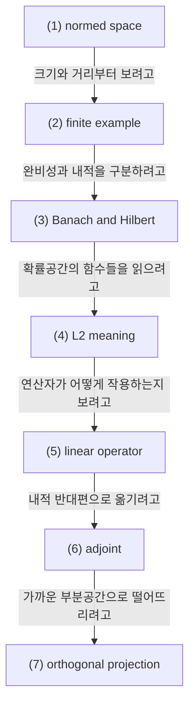

# Normed Spaces, Hilbert Spaces, Operators, and Adjoint

## 전체상

화살표는 inclusion map으로 읽는다.

## 각 층의 분기 포인트

- `Banach space의 모임`
  - `(1)` 중에서, Cauchy sequence가 그 공간 안에서 실제로 수렴하는 경우만 모아 둔 층이다.
  - 예를 들어 다항식의 공간에 $\|\cdot\|_\infty$ norm만 두고 완비화하지 않으면 `(1)`에는 들어가도 `(2)`에는 들어오지 못한다.
- `Hilbert space의 모임`
  - `(2)` 중에서, norm이 inner product에서 오는 경우만 모아 둔 층이다.
  - 예를 들어 $\ell^1$은 완비라서 `(2)`에는 들어가도 그 norm이 inner product에서 오지 않으므로 `(3)`에는 들어오지 못한다.
- `L²형 Hilbert space의 모임`
  - `(3)` 중에서, 내적이 적분 형태로 주어져 projection과 adjoint 계산에 바로 쓰이는 공간들만 모아 둔 층이다.
  - 예를 들어 일반 Hilbert space는 `(3)`에는 들어가도 곧바로 함수의 적분 내적으로 읽히지 않으면 `(4)`의 전형적인 예시는 아니다.

## 문서 로드맵

## (1) Normed Space

diffusion 이론에서 $L^2$, projection, generator, adjoint 같은 말이 반복되는데, 이들은 사실 함수해석의 기본 언어다. 확률론 문헌처럼 보여도 안쪽에서는 "어떤 함수공간 위에서 연산자가 어떻게 작용하는가"를 계속 묻고 있다.

벡터공간 $V$ 위의 norm은 함수

$$
\|\cdot\|:V\to[0,\infty)
$$

로서

- $\|x\|=0 \Leftrightarrow x=0$,
- $\|\alpha x\|=|\alpha|\|x\|$,
- $\|x+y\|\le \|x\|+\|y\|$

를 만족한다.

이 구조를 두는 이유는 "벡터가 얼마나 큰가", "둘이 얼마나 가까운가"를 말하기 위해서다.

## (2) 유한차원 예시

$V=\mathbb R^2$에서

$$
\|(x,y)\|_2=\sqrt{x^2+y^2}
$$

는 Euclidean norm이다. 예를 들어

$$
\|(3,4)\|_2=5
$$

이다.

## (3) Banach Space와 Hilbert Space

norm으로 생기는 거리에서 Cauchy sequence가 항상 수렴하면 Banach space라 한다.

inner product

$$
\langle x,y\rangle
$$

가 주어지고, 그로부터 norm

$$
\|x\|=\sqrt{\langle x,x\rangle}
$$

가 나오는 완비공간이면 Hilbert space라 한다.

Hilbert space가 중요한 이유는 직교성, projection, adjoint 같은 개념이 자연스럽게 들어오기 때문이다.

## (4) $L^2$의 의미

$L^2(\Omega,\mathcal F,\mathbb P)$에서는

$$
\langle X,Y\rangle=\mathbb E[XY]
$$

를 inner product로 쓴다. 그래서 conditional expectation이 orthogonal projection이라는 말이 성립한다.

유한집합 $\Omega=\{\omega_1,\omega_2\}$, $\mathbb P(\omega_1)=\mathbb P(\omega_2)=1/2$이면 함수 $X$는 사실상 두 숫자

$$
(X(\omega_1),X(\omega_2))
$$

로 볼 수 있다. 이때 $L^2$는 weighted Euclidean space와 거의 같다.

## (5) Linear Operator

벡터공간 $V,W$ 사이의 linear operator $T:V\to W$는

$$
T(ax+by)=aT(x)+bT(y)
$$

를 만족하는 함수다.

함수해석에서는 특히 bounded operator가 중요하다. 즉 어떤 $C>0$가 있어서

$$
\|Tx\|_W\le C\|x\|_V
$$

가 성립하면 bounded라 한다.

boundedness는 "작은 입력을 넣었는데 출력이 갑자기 폭주하지 않는다"는 뜻이다.

### (5-a) 유한차원 operator 예시

$A=\begin{pmatrix}1&2\\0&1\end{pmatrix}$를 생각하자. 그러면

$$
T(x)=Ax
$$

는 $\mathbb R^2\to\mathbb R^2$의 linear operator다. 유한차원에서는 모든 선형사상이 자동으로 bounded다.

## (6) Adjoint

Hilbert spaces $H,K$ 사이의 bounded operator $T:H\to K$에 대해 adjoint $T^\ast:K\to H$는

$$
\langle Tx,y\rangle_K=\langle x,T^\ast y\rangle_H
$$

를 만족하는 연산자다.

이 정의는 "연산자를 내적의 반대편으로 옮긴다"는 뜻이다. PDE와 probability에서 generator의 adjoint가 density equation을 만드는 이유가 여기에 있다.

### (6-a) 행렬로 보는 adjoint

실수 유클리드 공간에서는 adjoint가 transpose다.

$$
A=
\begin{pmatrix}
1 & 2\\
0 & 1
\end{pmatrix}
\quad\Rightarrow\quad
A^\ast=A^\top=
\begin{pmatrix}
1 & 0\\
2 & 1
\end{pmatrix}.
$$

## (7) Orthogonal Projection

닫힌 부분공간 $M\subset H$에 대해 각 $x\in H$는 유일하게

$$
x=m+r,\qquad m\in M,\quad r\perp M
$$

로 쓸 수 있다. 이때 $P_Mx:=m$을 projection이라 한다.

conditional expectation이 projection이라는 말은, $\mathcal G$-measurable 함수들로 이루어진 부분공간에 가장 가까운 근사를 취한다는 뜻이다.

## (8) 관련 문서

- [[Conditional Probability, Conditional Expectation, and L2 Projection]]
- [[Semigroups, Generators, Adjoint Operators, and Kolmogorov Equations]]
- [[Regularity, Test Functions, and Weak Meaning]]
