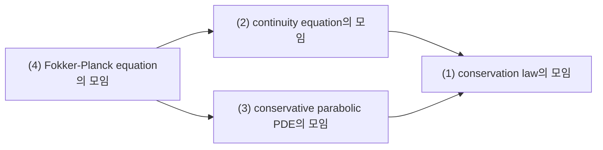
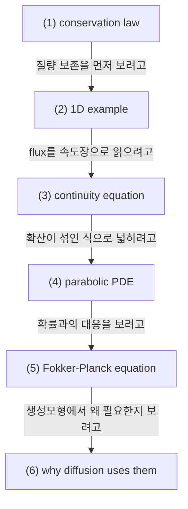

# Parabolic PDE, Conservation Laws, and Why Diffusion Uses Them

## 전체상

화살표는 inclusion map으로 읽는다.

## 각 층의 분기 포인트

- `continuity equation의 모임`
  - `(1)` 중에서, flux를 밀도와 속도장으로 적어 질량 보존을 transport 식으로 읽는 경우만 모아 둔 층이다.
  - 예를 들어 flux를 따로 주기만 한 일반 conservation law는 `(1)`에는 들어가도 `(2)`에는 들어오지 못한다.
- `conservative parabolic PDE의 모임`
  - `(1)` 중에서, 확산에 해당하는 2차 미분 항이 들어가 smoothing이 일어나는 식들만 모아 둔 층이다.
  - 예를 들어 순수 transport equation은 `(1)`에는 들어가도 2차 항이 없으므로 `(3)`에는 들어오지 못한다.
- `Fokker-Planck equation의 모임`
  - `(2)`와 `(3)`를 함께 만족하는 식들 가운데, drift와 diffusion이 확률밀도의 시간 진화로 읽히는 경우만 모아 둔 층이다.
  - 예를 들어 일반 heat equation이나 일반 continuity equation은 각각 `(3)` 또는 `(2)`에는 들어가도 `(4)`에는 바로 들어오지 못한다.

## 문서 로드맵

## (1) Conservation Law

diffusion 문헌에는 continuity equation과 Fokker-Planck equation이 번갈아 나온다. 하나는 질량 보존 법칙이고, 다른 하나는 확산까지 포함한 parabolic PDE다. 둘을 구분해 두면 probability flow ODE와 SDE의 역할도 훨씬 자연스럽게 읽힌다.

### (1-a) Conservation law in words

가장 기본 형태는

$$
\partial_t \rho + \nabla\cdot J = 0
$$

이다. 여기서 $\rho$는 density, $J$는 flux다.

이 식의 뜻은 단순하다. 어떤 영역 안의 질량 변화는 경계를 통해 드나든 양으로만 설명된다는 것이다. 즉 질량이 갑자기 생기거나 사라지지 않는다.

## (2) 1차원 예시

구간 $[a,b]$에서 적분하면

$$
\frac{d}{dt}\int_a^b \rho(x,t)\,dx
=
-J(b,t)+J(a,t)
$$

가 된다. 오른쪽은 경계로 나간 양과 들어온 양의 차이다.

## (3) Continuity Equation

flux가 단순히 속도장 $v$에 의해

$$
J=\rho v
$$

로 주어지면

$$
\partial_t \rho + \nabla\cdot(\rho v)=0
$$

를 얻는다. 이것이 continuity equation이다.

즉 개별 점은 ODE

$$
\dot x_t=v(x_t,t)
$$

를 따라 움직이고, 전체 질량은 continuity equation을 만족한다.

## (4) Parabolic PDE

확산까지 들어가면 flux는 단순 이동뿐 아니라 퍼짐을 반영해야 한다. 가장 대표적인 예는 heat equation

$$
\partial_t u = \Delta u
$$

이다. 이 식은 시간이 지나며 요철이 평탄해지는 smoothing 효과를 가진다.

parabolic PDE라는 말은 대략 "시간 방향으로는 진화식이고, 공간 방향으로는 second-order diffusion이 들어간다"는 뜻으로 이해하면 된다.

## (5) Fokker-Planck Equation

SDE

$$
dX_t=b(X_t,t)\,dt+\sigma(X_t,t)\,dW_t
$$

에 대응하는 density equation은

$$
\partial_t p_t
=
-\nabla\cdot(b\,p_t)
+\frac12\sum_{i,j}\partial_{ij}(a_{ij}p_t),
\qquad a=\sigma\sigma^\top
$$

이다.

첫 항은 수송(transport), 둘째 항은 확산(diffusion)이다. 그래서 Fokker-Planck equation은 transport와 parabolic smoothing이 함께 있는 PDE다.

## (6) 왜 diffusion 모델에서 중요한가

score-based SDE에서는 sample path는 무작위적이지만, one-time marginal $p_t$는 위 PDE를 따른다. 반면 probability flow ODE는 같은 $p_t$를 continuity equation만으로 재현한다.

즉

- SDE 쪽은 transport + diffusion,
- probability flow ODE 쪽은 transport only

인데, 둘이 같은 marginal path를 공유하도록 맞춰진다.

## (7) 관련 문서

- [[Semigroups, Generators, Adjoint Operators, and Kolmogorov Equations]]
- [[Score Function, Reverse-Time Dynamics, Probability Flow ODE]]
- [[Vector Fields, Continuity Equation, and Rectification]]
