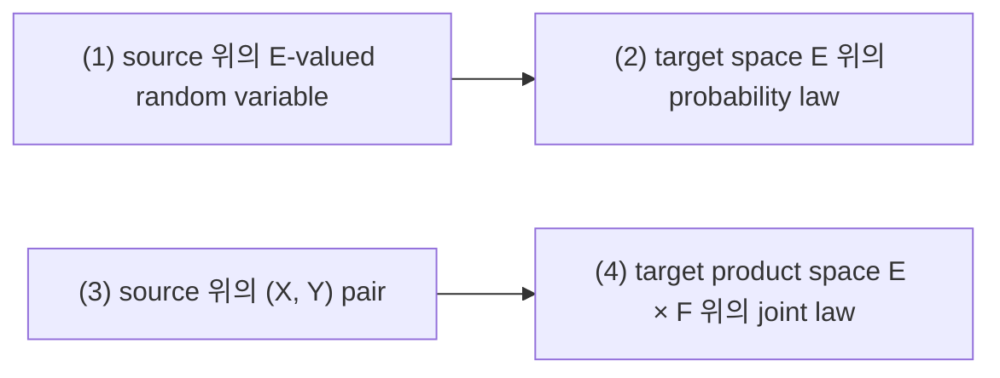
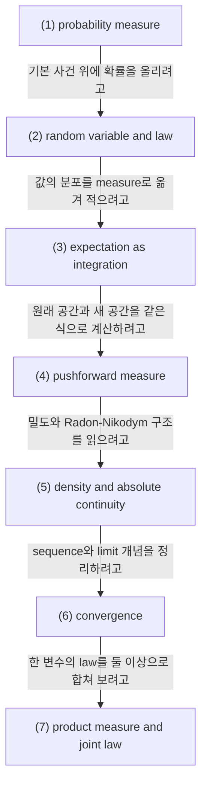

# Probability Measures, Random Variables, Pushforward, and Convergence

## 전체상

고정한 source probability space $(\Omega,\mathcal F,\mathbb P)$ 를 둔다. 화살표는 forgetful map으로 읽는다.

## 각 층의 분기 포인트

- `target space E 위의 probability law`
  - `(1)`에서 source와 samplewise coupling을 잊고 분포만 남긴 층이다.
  - 예를 들어 서로 다른 source 공간에서 정의된 random variable이라도 law가 같으면 `(1)`에서는 달라도 `(2)`에서는 같은 대상으로 본다.
- `target product space E × F 위의 joint law`
  - `(3)`에서 source를 잊고 두 변수의 결합분포만 남긴 층이다.
  - 예를 들어 같은 주변확률공간에서 정의된 두 pair라도 결합분포가 다르면 `(3)`에는 있어도 `(4)`에서는 같은 대상으로 보지 않는다.

## 문서 로드맵

문서의 흐름은 다음 질문을 따라간다.

- 먼저 `(1)`과 `(2)`에서, 확률을 올릴 수 있는 사건 구조와 그 위의 random variable이 무엇인지 본다.
- 그다음 `(3)`과 `(4)`에서, random variable의 law를 적분과 pushforward로 어떻게 읽는지 본다.
- 이어서 `(5)`와 `(6)`에서, density와 $L^p$, 그리고 수렴 개념을 같은 언어로 정리한다.
- 마지막 `(7)`에서는 두 변수의 결합 분포를 적고 독립과 joint law를 다시 본다.

## (1) probability measure

집합 $\Omega$ 위의 family $\mathcal F\subset\mathcal P(\Omega)$ 가 다음을 만족하면 $\sigma$-algebra라 하고, $(\Omega,\mathcal F)$ 를 measurable space라 한다.

1. $\varnothing,\Omega\in\mathcal F$.
2. $A\in\mathcal F$ 이면 $A^c\in\mathcal F$.
3. $A_1,A_2,\dots\in\mathcal F$ 이면 $\bigcup_{n=1}^\infty A_n\in\mathcal F$.

이제 $\mathbb P:\mathcal F\to[0,1]$ 가

1. $\mathbb P(\Omega)=1$,
2. 서로소인 집합열 $(A_n)$ 에 대해 $\mathbb P(\bigcup_{n=1}^\infty A_n)=\sum_{n=1}^\infty \mathbb P(A_n)$

을 만족하면 probability measure라 한다.

### (1-a) 정의를 쉬운 말로 읽기

1. $\mathbb P(\Omega)=1$.

   전체 경우를 다 합치면 확률이 1이 되도록 고정한다는 뜻이다.

   이 조건을 두는 이유는 확률의 총량을 처음부터 정해 두기 위해서다.

   이 조건이 없으면 확률이 어떤 크기 단위로 재고 있는지부터 흐려진다.

2. 서로소인 사건들의 확률은 더해진다.

   겹치지 않는 경우들을 한 덩어리로 합치면 전체 확률이 각 부분의 합이 된다는 뜻이다.

   이 조건을 두는 이유는 경우를 쪼개서 계산할 수 있게 하기 위해서다.

   이 조건이 없으면 작은 경우를 합쳐서 큰 경우를 계산하는 규칙이 깨진다.

> 예시. $\Omega=\{\omega_1,\omega_2,\omega_3,\omega_4\}$ 에서
> $$
> \mathcal G=
> \{
> \varnothing,\{\omega_1,\omega_2\},\{\omega_3,\omega_4\},\Omega
> \}
> $$
> 를 두고 $\mathbb P(\{\omega_1,\omega_2\})=\frac13$, $\mathbb P(\{\omega_3,\omega_4\})=\frac23$ 라 하자.
> 그러면 $\mathbb P(\Omega)=1$ 이고, 서로소한 두 블록의 확률을 더해 전체 확률을 얻는다.

## (2) random variable and law

$(E,\mathcal E)$ 를 measurable space라 하자. 함수
$$
X:(\Omega,\mathcal F)\to(E,\mathcal E)
$$
가 measurable이면 random variable이라 한다.

이때 law 또는 distribution은 pushforward measure
$$
X_\#\mathbb P
$$
이다. 각 $A\in\mathcal E$ 에 대해
$$
(X_\#\mathbb P)(A)=\mathbb P(X^{-1}(A))
$$
가 된다.

### (2-a) 정의를 쉬운 말로 읽기

random variable은 값 하나를 주는 함수가 아니라, 값이 어떤 집합에 들어가는지에 대한 질문을 사건으로 끌어올릴 수 있는 함수다.

이 조건을 두는 이유는 $X$ 를 통해 생기는 분포를 $\Omega$ 쪽 measure로 다시 적을 수 있게 하기 위해서다.

이 조건이 없으면 $\mathbb P(X\in A)$ 같은 말을 안정적으로 쓸 수 없다.

> 예시. $\Omega=\{\omega_1,\omega_2,\omega_3\}$ 이고 $\mathbb P(\{\omega_1\})=\frac14$, $\mathbb P(\{\omega_2\})=\frac14$, $\mathbb P(\{\omega_3\})=\frac12$ 라 하자.
>
> $E=\{0,1\}$ 와
> $$
> X(\omega_1)=0,\quad X(\omega_2)=1,\quad X(\omega_3)=1
> $$
> 를 두면 $X_\#\mathbb P(\{0\})=\frac14$, $X_\#\mathbb P(\{1\})=\frac34$ 이다.

## (3) expectation as integration

적분 가능한 random variable $X:\Omega\to\mathbb R$ 에 대해
$$
\mathbb E[X]=\int_\Omega X(\omega)\,\mathbb P(d\omega)
$$
이다.

더 일반적으로 measurable $f:E\to\mathbb R$ 에 대해
$$
\mathbb E[f(X)]
=
\int_\Omega f(X(\omega))\,\mathbb P(d\omega)
=
\int_E f(x)\,(X_\#\mathbb P)(dx)
$$
가 된다.

이 식이 random variable의 law와 expectation을 연결한다.

## (4) pushforward measure

measurable map $T:E\to F$ 와 $\mu\in\mathcal P(E)$ 가 주어지면 pushforward $T_\#\mu\in\mathcal P(F)$ 를
$$
T_\#\mu(B)=\mu(T^{-1}(B)),\qquad B\in\mathcal F
$$
로 정의한다.

이 정의는 원래 공간의 질량 배치를 함수 $T$ 를 통해 새 공간으로 옮겨 적는 가장 직접적인 방식이다.

### (4-a) 정의를 쉬운 말로 읽기

원래 공간에서 무엇이 얼마나 모여 있는지 새 공간에서 다시 세려면, 먼저 새 공간의 집합 $B$ 를 원래 공간의 사건 $T^{-1}(B)$ 로 끌어와야 한다.

이 정의를 두는 이유는 공간을 바꿔도 같은 분포를 다른 좌표로 적을 수 있게 하기 위해서다.

이 정의가 없으면 encoder, flow map, random variable의 law를 한 문장으로 묶어 적기 어렵다.

> 예시. $T:\{0,1\}\to\{a,b\}$ 를 $T(0)=a$, $T(1)=b$ 로 두자.
> $\mu(\{0\})=\frac13$, $\mu(\{1\})=\frac23$ 이면
> $$
> T_\#\mu(\{a\})=\frac13,\qquad T_\#\mu(\{b\})=\frac23
> $$
> 이다.

## (5) density and absolute continuity

$\mu\in\mathcal P(\mathbb R^d)$ 가 Lebesgue measure $dx$ 에 대해 absolutely continuous이면 어떤 비음수 함수 $p\in L^1(\mathbb R^d)$ 가 존재하여
$$
\mu(A)=\int_A p(x)\,dx
$$
로 쓸 수 있다. 이 $p$ 를 density라 한다.

두 측도 $\nu\ll\mu$ 이면 Radon-Nikodym derivative $\frac{d\nu}{d\mu}$ 가 존재한다.

이 구조는 density, likelihood ratio, KL divergence를 같은 틀에서 보게 해 준다.

## (6) $L^p$ and convergence

$1\le p<\infty$ 에 대해
$$
L^p(\Omega,\mathcal F,\mathbb P)
=
\{X:\Omega\to\mathbb R\text{ measurable}:\mathbb E[|X|^p]<\infty\}
$$
이다. 특히 $L^2$ 는
$$
\langle X,Y\rangle_{L^2}:=\mathbb E[XY]
$$
를 갖는 Hilbert space다.

수렴은 random variable 자체가 가까워지는지, law만 가까워지는지가 다르므로 나누어 본다.

1. almost sure convergence:
   $$
   X_n\to X \quad \mathbb P\text{-a.s.}
   $$
2. convergence in probability:
   $$
   \forall\varepsilon>0,\quad \mathbb P(|X_n-X|>\varepsilon)\to 0
   $$
3. $L^p$ convergence:
   $$
   \mathbb E[|X_n-X|^p]\to 0
   $$
4. convergence in distribution:
   $$
   X_n\Rightarrow X
   $$

measure 관점에서는 $\mu_n\Rightarrow \mu$ 가 모든 bounded continuous $f$ 에 대해
$$
\int f\,d\mu_n\to\int f\,d\mu
$$
와 같다.

일반적으로
$$
L^p \Rightarrow \text{in probability} \Rightarrow \text{in distribution}
$$
이고, almost sure convergence는 in probability를 함의한다.

## (7) product measure and joint law

$(X,Y)$ 의 law는 $\mathcal X\times\mathcal Y$ 위의 probability measure다. 독립이면
$$
\operatorname{Law}(X,Y)=\operatorname{Law}(X)\otimes\operatorname{Law}(Y)
$$
이다.

joint law는 conditioning과 Markov kernel로 넘어갈 때 기본 재료가 된다.

## 관련 문서

- [[Conditional Probability, Conditional Expectation, and L2 Projection]]
- [[Markov Kernels, Disintegration, and Bayes Formula]]
- [[Sigma-Algebras, Measurable Maps, and What Measurable Means]]
- [[Stochastic Processes, Filtrations, Brownian Motion, and Martingales]]
- [[Variational Objectives and Noise Prediction]]

