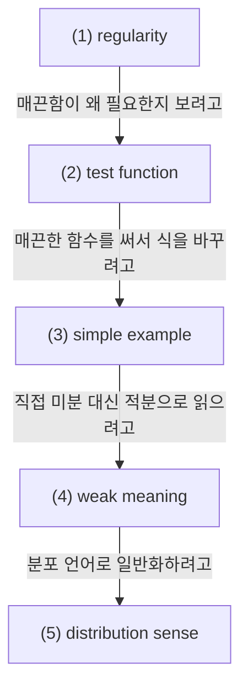

# Regularity, Test Functions, and Weak Meaning

## 전체상

화살표는 inclusion map으로 읽는다.

## 각 층의 분기 포인트

- `continuous function의 모임`
  - `(1)` 중에서, 점프 없이 값을 이어서 읽을 수 있는 함수들만 모아 둔 층이다.
  - 예를 들어 $\mathbf 1_{[0,\infty)}$ 는 `(1)`에는 들어가도 `(2)`에는 들어오지 못한다.
- `C¹ function의 모임`
  - `(2)` 중에서, 도함수를 실제 함수로 둘 수 있는 경우만 모아 둔 층이다.
  - 예를 들어 $|x|$ 는 `(2)`에는 들어가도 $x=0$에서 미분이 안 되므로 `(3)`에는 들어오지 못한다.
- `smooth function의 모임`
  - `(3)` 중에서, 필요한 만큼 계속 미분할 수 있는 함수들만 모아 둔 층이다.
  - 예를 들어 $x\mapsto |x|^3$ 는 `(3)`에는 들어가도 모든 차수에서 매끈하지 않으므로 `(4)`에는 들어오지 못한다.
- `test function C_c^∞(Ω)의 모임`
  - `(4)` 중에서, smooth할 뿐 아니라 compact support를 가져 적분과 부분적분에 바로 쓸 수 있는 함수들만 모아 둔 층이다.
  - 예를 들어 $\varphi(x)=e^{-x^2}$ 는 smooth라서 `(4)`에는 들어가도 compact support가 없으므로 `(5)`에는 들어오지 못한다.

## 문서 로드맵

## (1) Regularity

연속시간 확률과 PDE 문헌에서는 함수나 밀도가 늘 매끈하지 않다. 그래서 고전적인 미분이 안 될 때도 식을 해석할 수 있게 `regularity`, `test function`, `weak meaning` 같은 언어를 쓴다.

쉽게 말하면:

- `regularity`: 얼마나 매끈한가
- `test function`: 대신 미분을 받아 줄 매끈한 함수
- `weak meaning`: 직접 미분하지 않고 적분을 통해 식을 읽는 방식

이다.

### (1-a) regularity in practice

문헌에서 `under suitable regularity`라고 하면, 지금 쓰려는 미분, 부분적분, 정리가 성립할 만큼 충분히 매끈하다고 가정한다는 뜻이다.

예를 들어

$$
f(x)=x^2
$$

는 smooth하다. 반면

$$
g(x)=|x|
$$

는 연속이지만 $x=0$에서 미분 불가능하다. 또

$$
h(x)=\mathbf 1_{[0,\infty)}(x)
$$

는 jump를 가진다.

이렇게 매끈함의 정도가 다르기 때문에, 어떤 정리를 쓸 수 있는지가 regularity에 달려 있다.

## (2) Test Function

test function은 보통

$$
\varphi\in C_c^\infty(\mathbb R^d)
$$

처럼 smooth하고 compact support를 가진 함수다.

이런 함수를 쓰는 이유는

- 여러 번 미분해도 안전하고,
- 적분할 때 경계항을 제어하기 쉽기

때문이다.

## (3) 간단한 예시

$p(x)=\mathbf 1_{[0,1]}(x)$를 생각하자. 이 함수는 $0,1$에서 고전미분이 없다. 하지만 smooth한 $\varphi$에 대해서는

$$
\int_{\mathbb R} p(x)\varphi'(x)\,dx
=
\int_0^1 \varphi'(x)\,dx
=
\varphi(1)-\varphi(0)
$$

가 잘 정의된다.

즉 $p$를 직접 미분하지 않고도, test function 쪽으로 미분을 옮겨 그 효과를 읽을 수 있다.

## (4) Weak Meaning

식

$$
\partial_t p_t+\nabla\cdot(v_t p_t)=0
$$

를 고전적으로 해석하려면 $p_t$가 충분히 미분 가능해야 한다. 하지만 실제로는 그럴 필요가 없고, 모든 test function $\varphi$에 대해

$$
\frac{d}{dt}\int \varphi(x)\,p_t(x)\,dx
=
\int v_t(x)\cdot \nabla \varphi(x)\,p_t(x)\,dx
$$

가 성립하는지를 보는 약한 정의를 쓴다.

즉 weak formulation은 "rough한 대상 대신 매끈한 test function에 미분을 넘겨서 식을 읽는 방식"이다.

## (5) Distribution Sense

distribution은 함수라기보다 test function을 입력받아 숫자를 내는 연산자로 생각하면 된다. 함수 $f$도

$$
T_f(\varphi):=\int f(x)\varphi(x)\,dx
$$

로 distribution을 만든다.

그리고 미분은

$$
(\partial_i T)(\varphi):=-T(\partial_i \varphi)
$$

로 정의한다. 이 때문에 고전적 미분이 없는 대상도 distribution sense에서는 미분할 수 있다.

## (6) 관련 문서

- [[Sobolev Spaces, Weak Derivatives, and Integration by Parts]]
- [[Semigroups, Generators, Adjoint Operators, and Kolmogorov Equations]]
- [[Score Function, Reverse-Time Dynamics, Probability Flow ODE]]
- [[Vector Fields, Continuity Equation, and Rectification]]
