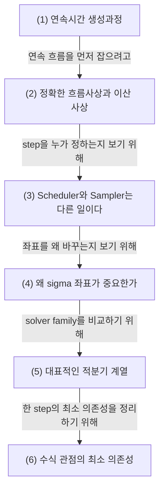

# Sampling as Numerical Integration: Scheduler, Sampler, and Sigma Coordinates

## 문서 로드맵

이 문서는 아래 순서로 이어진다.

- 먼저 `(1)`에서 연속시간 생성과정을 PDE, SDE, ODE로 나누어 본다.
- 그다음 `(2)`에서 정확한 흐름사상과 이산 step 근사를 연결한다.
- 이어서 `(3)`과 `(4)`에서 scheduler, sampler, sigma 좌표를 수치해석 언어로 다시 읽는다.
- 마지막 `(5)`와 `(6)`에서 대표적인 적분기와 한 step의 최소 의존성을 정리한다.

## (1) 연속시간 생성과정: PDE, SDE, ODE

가장 바깥 층에서는 분포의 시간진화가 있다. 예를 들어 확률과정 $X_t$가

$$
dX_t = f(X_t,t)\,dt + g(t)\,dW_t
$$

를 따른다고 하자. 여기서 $f$는 drift, $g$는 diffusion strength, $W_t$는 Brownian motion이다.

이 과정의 밀도 $p_t(x)$는 보통 Fokker-Planck 방정식

$$
\partial_t p_t(x)
= - \nabla \cdot \bigl(f(x,t)\,p_t(x)\bigr)
+ \frac{1}{2} g(t)^2 \Delta p_t(x)
$$

를 따른다.

쉽게 말하면,

- PDE는 분포 전체가 어떻게 움직이는지를 말하고
- SDE는 개별 샘플 경로가 어떻게 흔들리며 움직이는지를 말한다

diffusion 문헌에서 reverse-time dynamics를 말할 때 이 둘이 함께 등장하는 이유가 여기 있다.

## (2) 정확한 흐름사상과 이산 사상

연속시간 ODE

$$
\frac{dx}{dt} = f(x,t)
$$

의 해가 존재하면, 시각 $s$의 상태를 시각 $t$의 상태로 보내는 정확한 흐름사상 $\varphi_{t,s}$를 생각할 수 있다.

$$
\varphi_{t,s}(x_s)=x_t
$$

실제 sampling은 이 정확한 흐름사상을 직접 계산하지 못하므로, 한 step마다 그것을 근사하는 이산 사상 $\Phi_n$를 쓴다.

$$
x_{n+1} = \Phi_n(x_n)
$$

즉 sampling loop는 "정확한 연속계의 흐름사상"을 stepwise approximation으로 바꾼 것이다.

## (3) Scheduler와 Sampler는 다른 일이다

둘은 자주 같이 묶여 말해지지만 역할이 다르다.

- scheduler는 어느 좌표점들을 찍을지 정한다
- sampler는 찍힌 두 점 사이를 어떤 공식으로 건널지 정한다

쉽게 말하면 scheduler는 경유지를 정하고, sampler는 경유지 사이를 어떤 방식으로 이동할지 정한다.

그래서 같은 Euler sampler라도 grid가 다르면 trajectory는 달라진다.

## (4) 왜 sigma 좌표가 중요한가

많은 구현은 시간을 직접 $t$로 쓰지 않고 `sigma`나 log-SNR 계열 좌표로 다시 쓴다.

diffusion 계열에서는 자주

$$
\sigma = \sqrt{\frac{1-\bar\alpha}{\bar\alpha}}
$$

를 쓰고, DPM-Solver 계열에서는

$$
\lambda = -\log \sigma
$$

또는 half-log-SNR 좌표가 등장한다.

이 좌표계가 중요한 이유는 세 가지다.

- noise level을 기준으로 dynamics를 읽기가 쉽다
- solver 식이 더 단순해지기도 한다
- step 간격의 의미를 더 잘 통제할 수 있다

즉 sigma는 변수 이름이 아니라, 현재 생성 상태를 읽는 좌표계다.

## (5) 대표적인 적분기 계열

샘플러 이름이 많아 보여도 수치해석 관점으로 묶으면 구조가 단순해진다.

### Euler

가장 단순한 1차 적분기는 Euler다.

$$
x_{n+1} = x_n + h_n f(x_n,t_n)
$$

현재 기울기 한 번만 보고 다음 상태를 만든다.

### Heun

Heun은 predictor-corrector 형태의 2차 적분기다.

$$
\tilde x_{n+1} = x_n + h_n f(x_n,t_n)
$$

$$
x_{n+1}
= x_n + \frac{h_n}{2}
\Bigl(
f(x_n,t_n) + f(\tilde x_{n+1}, t_{n+1})
\Bigr)
$$

즉 예측점에서 한 번 더 기울기를 본다.

### LMS와 다단계법

다단계법은 현재 기울기만이 아니라 과거 기울기 기록까지 함께 사용한다.

$$
x_{n+1}
= x_n + h_n \sum_{j=0}^{k-1} \beta_j f_{n-j}
$$

같은 형태를 가진다.

### Euler-Maruyama와 SDE

확률항이 있는 SDE를 단순하게 적분하면

$$
X_{n+1}
= X_n + f(X_n,t_n)\Delta t_n
+ g(X_n,t_n)\Delta W_n
$$

꼴이 된다. 여기서 $\Delta W_n \sim \mathcal N(0,\Delta t_n)$다.

즉 deterministic drift와 stochastic noise reinjection이 함께 들어간다.

### DPM-Solver 계열

이 계열은 좌표계를 다시 쓰고, 선형 부분과 비선형 부분을 다르게 다루는 지수적분기 관점에서 읽는 편이 좋다.

핵심은 sampling을 "그냥 반복문"이 아니라 "특정 좌표계에서 더 나은 적분 공식을 설계하는 문제"로 본다는 점이다.

## (6) 수식 관점의 최소 의존성

한 step을 매우 추상적으로 쓰면 다음처럼 볼 수 있다.

$$
x_{n+1}
= \Phi_n\Bigl(
x_n,\,
\tau_n,\,
\tau_{n+1},\,
D_\theta(x_n,\tau_n,c)
\Bigr)
$$

여기서

- $\tau_n$은 $t$, $\sigma$, $\lambda$ 같은 선택된 좌표
- $D_\theta$는 모델 출력을 solver가 읽을 수 있는 양으로 바꾼 함수
- $\Phi_n$은 선택된 적분기

를 뜻한다.

이 식으로 보면 sampling 구현의 차이는 대부분 아래 세 질문으로 압축된다.

1. 어떤 좌표계를 쓰는가
2. 모델 출력을 어떻게 해석하는가
3. 어떤 적분기 가족을 쓰는가

## 관련 문서

- [[Score Function, Reverse-Time Dynamics, Probability Flow ODE]]
- [[Parabolic PDE, Conservation Laws, and Why Diffusion Uses Them]]
- [[Vector Fields, Continuity Equation, and Rectification]]
- [[DPM-Solver]]
- [[ComfyUI의 SDXL·Anima 샘플링 경로]]
