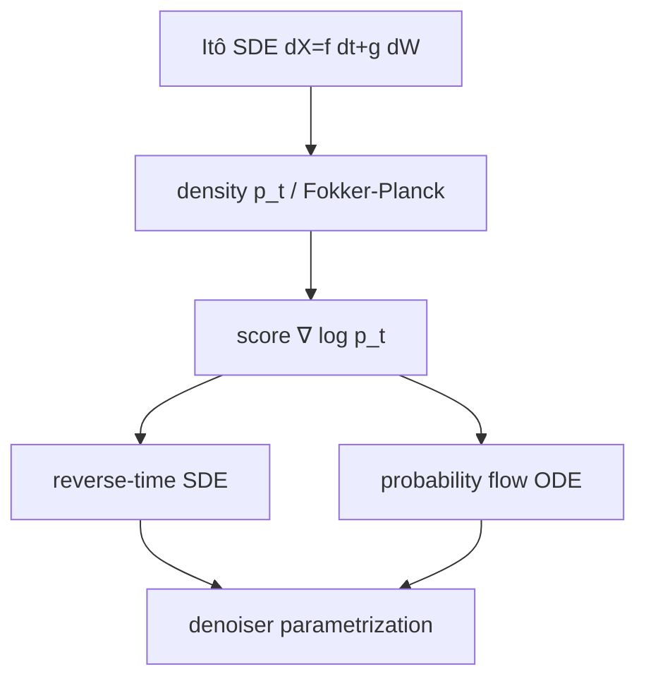
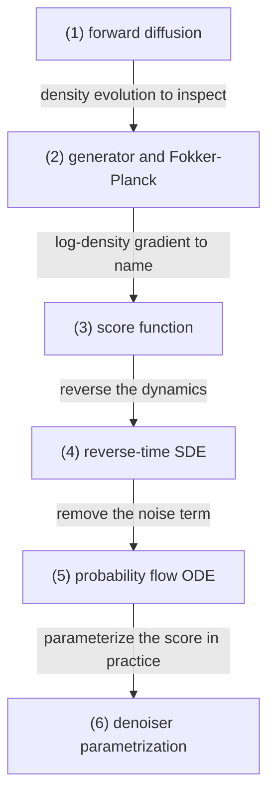

# Score Functions, Reverse-Time Dynamics, and Probability Flow ODE

## 전체상

## 각 층의 분기 포인트

- path level에서는 forward Itô SDE가 sample path의 drift와 diffusion을 정한다.
- density level에서는 generator의 adjoint가 $p_t$의 Fokker-Planck evolution을 정한다.
- score level에서는 $\nabla\log p_t$가 density evolution을 역방향 dynamics에 넣을 수 있는 형태로 바꾼다.
- dynamics level에서는 같은 marginal family를 reverse-time SDE와 probability flow ODE로 각각 읽는다.
- parametrization level에서는 score를 실제 denoiser 출력과 연결한다.

## 문서 로드맵

문서 흐름은 다음 질문을 따라간다.

- 먼저 `(1)`과 `(2)`에서, diffusion의 law가 어떻게 움직이는지 본다.
- 그다음 `(3)`에서 score가 무엇인지 정의하고, law의 기울기를 어떻게 읽는지 본다.
- 마지막 `(4)`와 `(5)`에서, 같은 marginal family를 stochastic dynamics와 deterministic dynamics로 각각 어떻게 되돌리는지 본다.
- `(6)`에서는 이 이론을 실제 모델 출력으로 어떻게 적는지 정리한다.

## (1) forward diffusion and generator

$(\Omega,\mathcal F,(\mathcal F_t)_{t\in[0,T]},\mathbb P)$를 filtration이 주어진 확률공간이라 하고, $W_t$를 $\mathbb R^d$-valued Brownian motion이라 하자. 상태공간은 $\mathbb R^d$로 두고, $X_t$는 다음 Itô SDE의 해라고 가정한다.

$$
dX_t = f(X_t,t)\,dt + g(t)\,dW_t.
$$

여기서

- $f:\mathbb R^d\times[0,T]\to\mathbb R^d$는 drift,
- $g:[0,T]\to[0,\infty)$는 diffusion coefficient

이다. $f$가 적당한 regularity를 가지면 해의 존재와 일의성이 주어진다.

### (1-a) 정의를 쉬운 말로 읽기

1. drift와 noise를 분리한다.

   $f\,dt$는 한쪽으로 밀리는 경향을, $g\,dW$는 랜덤 흔들림을 적는다.

   이 조건을 두는 이유는 규칙적인 변화와 불규칙한 변화를 따로 다루기 위해서다.

   이 조건이 없으면 한 과정 안에서 방향성과 잡음이 뒤섞여 law evolution을 읽기 어려워진다.

2. law evolution을 본다.

   sample path를 직접 미분하지 않고도 density가 어떻게 움직이는지 보려는 뜻이다.

   이 조건을 두는 이유는 rough path를 직접 보지 않고도 전체 분포의 움직임을 다루기 위해서다.

   이 조건이 없으면 sample path 하나하나의 움직임만 남고 density 수준의 계산이 어려워진다.

generator는 $\varphi\in C_c^\infty(\mathbb R^d)$에 대해

$$
L_t\varphi(x)
=
f(x,t)\cdot\nabla\varphi(x)
\,+\,
\frac12 g(t)^2\Delta\varphi(x)
$$

로 둔다. Itô formula에 의해

$$
\varphi(X_t)-\varphi(X_0)-\int_0^t L_s\varphi(X_s)\,ds
$$

는 local martingale이다. 따라서 $p_t$가 $X_t$의 density이면

$$
\partial_t p_t = L_t^\ast p_t
$$

를 만족한다.

> 예시. drift가 없고 $g(t)=1$이면 $X_t=X_0+W_t$가 된다. 특히 $X_0=0$일 때만 $X_t=W_t$다. 이 경우 diffusion term 하나만으로 density가 퍼진다.

## (2) score function and adjoint

$p_t(x)>0$인 영역에서 score function을

$$
s_t(x):=\nabla\log p_t(x)
$$

로 둔다. 그러면

$$
\nabla p_t = p_t s_t
$$

이므로 Fokker-Planck equation은

$$
\partial_t p_t
=
-\nabla\cdot(f p_t)
+\frac12 g(t)^2\nabla\cdot(p_t s_t)
$$

로 다시 쓸 수 있다.

### (2-a) 정의를 쉬운 말로 읽기

1. density의 기울기를 본다.

   score는 현재 점에서 density가 어느 쪽으로 더 가파른지를 적는다.

   이 조건을 두는 이유는 law를 단순한 값이 아니라 방향 정보까지 가진 대상으로 보기 위해서다.

   이 조건이 없으면 density의 기울기를 바탕으로 reverse dynamics를 만들 수 없다.

2. Fokker-Planck와 연결한다.

   score는 density evolution을 $\nabla\log p_t$로 다시 쓰게 해 준다.

   이 조건을 두는 이유는 drift와 diffusion이 law를 어떻게 바꾸는지 한 식 안에서 읽기 위해서다.

   이 조건이 없으면 generator와 density evolution 사이의 대응이 흐려진다.

> 예시. Gaussian density $p(x)\propto e^{-\frac12|x|^2}$이면 $s(x)=-x$이다. 가운데로 끌어당기는 방향이 바로 score다.

## (3) reverse-time SDE

시간을 뒤집은 과정 $\widetilde X_\tau:=X_{T-\tau}$를 생각하자. $p_t$가 충분히 smooth하고, $f$와 $g$가 표준 역시간 정리를 적용할 regularity를 만족하면, $\widetilde X_\tau$는 어떤 Brownian motion $\bar W_\tau$에 대해

$$
d\widetilde X_\tau
=
\bigl(-f(\widetilde X_\tau,T-\tau)+g(T-\tau)^2 s_{T-\tau}(\widetilde X_\tau)\bigr)\,d\tau
+g(T-\tau)\,d\bar W_\tau
$$

를 따른다.

### (3-a) 정의를 쉬운 말로 읽기

1. 시간을 거꾸로 읽는다.

   forward diffusion이 만든 density family를 반대 방향으로 따라간다는 뜻이다.

   이 조건을 두는 이유는 생성 과정을 sampling 방향으로 되돌리기 위해서다.

   이 조건이 없으면 forward law만 있고 reverse path를 쓸 수 없다.

2. score가 drift를 수정한다.

   단순히 부호만 뒤집는 것이 아니라, density의 기울기가 추가로 drift를 바꾼다.

   이 조건을 두는 이유는 reverse-time dynamics가 forward-time dynamics와 같은 marginal을 가지게 하려는 것이다.

   이 조건이 없으면 역시간 과정의 law가 맞지 않는다.

## (4) probability flow ODE

같은 marginal family $(\mu_t)_{t\in[0,T]}$를 만드는 deterministic dynamics를 찾는다. time-dependent vector field $v_t:\mathbb R^d\to\mathbb R^d$를

$$
v_t(x):=f(x,t)-\frac12 g(t)^2 s_t(x)
$$

로 두면, ODE

$$
\frac{dY_t}{dt}=v_t(Y_t)
$$

는 동일한 law evolution을 준다.

### (4-a) 정의를 쉬운 말로 읽기

1. noise를 없앤다.

   stochastic reverse dynamics와 같은 law를 가지면서도 sample path는 deterministic하게 간다.

   이 조건을 두는 이유는 같은 분포 변화를 더 단순한 길이로 따라가려는 것이다.

   이 조건이 없으면 같은 marginal을 가진 ODE를 따로 쓸 수 없다.

2. drift를 score로 보정한다.

   $f$에 score 보정이 반쯤 들어가서 law가 맞아진다.

   이 조건을 두는 이유는 reverse-time SDE와 같은 marginal을 deterministic field로 재현하기 위해서다.

   이 조건이 없으면 ODE가 forward diffusion의 density evolution을 따라가지 못한다.

정리하면 probability flow ODE는

$$
\frac{dY_t}{dt}
=
f(Y_t,t)-\frac12 g(t)^2 s_t(Y_t)
$$

이다.

## (5) denoiser parametrization

실제 모델은 $s_t$를 직접 출력하지 않고 $\epsilon_\theta$, $x_{0,\theta}$, $v_\theta$ 같은 parametrization을 사용한다. 가우시안 perturbation

$$
x_t=\alpha_t x_0+\sigma_t \epsilon,
\qquad
\epsilon\sim\mathcal N(0,I)
$$

에서

$$
\nabla_{x_t}\log p_t(x_t)
=
-\frac{1}{\sigma_t}\,\mathbb E[\epsilon\mid x_t]
$$

이므로 noise prediction은 결국 conditional expectation을 통해 score를 근사하는 문제와 동치가 된다.

## 관련 문서

- [[Stochastic Processes, Filtrations, Brownian Motion, and Martingales]]
- [[Gaussian Vectors, Covariance, and Conditional Gaussian Laws]]
- [[Variational Objectives and Noise Prediction]]
