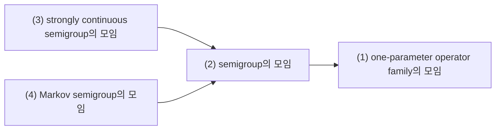
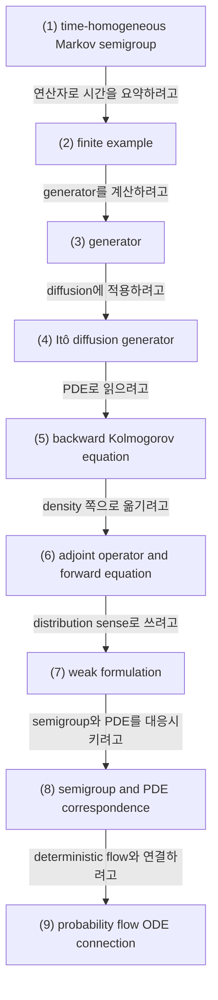

# Semigroups, Generators, Adjoint Operators, Kolmogorov Equations

## 전체상

화살표는 inclusion map으로 읽는다.

## 각 층의 분기 포인트

- semigroup의 모임
  - `(1)` 중에서, 시간 합이 operator 합성이 되도록 이어지는 family만 모아 둔 층이다.
  - 예를 들어 $T_{t+s}=T_tT_s$를 만족하지 않는 일반 operator family는 `(1)`에는 들어가도 `(2)`에는 들어오지 못한다.
- strongly continuous semigroup의 모임
  - `(2)` 중에서, $t\downarrow 0$일 때 각 벡터에 대해 $T_t x\to x$가 성립하는 경우만 모아 둔 층이다.
  - 예를 들어 semigroup 법칙은 만족해도 $t=0$에서 강연속성이 깨지면 `(2)`에는 들어가도 `(3)`에는 들어오지 못한다.
- Markov semigroup의 모임
  - `(2)` 중에서, positivity와 mass 보존을 함께 가져 확률과정의 평균 진화로 읽히는 경우만 모아 둔 층이다.
  - 예를 들어 일반 선형 semigroup는 `(2)`에는 들어가도 확률을 보존하지 않으면 `(4)`에는 들어오지 못한다.

## 문서 로드맵

## (1) Time-Homogeneous Markov Semigroup

과정을 직접 따라가는 대신 관측함수 $f$가 시간에 따라 어떻게 바뀌는지만 보아도 충분한 경우가 많다. semigroup는 "시간 $t$만큼 진화시킨 뒤 observable을 평균한 것"을 한 번에 묶은 연산자다.

$(X_t)_{t\ge 0}$가 state space $E$ 위의 time-homogeneous Markov process라 하자. bounded measurable $f:E\to\mathbb R$에 대해

$$
P_t f(x):=\mathbb E_x[f(X_t)]
$$

를 transition operator라 한다. 그러면

$$
P_{t+s}=P_tP_s,\qquad P_0=I
$$

가 성립한다. 이를 Markov semigroup라 한다.

measure 쪽에서는 dual action

$$
\mu P_t(A):=\int_E P_t(x,A)\,\mu(dx)
$$

를 쓴다.

## (2) 유한 상태공간 예시

상태공간 $E=\{0,1\}$를 생각하자. 연속시간 two-state chain의 generator를

$$
Q=
\begin{pmatrix}
-\lambda & \lambda\\
\mu & -\mu
\end{pmatrix}
$$

로 두면, 함수 $f:E\to\mathbb R$를

$$
f=
\begin{pmatrix}
f(0)\\f(1)
\end{pmatrix}
$$

로 쓸 수 있고 generator 작용은

$$
Lf=Qf
$$

이다. 즉

$$
(Lf)(0)=\lambda(f(1)-f(0)),
\qquad
(Lf)(1)=\mu(f(0)-f(1))
$$

이다.

## (3) Generator

generator를 차분몫으로 정의하는 이유는, 연속시간 dynamics를 가장 짧은 시간 단위에서 요약한 미분계수를 잡기 위해서다. finite-step 정보 $P_t$를 infinitesimal law $L$로 압축한다고 보면 된다.

적당한 domain $\mathcal D(L)$에서 generator $L$를

$$
Lf:=\lim_{t\downarrow 0}\frac{P_t f-f}{t}
$$

로 정의한다. 이 극한이 존재하는 $f$들만 domain에 들어간다.

직관적으로 $L$은 semigroup의 infinitesimal derivative다.

위 유한 예시에서는

$$
P_t=e^{tQ}
$$

가 semigroup이고

$$
\frac{P_t-I}{t}\to Q
\qquad (t\downarrow 0)
$$

로 이해할 수 있다.

## (4) Itô Diffusion의 Generator

$\mathbb R^d$ 위의 diffusion

$$
dX_t=b(X_t)\,dt+\sigma(X_t)\,dW_t
$$

를 생각하자. $a(x)=\sigma(x)\sigma(x)^\top$라 두면, $\varphi\in C_c^\infty(\mathbb R^d)$에 대해 generator는

$$
L\varphi(x)
=
b(x)\cdot \nabla \varphi(x)
+\frac12 \operatorname{Tr}\!\bigl(a(x)D^2\varphi(x)\bigr)
$$

이다.

time-inhomogeneous case에서는 $L_t$가 시간에 의존하고 semigroup 대신 evolution family $P_{s,t}$를 쓴다.

## (5) Backward Kolmogorov Equation

$u(t,x):=P_t f(x)$라 두면 적절한 regularity 아래

$$
\partial_t u = Lu,
\qquad
u(0,x)=f(x)
$$

를 만족한다. time-inhomogeneous case에서는

$$
\partial_t u(t,x)=L_tu(t,\cdot)(x)
$$

로 쓴다. 이것이 backward Kolmogorov equation이다.

## (6) Adjoint Operator와 Forward Equation

왜 adjoint가 밀도 방정식에 등장하는지는 test function에 대해 적분한 뒤 부분적분을 해 보면 바로 보인다. 함수 쪽에서의 진화 $L$를 density 쪽으로 옮기면 자동으로 adjoint $L^\ast$가 나타난다.

density나 measure가 시간에 따라 어떻게 변하는지는 adjoint가 결정한다. $L^\ast$를 distribution sense의 adjoint라 하면

$$
\int_E (Lf)(x)\,\rho(x)\,dx
=
\int_E f(x)\,(L^\ast \rho)(x)\,dx
$$

이다.

diffusion generator의 경우

$$
L^\ast \rho
=
-\nabla\cdot(b\rho)
+\frac12\sum_{i,j}\partial_{ij}(a_{ij}\rho)
$$

가 되고, density $p_t$는

$$
\partial_t p_t=L^\ast p_t
$$

를 만족한다. 이것이 forward Kolmogorov equation 또는 Fokker-Planck equation이다.

## (7) Weak Formulation

measure-valued curve $(\mu_t)$가 forward equation의 해라는 것은 모든 test function $f\in C_c^\infty(E)$에 대해

$$
\frac{d}{dt}\int_E f\,d\mu_t
=
\int_E Lf\,d\mu_t
$$

가 성립한다는 뜻이다. distribution이나 rough density를 다룰 때는 이 약한 형태가 기본 정의가 된다.

## (8) Semigroup와 PDE의 대응

다음을 항상 구분해야 한다.

- $P_t$: 함수에 작용하는 operator
- $L$: 그 infinitesimal generator
- $P_t^\ast$: measure에 작용하는 dual operator
- $L^\ast$: density 또는 distribution에 작용하는 adjoint

생성모형 문헌에서 "same marginal path"라는 말은 보통 $P_t^\ast\mu_0$가 같다는 뜻이다.

유한 상태공간에서는 measure $\mu_t$를 행벡터

$$
\mu_t=(\mu_t(0),\mu_t(1))
$$

로 쓰면 forward equation은

$$
\frac{d}{dt}\mu_t=\mu_t Q
$$

가 된다. 이것이 연속공간에서의 $ \partial_t p_t=L^\ast p_t $에 대응하는 가장 단순한 예시다.

## (9) Probability Flow ODE와의 연결

확산 SDE의 $L_t^\ast p_t$가 주어졌을 때, 어떤 deterministic vector field $v_t$가

$$
-\nabla\cdot(v_t p_t)=L_t^\ast p_t
$$

를 만족하면 그 ODE는 같은 marginal law를 재현한다. probability flow ODE는 바로 이 원리에서 나온다.

## (10) 관련 문서

- [[Stochastic Processes, Filtrations, Brownian Motion, and Martingales]]
- [[Normed Spaces, Hilbert Spaces, Operators, and Adjoint]]
- [[Regularity, Test Functions, and Weak Meaning]]
- [[Parabolic PDE, Conservation Laws, and Why Diffusion Uses Them]]
- [[Score Function, Reverse-Time Dynamics, Probability Flow ODE]]
- [[Vector Fields, Continuity Equation, and Rectification]]
