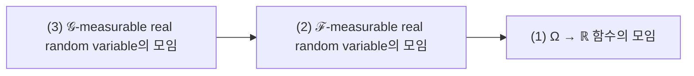
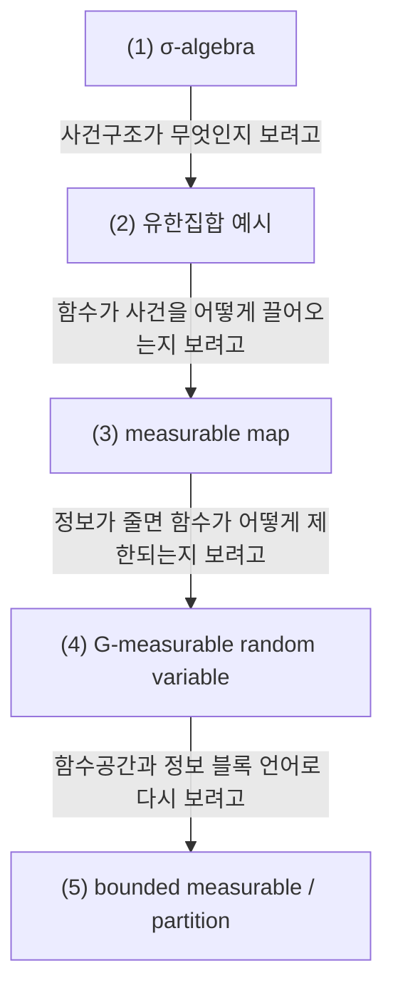

# Sigma-Algebras, Measurable Maps, and What Measurable Means

## 전체상

고정한 집합 $\Omega$ 와 두 사건구조 $\mathcal G\subset\mathcal F$ 를 둔다. 화살표는 inclusion map으로 읽는다.

## 각 층의 분기 포인트

- $\mathcal F$-measurable real random variable들의 모임
  - `(1)` 중에서, Borel 집합의 역상이 항상 $\mathcal F$-사건이 되는 함수만 모아 둔 층이다.
  - 예를 들어 $\mathcal F$가 구별하지 못하는 두 점에 서로 다른 값을 주는 함수는 `(1)`에는 들어가도 `(2)`에는 들어오지 못한다.
- $\mathcal G$-measurable real random variable들의 모임
  - `(2)` 중에서, 더 큰 $\mathcal F$가 아니라 더 작은 $\mathcal G$ 정보만으로 값이 정해지는 함수만 모아 둔 층이다.
  - 예를 들어 $\mathcal F$-measurable이더라도 $\mathcal G$가 구별하지 못하는 두 점에 서로 다른 값을 주면 `(2)`에는 들어가도 `(3)`에는 들어오지 못한다.

## 문서 로드맵

문서 흐름은 두 질문을 따라간다.

- 먼저 `(1)`과 `(2)`에서, 사건으로 인정하는 집합들의 모음이 실제로 무엇을 구별하고 무엇을 구별하지 못하는지 본다.
- 그다음 `(3)`과 `(4)`에서, 함수가 그 사건구조를 보존한다는 말이 무엇인지 보고, 정보가 더 적을 때 함수가 얼마나 거칠게만 움직일 수 있는지 본다.
- 마지막 `(5)`에서는 이 내용을 bounded measurable function과 partition 언어로 다시 적어, 뒤의 conditional expectation 같은 문서로 넘어갈 준비를 한다.

## (1) σ-algebra

집합 $\Omega$ 위의 family $\mathcal F\subset\mathcal P(\Omega)$ 가 다음 조건을 만족하면 $\sigma$-algebra라 한다.

1. $\varnothing,\Omega\in\mathcal F$.
2. $A\in\mathcal F$ 이면 $A^c\in\mathcal F$.
3. $A_1,A_2,\dots\in\mathcal F$ 이면 $\bigcup_{n=1}^\infty A_n\in\mathcal F$.

### (1-a) 정의를 쉬운 말로 읽기

1. $\varnothing,\Omega\in\mathcal F$.

   아무 일도 일어나지 않는 경우와 모든 경우 전체는 기본 사건으로 넣어 둔다는 뜻이다.

   이 조건을 두는 이유는 "불가능"과 "전체 경우"를 처음부터 사건으로 다루기 위해서다.

   이 조건이 없으면 가장 기본적인 기준 사건조차 family 안에서 말할 수 없게 된다.

2. $A\in\mathcal F$ 이면 $A^c\in\mathcal F$.

   어떤 사건을 알 수 있으면, 그 사건이 일어나지 않는 경우도 같이 알 수 있다는 뜻이다.

   이 조건을 두는 이유는 "참"뿐 아니라 "아님"도 같은 수준의 정보로 다루기 위해서다.

   이 조건이 없으면 한 사건은 말할 수 있는데 그 부정은 말할 수 없는 어색한 family가 들어온다.

3. $A_1,A_2,\dots\in\mathcal F$ 이면 $\bigcup_{n=1}^\infty A_n\in\mathcal F$.

   countably many cases를 하나라도 일어나면 되는 사건으로 묶어도 여전히 사건으로 남는다는 뜻이다.

   이 조건을 두는 이유는 극한, 적분, 확률의 가산합 규칙을 같은 사건구조 안에서 다루기 위해서다.

   이 조건이 없으면 한 항 한 항은 사건인데, "그중 하나라도 일어남"은 사건이 아니게 되는 family가 들어온다.

> 예시. $\Omega=\{\omega_1,\omega_2,\omega_3,\omega_4\}$ 라 하자.
>
> 아래 family
> $$
> \mathcal G=
> \{
> \varnothing,
> \{\omega_1,\omega_2\},
> \{\omega_3,\omega_4\},
> \Omega
> \}
> $$
> 는 $\sigma$-algebra이다.
>
> 반면
> $$
> \mathcal H=
> \{
> \varnothing,
> \{\omega_1\},
> \Omega
> \}
> $$
> 는 $\{\omega_1\}^c=\{\omega_2,\omega_3,\omega_4\}$ 가 빠져 있으므로 $\sigma$-algebra가 아니다.

## (2) 유한집합 예시

위의
$$
\mathcal G=
\{
\varnothing,
\{\omega_1,\omega_2\},
\{\omega_3,\omega_4\},
\Omega
\}
$$
를 다시 보자.

이 $\mathcal G$는 원소를 하나하나 다 구별하는 정보가 아니다. 대신
$$
\{\omega_1,\omega_2\},\qquad \{\omega_3,\omega_4\}
$$
두 덩어리까지만 구별하는 정보다.

즉 이 정보 아래에서는

- $\omega_1$과 $\omega_2$는 서로 구별되지 않고,
- $\omega_3$과 $\omega_4$도 서로 구별되지 않는다.

뒤에서 나오는 measurable map과 $\mathcal G$-measurable random variable은 모두 이 "어디까지 구별하느냐"와 연결된다.

## (3) measurable map

measurable spaces $(\Omega,\mathcal F)$, $(E,\mathcal E)$ 가 주어졌다고 하자. 함수
$$
X:\Omega\to E
$$
가 measurable이라는 것은 모든 $A\in\mathcal E$ 에 대하여
$$
X^{-1}(A)\in\mathcal F
$$
가 성립한다는 뜻이다.

### (3-a) 정의를 쉬운 말로 읽기

$E$ 쪽에서 "값이 $A$ 안에 들어가느냐"를 물으면, $\Omega$ 쪽에서도 그 질문이 사건이어야 한다는 뜻이다.

이 조건을 두는 이유는 공역 쪽 질문을 정의역 쪽 사건으로 끌어와 확률과 적분을 걸 수 있게 하기 위해서다.

이 조건이 없으면 함수값에 대해 자연스럽게 묻는 질문이 $\Omega$ 쪽에서는 사건이 아니게 된다. 그러면 $\mathbb P(X\in A)$ 같은 말을 안정적으로 쓸 수 없다.

> 예시. $\Omega=\{\omega_1,\omega_2,\omega_3,\omega_4\}$,
> $$
> \mathcal G=
> \{
> \varnothing,
> \{\omega_1,\omega_2\},
> \{\omega_3,\omega_4\},
> \Omega
> \}
> $$
> 그리고 $E=\{0,1\}$, $\mathcal E=\mathcal P(E)$ 라 하자.
>
> 함수 $X:\Omega\to E$ 를
> $$
> X(\omega_1)=0,\quad X(\omega_2)=1,\quad
> X(\omega_3)=0,\quad X(\omega_4)=1
> $$
> 로 두면
> $$
> X^{-1}(\{0\})=\{\omega_1,\omega_3\}
> $$
> 이다.
>
> 그런데 $\{\omega_1,\omega_3\}\notin\mathcal G$ 이므로 이 $X$ 는 $\mathcal G$-measurable이 아니다.

## (4) $\mathcal G$-measurable random variable

실값 random variable $Y:\Omega\to\mathbb R$ 가 $\mathcal G$-measurable이라는 것은
$$
Y:(\Omega,\mathcal G)\to(\mathbb R,\mathcal B(\mathbb R))
$$
가 measurable이라는 뜻이다.

### (4-a) 정의를 쉬운 말로 읽기

$Y$ 의 값이 $\mathcal G$ 가 가진 정보만으로 정해진다는 뜻이다.

유한집합 예시에서는 이 말이 아주 구체적이다. $\mathcal G$ 가 구별하지 못하는 원소들에는 $Y$ 가 같은 값을 주어야 한다.

이 조건을 두는 이유는 "허용된 정보 수준"보다 더 세밀한 값을 함수가 몰래 쓰지 못하게 하기 위해서다.

이 조건이 없으면 더 큰 $\mathcal F$ 에서는 측정 가능하지만, $\mathcal G$ 가 실제로는 구별하지 못하는 차이까지 함수값에 집어넣는 random variable이 들어온다.

> 예시. 위의 $\mathcal G$ 에 대하여
> $$
> Y(\omega_1)=Y(\omega_2)=3,\qquad
> Y(\omega_3)=Y(\omega_4)=-1
> $$
> 이면 $Y$ 는 $\mathcal G$-measurable이다.
>
> 반면
> $$
> Z(\omega_1)=0,\quad Z(\omega_2)=1,\quad
> Z(\omega_3)=0,\quad Z(\omega_4)=0
> $$
> 이면 $\omega_1,\omega_2$ 가 같은 정보 블록 안에 있는데 값이 다르므로 $\mathcal G$-measurable이 아니다.

## (5) bounded measurable / partition으로 다시 보기

bounded measurable function은 measurable이고 동시에 어떤 상수 $M$ 이 있어서
$$
|f|\le M
$$
가 항상 성립하는 함수다.

유한집합에서는 모든 함수가 자동으로 bounded이다. 원소가 유한 개라서 함수값도 유한 개만 나타나기 때문이다.

또 유한집합에서는 $\sigma$-algebra를 partition 언어로 읽으면 구조가 더 빨리 보인다.

- partition은 "어디까지 구별 가능한가"를 정한다.
- measurable 함수는 그 구별보다 더 세밀한 값을 쓰지 않는 함수다.

따라서 $\mathcal G$-measurable random variable이라는 말을 보면, 먼저 $\mathcal G$ 가 원소들을 어떤 블록으로 묶는지부터 보면 된다.

## 관련 문서

- [[Probability Measures, Random Variables, Pushforward, Convergence]]
- [[Conditional Probability, Conditional Expectation, and L2 Projection]]
- [[Stochastic Processes, Filtrations, Brownian Motion, and Martingales]]
