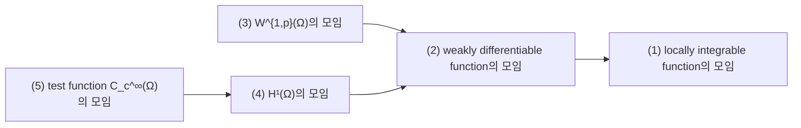
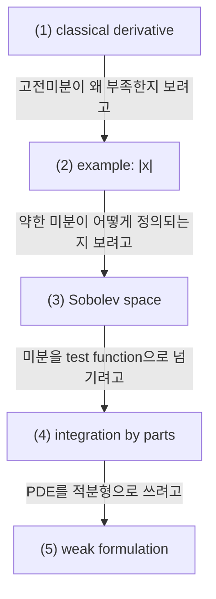

# Sobolev Spaces, Weak Derivatives, and Integration by Parts

## 전체상

화살표는 inclusion map으로 읽는다.

## 각 층의 분기 포인트

- `weakly differentiable function의 모임`
  - `(1)` 중에서, 점마다 도함수를 요구하지 않아도 적분 관계로 미분을 잡을 수 있는 함수들만 모아 둔 층이다.
  - 예를 들어 계단함수처럼 jump를 가진 함수는 `(1)`에는 들어가도 weak derivative가 함수로 잡히지 않으면 `(2)`에는 들어오지 못한다.
- `W^{1,p}(Ω)의 모임`
  - `(2)` 중에서, 함수와 weak derivative가 함께 $L^p$에 들어오는 경우만 모아 둔 층이다.
  - 예를 들어 weak derivative는 있어도 그 derivative가 $L^p$에 속하지 않으면 `(2)`에는 들어가도 `(3)`에는 들어오지 못한다.
- `H¹(Ω)의 모임`
  - `(2)` 중에서, $L^2$ 구조까지 써서 inner product와 projection을 함께 다룰 수 있는 경우만 모아 둔 층이다.
  - 예를 들어 $W^{1,1}$ 함수는 `(2)`에는 들어가도 $L^2$ 수준의 제어가 없으면 `(4)`에는 들어오지 못한다.
- `test function C_c^∞(Ω)의 모임`
  - `(4)` 중에서, smooth하고 compact support를 가져 integration by parts에 바로 넣을 수 있는 함수들만 모아 둔 층이다.
  - 예를 들어 $H^1(\Omega)$ 함수라도 경계까지 살아 있거나 매끈하지 않으면 `(4)`에는 들어가도 `(5)`에는 들어오지 못한다.

## 문서 로드맵

## (1) Classical Derivative와 Weak Derivative

고전미분은 점마다 도함수를 요구한다. 하지만

$$
u(x)=|x|
$$

처럼 점 하나에서 미분이 안 되는 함수도 많다.

weak derivative는 test function과의 적분 관계로 미분을 정의한다. $u\in L^1_{\mathrm{loc}}(\Omega)$에 대해 함수 $v$가 $u$의 weak derivative라는 것은 모든 $\varphi\in C_c^\infty(\Omega)$에 대해

$$
\int_\Omega u\,\partial_i\varphi\,dx
=
-\int_\Omega v\,\varphi\,dx
$$

가 성립한다는 뜻이다.

즉 미분을 $u$에 직접 거는 대신 $\varphi$ 쪽으로 넘겨 정의한다.

## (2) 간단한 예시

$u(x)=|x|$를 보자. 이 함수는 $x=0$에서 고전미분이 없지만,

$$
u'(x)=
\begin{cases}
-1,&x<0,\\
1,&x>0
\end{cases}
$$

를 weak derivative로 생각할 수 있다. 점 하나에서 값이 어떻게 되느냐는 적분에는 영향을 주지 않으므로 거의 어디서나 정의하면 충분하다.

## (3) Sobolev Space

$\Omega\subset\mathbb R^d$에서

$$
W^{1,p}(\Omega)
=
\{u\in L^p(\Omega): \partial_i u \text{가 weak sense로 존재하고 }L^p(\Omega)\text{에 속함}\}
$$

이다.

특히 $p=2$인 경우

$$
H^1(\Omega):=W^{1,2}(\Omega)
$$

는 Hilbert space가 된다.

이 공간을 쓰는 이유는 함수값과 그 약한 도함수를 함께 제어하고 싶기 때문이다.

## (4) 원소 수준 비유

유한집합에서는 도함수 자체가 없으므로 Sobolev space를 직접 만들 수는 없다. 대신 "함수값 자체뿐 아니라 인접한 원소들 사이 차이도 함께 제어한다"는 감각으로 받아들이면 된다. 연속공간에서는 그 차이의 극한이 weak derivative 역할을 한다.

## (5) Integration by Parts

weak derivative 정의의 핵심은 integration by parts다. 충분히 매끈하면

$$
\int_\Omega u\,\partial_i\varphi\,dx
=
-\int_\Omega (\partial_i u)\,\varphi\,dx
+ \text{boundary term}
$$

이다.

test function이 compact support를 가지면 경계항이 사라져 weak formulation이 깔끔해진다.

## (6) Weak Formulation과 Sobolev Space

PDE

$$
-\Delta u=f
$$

를 고전적으로 푸는 대신, 모든 $\varphi\in C_c^\infty(\Omega)$에 대해

$$
\int_\Omega \nabla u\cdot \nabla \varphi\,dx
=
\int_\Omega f\varphi\,dx
$$

가 성립한다고 정의할 수 있다. 이때 $u\in H^1(\Omega)$ 정도면 식이 잘 정의된다.

연속시간 생성모형에서 쓰는 continuity equation, Fokker-Planck equation의 weak form도 같은 철학을 따른다.

## (7) 관련 문서

- [[Regularity, Test Functions, and Weak Meaning]]
- [[Semigroups, Generators, Adjoint Operators, and Kolmogorov Equations]]
- [[Vector Fields, Continuity Equation, and Rectification]]
