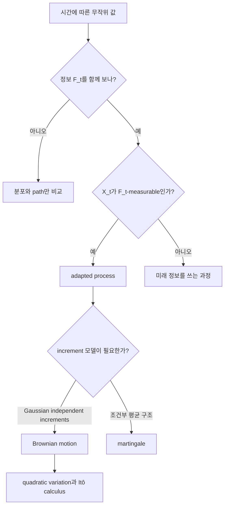

# Stochastic Processes, Filtrations, Brownian Motion, Martingales

## 전체상

확률과정은 시간에 따라 변하는 random variable의 묶음이고, filtration은 그 과정을 볼 때 허용되는 정보의 흐름이다. Brownian motion은 연속시간 noise의 표준 모델이며, martingale은 현재 정보로 본 미래 평균이 현재와 같다는 조건이다.

```mermaid
flowchart LR
  A["Probability space"] --> B["Stochastic process X_t"]
  B --> C["Filtration F_t"]
  C --> D["Adaptedness"]
  D --> E["Brownian motion W_t"]
  E --> F["Quadratic variation"]
  F --> G["Itô integral"]
  G --> H["Itô process / SDE"]
  H --> I["Itô formula"]
  I --> J["Martingale terms"]
```

## 각 층의 분기 포인트

## 문서 로드맵

이 문서는 stochastic process와 filtration에서 시작해 Brownian motion, martingale, quadratic variation, Itô integral, SDE, Itô formula로 이어지는 최소 spine을 잡는다. 마지막에는 stopping time과 diffusion 문헌을 읽을 때 분리해야 할 관점을 정리한다.

## (1) Stochastic Process와 Adaptedness

확률과정을 볼 때는 값만 적는 것으로는 부족하고, 어느 시점에 무엇을 알고 있는지도 함께 적어야 한다. filtration은 그 정보의 성장 과정을 기록하고, adaptedness는 과정이 미래 정보를 몰래 쓰지 않는다는 조건이다.

\((\Omega,\mathcal F,\mathbb P)\) 위에서 index set \(T\)를 갖는 family

$$
(X_t)_{t\in T}
$$

를 stochastic process라 한다. 보통 \(T=[0,\infty)\) 또는 \(\{0,1,\dots,T\}\)이다.

filtration \((\mathcal F_t)_{t\ge 0}\)는 정보가 시간에 따라 증가하는 sub-\(\sigma\)-algebras의 family이다.

$$
\mathcal F_s\subset \mathcal F_t,\qquad s\le t.
$$

과정 \(X_t\)가 adapted라는 것은

$$
X_t \text{ is } \mathcal F_t\text{-measurable for each }t
$$

임을 뜻한다. 즉 시각 \(t\)의 값이 시각 \(t\)까지의 정보로 결정 가능하다는 말이다.

## (2) 이산시간 예시

동전을 두 번 던지는 실험을 생각하자.

$$
\Omega=\{HH,HT,TH,TT\}.
$$

\(\mathcal F_0=\{\varnothing,\Omega\}\)라 하고, 첫 번째 던짐까지만 본 정보는

$$
\mathcal F_1=
\{
\varnothing,
\{HH,HT\},
\{TH,TT\},
\Omega
\}
$$

로 둘 수 있다.

이제

$$
X_1(HH)=X_1(HT)=1,\qquad X_1(TH)=X_1(TT)=0
$$

이면 \(X_1\)은 \(\mathcal F_1\)-measurable이다. 반면

$$
Y(HH)=0,\quad Y(HT)=1,\quad Y(TH)=0,\quad Y(TT)=1
$$

는 \(\mathcal F_1\)-measurable이 아니다.

## (3) Brownian Motion

Brownian motion의 정의에서 increment의 분산을 \(t-s\)로 두는 이유는 서로 독립인 작은 흔들림이 시간에 따라 선형으로 누적되어야 하기 때문이다. 이 한 줄이 나중에 quadratic variation과 Itô calculus 전체를 만든다.

\(\mathbb R^d\)-valued Brownian motion \(W_t\)는 다음을 만족하는 process이다.

1. \(W_0=0\) almost surely.
2. \(0\le s<t\)이면 increment \(W_t-W_s\sim \mathcal N(0,(t-s)I_d)\).
3. 서로 겹치지 않는 시간구간의 increment들은 independent.
4. sample path는 almost surely continuous.

Brownian motion은 diffusion 모델의 noise source다.

아주 짧은 시간 \(\Delta t\)에서는 increment를

$$
\Delta W\sim \mathcal N(0,\Delta t)
$$

로 생각하면 된다. 예를 들어 \(\Delta t=0.01\)이면 분산 \(0.01\)인 centered Gaussian noise를 한 번 더하는 셈이다.

## (4) Martingale

martingale은 "drift가 없는 과정"을 정보의 언어로 번역한 것이다. 즉 현재까지의 정보를 고정했을 때 미래 평균이 더 올라가지도 내려가지도 않으면 martingale이다.

적분 가능한 adapted process \(M_t\)가 모든 \(s\le t\)에 대해

$$
\mathbb E[M_t\mid\mathcal F_s]=M_s
$$

를 만족하면 martingale이라 한다.

submartingale은

$$
\mathbb E[M_t\mid\mathcal F_s]\ge M_s
$$

를 만족하는 경우다.

martingale은 "미래의 평균이 현재와 같다"는 뜻이며, Itô formula 뒤에 따라오는 drift-free part를 읽는 표준 언어다.

위 동전 예시에서 \(M_0=0\), \(M_1=2X_1-1\), \(M_2=M_1\)로 두면

$$
\mathbb E[M_2\mid\mathcal F_1]=M_1
$$

이므로 martingale이다.

## (5) Quadratic Variation

Brownian motion은 differentiable하지 않지만 quadratic variation은 존재한다.

1-dimensional Brownian motion에 대해 partition \(\Pi_n=\{0=t_0<\cdots<t_n=t\}\)의 mesh가 0으로 갈 때

$$
\sum_i |W_{t_{i+1}}-W_{t_i}|^2 \to t
$$

in probability가 성립한다. 이를

$$
[W]_t=t
$$

로 쓴다.

앞에서처럼 \(W_t\)가 \(\mathbb R^d\)-valued Brownian motion이면 coordinate별로

$$
[W^k]_t=t,\qquad [W^k,W^\ell]_t=0\quad(k\ne \ell)
$$

이고, equivalently bracket matrix는

$$
[W]_t=tI_d
$$

이다.

1-dimensional에서는 이 성질 때문에 \(dW_t^2=dt\)라는 Itô 계산 규칙이 나타난다.

## (6) Itô Integral

적당한 adapted process \(H_t\)에 대해

$$
\int_0^t H_s\,dW_s
$$

를 Itô integral이라 한다. simple adapted process에서 정의한 뒤 \(L^2\) completion으로 확장한다.

중요한 등식은 Itô isometry:

$$
\mathbb E\left[\left|\int_0^t H_s\,dW_s\right|^2\right]
=
\mathbb E\left[\int_0^t |H_s|^2\,ds\right].
$$

이다.

## (7) Itô Process와 SDE

과정 \(X_t\)가

$$
X_t=X_0+\int_0^t b_s\,ds+\int_0^t \sigma_s\,dW_s
$$

형태로 주어지면 Itô process라 한다. 미분형으로는

$$
dX_t=b_t\,dt+\sigma_t\,dW_t
$$

라고 쓴다.

좀 더 구체적으로

$$
dX_t=f(X_t,t)\,dt+g(X_t,t)\,dW_t
$$

는 state-dependent coefficients를 갖는 SDE이다.

## (8) Itô Formula

여기서 second-order term이 뜬금없어 보이기 쉬운데, 핵심은 Brownian path가 1차 미분은 없지만 quadratic variation은 남긴다는 점이다. 그래서 Taylor 전개에서 원래는 버려질 \(2\)차 항의 일부가 \(dt\) 크기로 살아남는다.

\(X_t\)가 \(\mathbb R^d\)-valued Itô process이고 \(\varphi\in C^{1,2}\)이면

$$
d\varphi(t,X_t)
=
\partial_t\varphi(t,X_t)\,dt
+\nabla\varphi(t,X_t)\cdot dX_t
+\frac12 \operatorname{Tr}\!\bigl(a_t D^2\varphi(t,X_t)\bigr)\,dt
$$

가 성립한다. 여기서 \(a_t=\sigma_t\sigma_t^\top\)이다.

drift와 diffusion이 동시에 있을 때 second-order term이 생기는 것이 ODE와의 본질적 차이다.

## (9) Stopping Time

random time \(\tau:\Omega\to[0,\infty]\)가 모든 \(t\)에 대해

$$
\{\tau\le t\}\in\mathcal F_t
$$

를 만족하면 stopping time이라 한다. 이 개념은 optional stopping theorem, local martingale, explosion time 같은 정리에 필요하다.

## (10) Diffusion 문헌에서 필요한 최소 관점

연속시간 diffusion 논문을 읽을 때는 다음 구분이 중요하다.

- process \(X_t\): sample path 수준의 객체
- law \(\mu_t\): 분포 수준의 객체
- filtration \(\mathcal F_t\): 정보 수준의 객체
- martingale: Itô formula 뒤 residual term을 기술하는 객체

이 네 층이 분리되어야 reverse-time dynamics, score process, generator를 혼동하지 않는다.

## (11) 관련 문서

- [[Probability Measures, Random Variables, Pushforward, Convergence]]
- [[Sigma-Algebras, Measurable Maps, and What Measurable Means]]
- [[Semigroups, Generators, Adjoint Operators, and Kolmogorov Equations]]
- [[Score Function, Reverse-Time Dynamics, Probability Flow ODE]]
