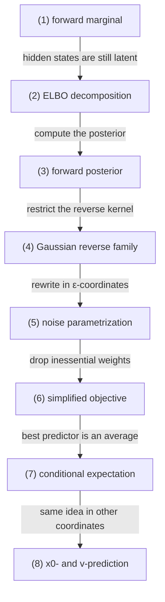

# Variational Objectives and Noise Prediction

## 문서 로드맵

문서 흐름은 다음 질문을 따라간다.

- 먼저 `(1)`에서 forward chain이 어떻게 marginal을 만든는지 본다.
- 그다음 `(2)`에서 ELBO가 왜 등장하는지 보고, hidden chain을 계산 가능한 posterior matching 문제로 바꾼다.
- 이어서 `(3)`과 `(4)`에서 posterior를 계산하고 reverse family를 Gaussian으로 제한한다.
- 마지막 `(5)`부터 `(8)`까지에서 그 Gaussian family를 noise 좌표와 expectation 언어로 다시 써서 실제 loss와 prediction parameterization으로 바꾼다.

## (1) forward marginal

데이터공간을 $\mathcal X=\mathbb R^d$라 하고, 데이터분포를 $\mu_0$라 하자. $T\in\mathbb N$를 고정하고, forward noising chain을 Markov kernel

$$
q_t(dx_t\mid x_{t-1})
=
\mathcal N\!\bigl(dx_t;\sqrt{\alpha_t}\,x_{t-1},(1-\alpha_t)I\bigr),
\qquad \alpha_t=1-\beta_t\in(0,1)
$$

로 둔다. 전체 forward law는

$$
q(dx_{0:T})
=
\mu_0(dx_0)\prod_{t=1}^T q_t(dx_t\mid x_{t-1})
$$

이다.

### (1-a) 정의를 쉬운 말로 읽기

1. $x_0$ 뒤에 latent chain을 둔다.

   관측값 하나만 보는 대신, 그 뒤에 숨은 noisy states를 함께 둔다.

   이 조건을 두는 이유는 noising 과정을 단계별로 적어 posterior를 계산하려는 것이다.

   이 조건이 없으면 전체 과정을 한 번에 바로 적기 어려워진다.

2. forward kernel이 Gaussian이다.

   각 단계에서 이전 상태에 Gaussian noise를 더한다.

   이 조건을 두는 이유는 뒤에서 posterior를 Gaussian 계산으로 닫으려는 것이다.

   이 조건이 없으면 noise prediction으로 이어지는 closed form이 사라진다.

> 예시. $x_t=\sqrt{\alpha_t}x_{t-1}+\sqrt{1-\alpha_t}\,\epsilon_t$ 꼴이면 각 단계의 perturbation이 명시적으로 Gaussian noise로 적힌다.

## (2) ELBO decomposition

negative log-likelihood를 직접 다루지 않고 ELBO를 도입하는 이유는 적분

$$
\int p_\theta(x_{0:T})\,dx_{1:T}
$$

가 보통 닫힌형으로 계산되지 않기 때문이다. Jensen 부등식은 이 어려운 적분을 계산 가능한 posterior matching 문제로 바꿔 준다.

우리가 직접 최소화하고 싶은 양은 negative log-likelihood

$$
-\log p_\theta(x_0)
=
-\log \int p_\theta(x_{0:T})\,dx_{1:T}
$$

이다. Jensen 부등식을 $q(dx_{1:T}\mid x_0)$에 적용하면

$$
\log p_\theta(x_0)
\ge
\mathbb E_{q(\cdot\mid x_0)}
\left[
\log p_\theta(x_{0:T})-\log q(x_{1:T}\mid x_0)
\right]
$$

를 얻는다. 따라서 ELBO loss를

$$
\mathcal L_{\mathrm{vlb}}(x_0)
:=
-\mathbb E_{q(\cdot\mid x_0)}
\left[
\log p_\theta(x_{0:T})-\log q(x_{1:T}\mid x_0)
\right]
$$

로 둔다.

Markov structure를 대입하면

$$
\mathcal L_{\mathrm{vlb}}(x_0)
=
D_{\mathrm{KL}}(q(x_T\mid x_0)\|p_T)
+\sum_{t=2}^T
\mathbb E_q\!\left[
D_{\mathrm{KL}}(q(x_{t-1}\mid x_t,x_0)\|p_{\theta,t-1}(x_{t-1}\mid x_t))
\right]
-\mathbb E_q[\log p_{\theta,0}(x_0\mid x_1)].
$$

### (2-a) 왜 이런 분해가 나오는가

1. hidden chain을 시간별로 분해한다.

   전체 chain의 matching을 각 시점의 KL 합으로 바꾼다.

   이 조건을 두는 이유는 긴 path-space 문제를 단계별 local problem으로 낮추려는 것이다.

   이 조건이 없으면 전체 적분을 직접 다뤄야 한다.

2. posterior matching으로 바꾼다.

   reverse model이 forward posterior를 얼마나 잘 맞추는지 보게 된다.

   이 조건을 두는 이유는 학습 목표를 계산 가능한 conditional law 비교로 바꾸려는 것이다.

   이 조건이 없으면 negative log-likelihood를 직접 최적화해야 한다.

## (3) forward posterior

$q(x_{t-1}\mid x_t,x_0)$를 계산한다. Gaussian density의 곱을 정리하면

$$
q(x_{t-1}\mid x_t,x_0)
=
\mathcal N\!\bigl(x_{t-1};\widetilde\mu_t(x_t,x_0),\widetilde\beta_t I\bigr)
$$

이며

$$
\widetilde\beta_t
=
\frac{1-\bar\alpha_{t-1}}{1-\bar\alpha_t}\beta_t,
$$

$$
\widetilde\mu_t(x_t,x_0)
=
\frac{\sqrt{\bar\alpha_{t-1}}\beta_t}{1-\bar\alpha_t}x_0
+
\frac{\sqrt{\alpha_t}(1-\bar\alpha_{t-1})}{1-\bar\alpha_t}x_t.
$$

이다.

### (3-a) 정의를 쉬운 말로 읽기

1. $x_t$와 $x_0$를 함께 주면 중간 상태가 Gaussian으로 닫힌다.

   두 시점의 정보를 같이 알 때 중간 상태의 law가 다시 Gaussian이 된다는 뜻이다.

   이 조건을 두는 이유는 reverse family를 Gaussian으로 둘 수 있는 기반을 마련하려는 것이다.

   이 조건이 없으면 posterior를 Gaussian로 계산하는 간단한 공식을 쓸 수 없다.

2. mean과 variance가 명시적으로 계산된다.

   관측된 noisy state와 원래 상태를 이용해 중간 상태를 바로 쓸 수 있다.

   이 조건을 두는 이유는 학습 대상을 posterior mean으로 환원하려는 것이다.

   이 조건이 없으면 posterior target을 직접 적기 어렵다.

## (4) Gaussian reverse family

reverse kernel을 Gaussian family

$$
p_{\theta,t-1}(x_{t-1}\mid x_t)
=
\mathcal N\!\bigl(x_{t-1};\mu_\theta(x_t,t),\Sigma_t\bigr)
$$

로 제한하자. $\Sigma_t$를 고정하면, 시점 $t$의 KL term은 상수항을 제외하고

$$
\mathbb E_q\!\left[
\|\widetilde\mu_t(x_t,x_0)-\mu_\theta(x_t,t)\|_{\Sigma_t^{-1}}^2
\right]
$$

와 동치가 된다. 따라서 학습의 핵심은 posterior mean을 맞추는 문제로 환원된다.

### (4-a) 왜 Gaussian family로 제한하는가

1. mean matching으로 바꾼다.

   복잡한 conditional law 비교가 mean regression이 된다.

   이 조건을 두는 이유는 reverse model을 실제로 학습 가능한 형태로 낮추려는 것이다.

   이 조건이 없으면 full distribution matching을 직접 해야 한다.

2. covariance는 고정하거나 단순화한다.

   학습이 mean 쪽에 집중되게 만든다.

   이 조건을 두는 이유는 forward posterior의 핵심 정보를 먼저 맞추려는 것이다.

   이 조건이 없으면 covariance까지 모두 학습해야 해서 목적이 더 복잡해진다.

## (5) noise parametrization

여기서 $\epsilon$-prediction이 갑자기 나오는 것처럼 보이지만, 실제로는 posterior mean을 $x_0$ 대신 $\epsilon$ 좌표로 다시 쓴 것뿐이다. Gaussian 구조 덕분에 좌표를 바꾸어도 같은 정보를 담는다.

앞의 재매개화

$$
x_t=\sqrt{\bar\alpha_t}x_0+\sqrt{1-\bar\alpha_t}\,\epsilon,
\qquad
\epsilon\sim\mathcal N(0,I)
$$

에서

$$
x_0
=
\frac{1}{\sqrt{\bar\alpha_t}}
\left(x_t-\sqrt{1-\bar\alpha_t}\,\epsilon\right)
$$

이므로 $\widetilde\mu_t$는 $x_0$ 대신 $\epsilon$으로 쓸 수 있다. 정리하면

$$
\widetilde\mu_t(x_t,x_0)
=
\frac{1}{\sqrt{\alpha_t}}
\left(
x_t-\frac{\beta_t}{\sqrt{1-\bar\alpha_t}}\epsilon
\right).
$$

이제 network가 $\epsilon_\theta(x_t,t)$를 출력하도록 두고

$$
\mu_\theta(x_t,t)
=
\frac{1}{\sqrt{\alpha_t}}
\left(
x_t-\frac{\beta_t}{\sqrt{1-\bar\alpha_t}}\epsilon_\theta(x_t,t)
\right)
$$

로 정의하면, 각 KL term은 상수 및 시점별 가중치 $\lambda_t$를 제외하고

$$
\lambda_t\,
\mathbb E_{x_0,\epsilon}
\left[
\|\epsilon-\epsilon_\theta(x_t,t)\|^2
\right]
$$

로 바뀐다.

### (5-a) 정의를 쉬운 말로 읽기

1. noise를 직접 맞춘다.

   $x_0$를 바로 예측하는 대신 $x_t$ 안에 섞인 noise를 예측한다.

   이 조건을 두는 이유는 reverse mean을 더 단순한 좌표로 표현하기 위해서다.

   이 조건이 없으면 posterior mean을 그대로 맞춰야 해서 표현이 더 복잡해진다.

2. 같은 정보를 다른 좌표로 쓴다.

   noise 좌표와 $x_0$ 좌표는 같은 Gaussian family의 다른 표현이다.

   이 조건을 두는 이유는 구현과 분석을 같은 정보 위에서 보기 위해서다.

   이 조건이 없으면 같은 목표를 두 방식으로 연결하기 어렵다.

## (6) simplified objective and conditional expectation

실제 구현에서는 $\lambda_t$를 생략하거나 단순화한

$$
\mathcal L_{\epsilon}
=
\mathbb E_{t,x_0,\epsilon}
\left[
\|\epsilon-\epsilon_\theta(x_t,t)\|^2
\right]
$$

를 자주 사용한다. 따라서 흔히 보는 noise prediction MSE는 ad hoc loss가 아니라, Gaussian reverse family 안에서 ELBO의 핵심 항을 재표현한 것이다.

$x_t$를 고정했을 때 MSE minimizer는

$$
\epsilon_\theta^\ast(x_t,t)=\mathbb E[\epsilon\mid x_t]
$$

이다. 따라서 최적 noise predictor는 conditional expectation을 근사한다.

### (6-a) 왜 conditional expectation이 나오는가

1. MSE의 최적해는 평균이다.

   noise를 squared error로 맞추면 조건부 평균이 나온다.

   이 조건을 두는 이유는 학습 objective가 왜 평균 예측으로 귀결되는지 설명하기 위해서다.

   이 조건이 없으면 noise prediction이 왜 expectation과 연결되는지 바로 보이지 않는다.

2. score와도 연결된다.

   마진널 score와 conditional expectation은 Gaussian perturbation 아래서 서로 바뀐다.

   이 조건을 두는 이유는 noise prediction을 score approximation으로 읽기 위해서다.

   이 조건이 없으면 score-based와 variational 관점의 연결이 흐려진다.

마지막으로

$$
\nabla_{x_t}\log q_t(x_t\mid x_0)
=
-\frac{1}{\sqrt{1-\bar\alpha_t}}\epsilon
$$

및 marginalization을 통해 noise prediction은 score approximation과 연결된다.

## 관련 문서

- [[Probability Measures, Random Variables, Pushforward, and Convergence]]
- [[Conditional Probability, Conditional Expectation, and L2 Projection]]
- [[Gaussian Vectors, Covariance, and Conditional Gaussian Laws]]
- [[Score Functions, Reverse-Time Dynamics, and Probability Flow ODE]]
