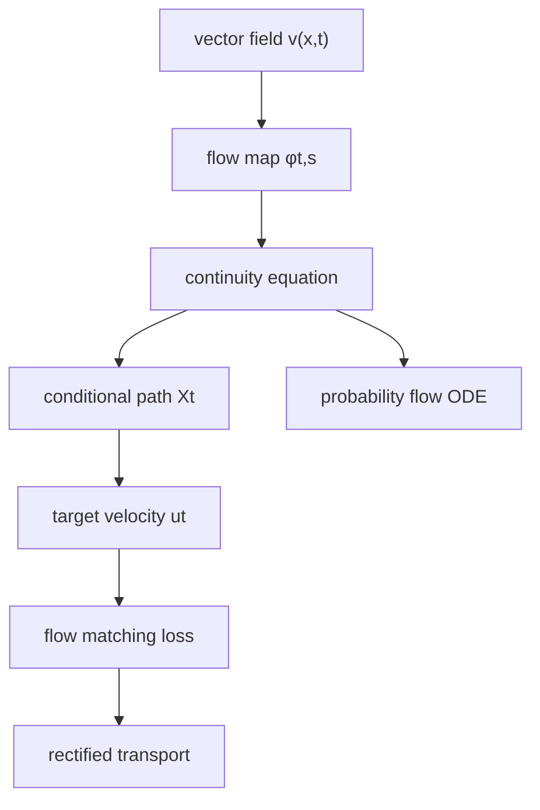
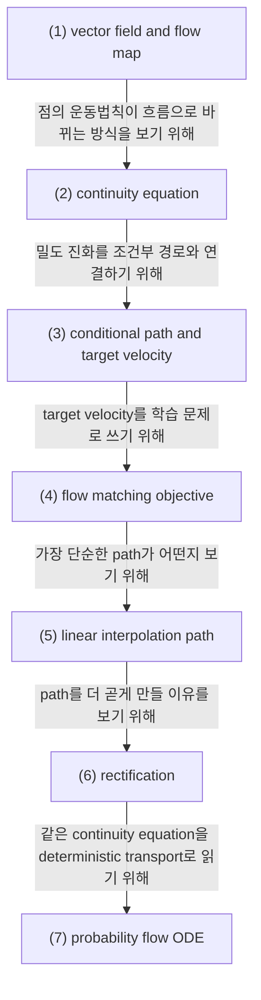

# Vector Fields, Continuity Equation, Rectification

## 전체상

## 각 층의 분기 포인트

- `vector field v(x,t)`: local velocity law를 먼저 정한다.
- `flow map φt,s`: local law가 point trajectory를 만든다.
- `continuity equation`: point trajectory가 probability mass evolution으로 옮겨진다.
- `conditional path Xt`: endpoint coupling 위에서 학습 target path를 정한다.
- `target velocity ut`: path의 시간 미분을 matching target으로 쓴다.
- `flow matching loss`: network velocity가 target velocity의 조건부 평균을 맞춘다.
- `rectified transport`: 같은 endpoint를 더 straight한 path로 다시 잇는다.
- `probability flow ODE`: continuity equation을 deterministic transport로 읽는다.

## 문서 로드맵

이 문서는 두 질문을 따라간다.

- 벡터장과 flow map이 개별 점의 움직임과 밀도 진화를 어떻게 연결하는가.
- Flow Matching과 Rectification이 왜 더 straight한 transport를 목표로 하는가.

## (1) time-dependent vector field and flow map

$v:\mathbb R^d\times[0,1]\to\mathbb R^d$를 time-dependent vector field라 하자. 단순히 Borel인 것만으로는 flow가 잘 정의되지 않으므로, 여기서는 $t$에 대해 measurable이고 $x$에 대해 local Lipschitz인 정도의 regularity를 가정한다. 초기값 $x_s$에 대해

$$
\dot x_t=v(x_t,t),\qquad t\in[s,1]
$$

의 해가 있으면 $\phi_{t,s}(x)$를 시각 $s$의 초기값 $x$를 시각 $t$의 해로 보내는 flow map이라 한다.

### (1-a) 정의를 쉬운 말로 읽기

vector field를 먼저 두는 이유는 생성모형이 실제로 학습하는 대상이 각 점에서 다음 순간 어느 방향으로 움직일지라는 local law이기 때문이다.

이 조건을 두는 이유는 trajectory를 하나하나 외우지 않고, local law 하나로 전체 경로를 만들기 위해서다.

이 식이 없으면 점의 움직임과 그 점이 만든 흐름을 같은 문법으로 쓰기 어렵다.

> 예시. $v(x,t)=-x$이면 점들은 원점 쪽으로 끌려가고, 그 흐름 전체가 $\phi_{t,s}$로 정리된다.

## (2) continuity equation

$(\mu_t)_{t\in[0,1]}\subset\mathcal P(\mathbb R^d)$가 위 flow map으로 운반되는 확률측도 family라 하자. 그러면 $\mu_t$는 distribution sense에서

$$
\partial_t \mu_t + \nabla\cdot(v_t\mu_t)=0
$$

를 만족한다. 밀도 $p_t$가 있으면

$$
\partial_t p_t + \nabla\cdot(v_t p_t)=0
$$

가 된다.

### (2-a) 정의를 쉬운 말로 읽기

continuity equation은 질량이 사라지거나 생기지 않고 흐르기만 한다는 뜻이다.

이 조건을 두는 이유는 개별 점의 운동법칙을 확률질량 수준으로 번역하기 위해서다.

이 식이 없으면 pointwise motion과 density evolution을 같은 문법으로 맞추지 못한다.

> 예시. 한 점이 오른쪽으로 움직이면 그 점 하나는 사라지지 않지만, 점들이 모인 밀도는 그 방향으로 밀리면서 모양이 바뀐다. continuity equation은 그 밀도 쪽 변화를 적는다.

## (3) conditional path and target velocity

Flow Matching에서는 source law $\mu_0$, target law $\mu_1$를 잇는 coupling $\pi(dx_0,dx_1)$를 먼저 둔다. 각 endpoint pair $(x_0,x_1)$에 대해 경로 $t\mapsto X_t(x_0,x_1)$를 정하면 conditional velocity는

$$
u_t(x\mid x_0,x_1):=\frac{d}{dt}X_t(x_0,x_1)\quad\text{with }x=X_t(x_0,x_1)
$$

로 정의된다.

### (3-a) 정의를 쉬운 말로 읽기

여기서는 먼저 "어떤 두 점을 잇는가"를 고르고, 그 다음 "그 사이를 어떤 속도로 움직이는가"를 정한다.

이 조건을 두는 이유는 target velocity를 직접 학습할 수 있게 하기 위해서다.

이 식이 없으면 Flow Matching이 무엇을 맞추는지 보이지 않는다.

> 예시. $X_t=(1-t)X_0+tX_1$ 같은 직선 경로를 택하면, 그 경로의 속도는 endpoint pair만으로 정해진다.

## (4) flow matching objective

network $v_\theta(x,t)$에 대해

$$
\mathcal L(\theta)
=
\mathbb E\left[\|v_\theta(X_t,t)-u_t(X_t\mid X_0,X_1)\|^2\right]
$$

를 최소화하면 각 $t$에서 최적해는 conditional velocity의 조건부 평균이 된다.

### (4-a) 정의를 쉬운 말로 읽기

Flow Matching은 vector field를 직접 회귀하는 문제다.

이 조건을 두는 이유는 경로를 직접 생성하기보다, 각 시각의 속도를 맞추는 편이 학습이 더 단순하기 때문이다.

이 식이 없으면 "flow를 학습한다"는 말이 구체적으로 무엇을 최소화하는지 드러나지 않는다.

> 예시. 같은 $(X_0,X_1)$ 쌍에 대해 경로가 여러 개면 속도도 달라질 수 있다. objective는 그 속도의 평균적인 패턴을 맞춘다.

## (5) linear interpolation path

가장 자주 쓰는 경로는

$$
X_t=(1-t)X_0+tX_1
$$

이다. 이 경우 conditional velocity는

$$
u_t(X_t\mid X_0,X_1)=X_1-X_0
$$

로 시간에 무관하다.

### (5-a) 정의를 쉬운 말로 읽기

linear interpolation은 가장 단순한 기준 경로다.

이 조건을 두는 이유는 더 곧은 path가 무엇인지 먼저 기준점을 잡기 위해서다.

이 식이 없으면 rectification이 무엇을 기준으로 "더 straight"한지 흐려진다.

> 예시. 두 점을 직선으로 잇는 경우와 빙글빙글 도는 경우를 비교하면, flow matching이 왜 straight path를 선호하는지 바로 보인다.

## (6) rectification

rectified flow의 핵심은 endpoint를 유지하면서 path geometry를 더 straight하게 만드는 것이다. 이를 엄밀한 정의 하나로 고정하기보다는, 예를 들어 smooth path에 대한 curvature-like diagnostic

$$
\int_0^1 \mathbb E\|\ddot X_t\|^2\,dt
$$

또는 평균 속도 주변의 velocity variation

$$
\int_0^1 \mathbb E\left\|v_t(X_t)-\int_0^1 v_s(X_s)\,ds\right\|^2\,dt
$$

같은 heuristic functional로 볼 수 있다.

### (6-a) 정의를 쉬운 말로 읽기

rectification은 path를 덜 휘게 만드는 일이다.

이 조건을 두는 이유는 같은 endpoints라도 덜 휘는 경로가 수치적으로 더 다루기 쉽기 때문이다.

이 식이 없으면 rectification이 그냥 미관상의 선택처럼 보인다.

> 예시. 같은 endpoint를 연결해도 곡선이 덜 휘면 적은 step으로 따라가기 쉬워진다.

## (7) probability flow ODE

[[Score Functions, Reverse-Time Dynamics, and Probability Flow ODE]]에서 나온 probability flow ODE도 역시 continuity equation을 만족하는 deterministic transport이다. 차이는 vector field의 출처에 있다.

- probability flow ODE: SDE의 density evolution에 맞춰 $v_t$를 역으로 구성
- Flow Matching: 선택한 path family의 conditional velocity를 $L^2$ regression으로 직접 근사

### (7-a) 정의를 쉬운 말로 읽기

둘 다 밀도 흐름을 따라가는 deterministic transport라는 점은 같다.

이 조건을 두는 이유는 SDE 기반 transport와 flow matching 기반 transport를 같은 continuity equation 문법으로 보기 위해서다.

이 식이 없으면 두 접근법이 왜 같은 방정식 계열에 놓이는지 보이지 않는다.

## 관련 문서

- [[Semigroups, Generators, Adjoint Operators, and Kolmogorov Equations]]
- [[Sobolev Spaces, Weak Derivatives, and Integration by Parts]]
- [[Parabolic PDE, Conservation Laws, and Why Diffusion Uses Them]]
- [[Flow Matching for Generative Modeling]]
- [[Rectified Flow]]
- [[Score Functions, Reverse-Time Dynamics, and Probability Flow ODE]]
