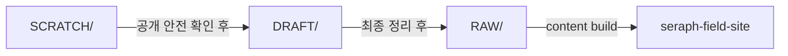
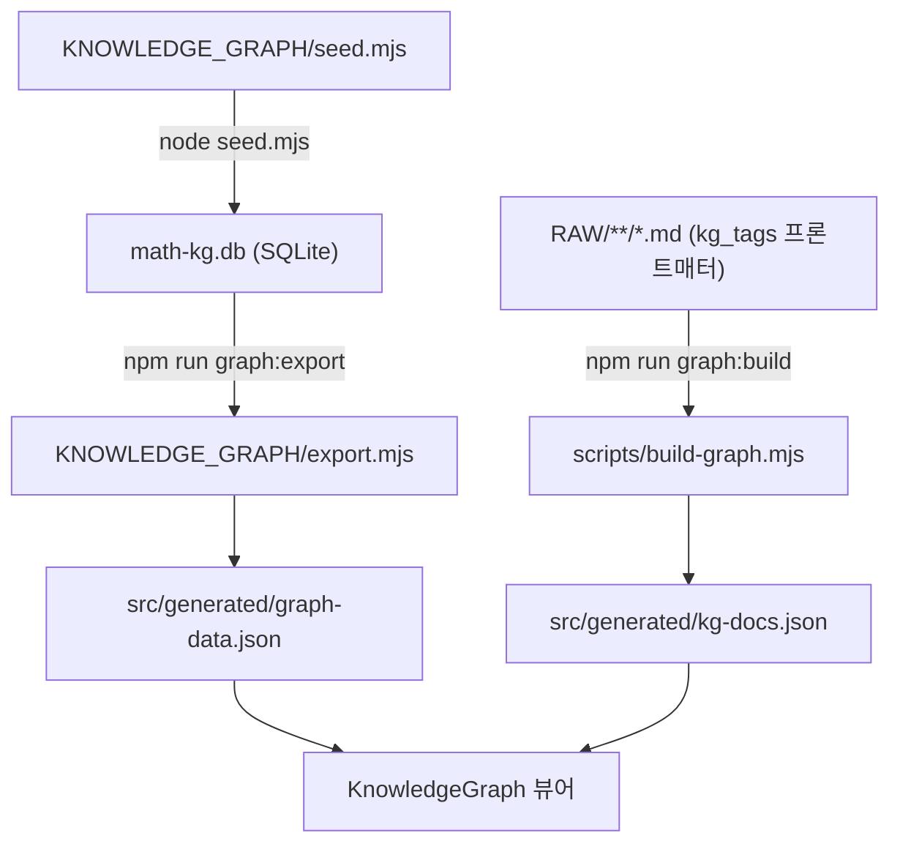

# Seraph Field

`RAW/**/*.md`를 콘텐츠 원본으로 두고, `seraph-field-site`에서 정적 JSON을 생성해 GitHub Pages로 배포하는 개인 기술 블로그.

배포 주소:

- [https://echidnarezero.github.io/SeraphField/](https://echidnarezero.github.io/SeraphField/)

## 구성

- `콘텐츠`
  - `SCRATCH/` -> Git으로 추적하지 않는 private 초안
  - `DRAFT/` -> Git으로 추적하는 작업중 원본
  - `RAW/` -> 사이트에 게시하는 최종 공개 원본
- `KNOWLEDGE_GRAPH/`
  - SQLite 기반 수학 지식 그래프 데이터 관리 (seed, export)
- `seraph-field-site/`
  - React + Vite 기반 정적 사이트
- `scripts/`
  - 콘텐츠 빌드와 검증 스크립트
- `docs/`
  - 사이트 구조와 프로젝트 설명 문서
- `skills/`
  - 프로젝트 작업용 로컬 스킬
- `.github/workflows/deploy-blog.yml`
  - GitHub Pages 배포 워크플로

## 기술 스택

- Runtime/Tooling: `Node.js 24`
- Frontend: `React 19`, `TypeScript`, `Vite 8`
- Styling/UI: `Tailwind CSS 4`, `Motion`, `Lucide React`
- Knowledge Graph: `Cytoscape.js`, `cytoscape-fcose`, `better-sqlite3`
- Content: `gray-matter`, `react-markdown`, `remark-math`, `rehype-katex`, `react-syntax-highlighter`
- Testing: `Vitest`
- Deploy: `GitHub Pages`, `GitHub Actions`

## 사용법

Windows 기준:

1. `cd seraph-field-site`
2. `npm install`
3. `npm run dev`

내용 Markdown만 추가하거나 수정했을 때:

1. `cd seraph-field-site`
2. `npm run content:build`

사이트 코드를 수정했을 때:

1. `cd seraph-field-site`
2. `npm run lint`
3. `npm test`
4. `npm run build`

## 콘텐츠 파이프라인

콘텐츠 원본은 `SCRATCH/`, `DRAFT/`, `RAW/`로 나눠 관리합니다.



## 지식 그래프 파이프라인

수학 개념 간의 관계를 노드-엣지 그래프로 시각화합니다. 데이터는 SQLite에서 관리하고, 빌드 시점에 JSON으로 변환되어 프론트엔드에 번들됩니다.



### 콘텐츠 → 그래프 연결

`RAW/` 문서의 프론트매터에 `kg_tags`를 추가하면 그래프 팝업에서 관련 문서로 연결됩니다.

```yaml
---
title: "군론 입문"
kg_tags: ["Group", "functor:free"]
---
```

- `Group` → "군 (Group)" 노드 클릭 시 이 문서가 팝업에 표시
- `functor:free` → 해당 태그를 가진 엣지 클릭 시에도 표시

자세한 구조와 운영 방법은 `docs/KNOWLEDGE_GRAPH.md`를 참고합니다.
