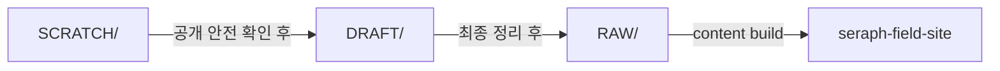

# Seraph Field

`RAW/**/*.md`를 콘텐츠 원본으로 두고, `seraph-field-site`에서 정적 JSON을 생성해 GitHub Pages로 배포하는 개인 기술 블로그.

배포 주소:

- [https://echidnarezero.github.io/SeraphField/](https://echidnarezero.github.io/SeraphField/)

## 구성

- `RAW/`
  - 공개용 Markdown 원본
- `seraph-field-site/`
  - React + Vite 기반 정적 사이트
- `.github/workflows/deploy-blog.yml`
  - GitHub Pages 배포 워크플로

## 기술 스택

- Runtime/Tooling: `Node.js 24`
- Frontend: `React 19`, `TypeScript`, `Vite 8`
- Styling/UI: `Tailwind CSS 4`, `Motion`, `Lucide React`
- Content: `gray-matter`, `react-markdown`, `remark-math`, `rehype-katex`, `react-syntax-highlighter`
- Testing: `Vitest`
- Deploy: `GitHub Pages`, `GitHub Actions`

## 사용법

Windows 기준:

권장 버전:

- `Node.js 24`

1. `seraph-field-site`로 이동
2. `npm install`
3. `npm run dev`

내용만 바꿨을 때:

쉽게 말하면, Markdown 원본이 사이트에 들어갈 수 있는지 먼저 확인하면 됩니다.

1. `seraph-field-site`로 이동
2. `npm run content:build`

이 명령은 `RAW/**/*.md`를 읽어 사이트에서 쓰는 JSON을 다시 만듭니다.

코드도 같이 바꿨을 때:

쉽게 말하면, 타입 검사와 테스트, 빌드까지 같이 통과하는지 봅니다.

1. `seraph-field-site`로 이동
2. `npm run lint`
3. `npm test`
4. `npm run build`

## 콘텐츠 파이프라인

이 프로젝트의 문서는 한 번에 `RAW/`로 바로 가지 않습니다. 거친 초안, Git으로 추적하는 작업중 문서, 최종 게시 원본을 나눠서 관리합니다.

- `SCRATCH/`
  - Git으로 추적하지 않는 private 초안
- `DRAFT/`
  - Git으로 추적하는 작업중 문서
  - 공개 저장소에 push할 수 있어야 함
  - 아직 사이트에는 게시하지 않음
- `RAW/`
  - 사이트에 들어가는 최종 공개 원본
