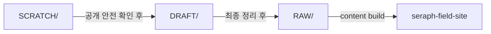
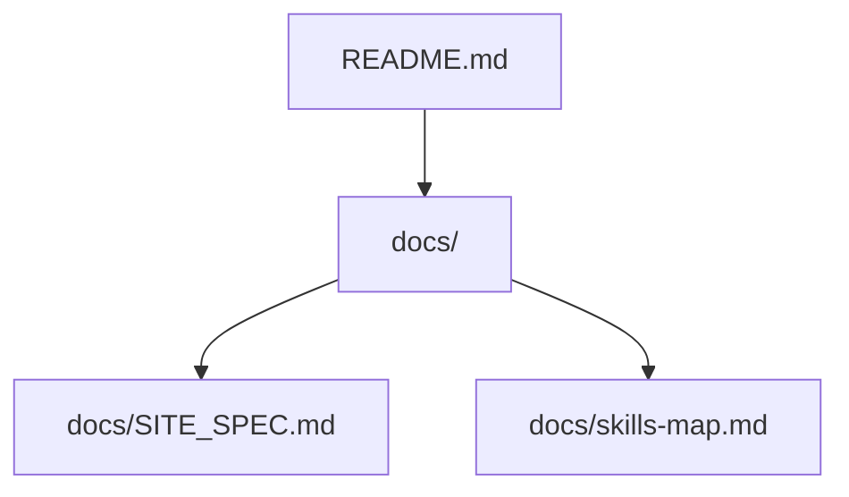

# Seraph Field

`RAW/**/*.md`를 콘텐츠 원본으로 두고, `seraph-field-site`에서 정적 JSON을 생성해 GitHub Pages로 배포하는 개인 기술 블로그.

배포 주소:

- [https://echidnarezero.github.io/SeraphField/](https://echidnarezero.github.io/SeraphField/)

## 구성

- `RAW/`
  - 공개용 Markdown 원본
- `seraph-field-site/`
  - React + Vite 기반 정적 사이트
- `.github/workflows/deploy-blog.yml`
  - GitHub Pages 배포 워크플로

## 기술 스택

- Runtime/Tooling: `Node.js 24`
- Frontend: `React 19`, `TypeScript`, `Vite 8`
- Styling/UI: `Tailwind CSS 4`, `Motion`, `Lucide React`
- Content: `gray-matter`, `react-markdown`, `remark-math`, `rehype-katex`, `react-syntax-highlighter`
- Testing: `Vitest`
- Deploy: `GitHub Pages`, `GitHub Actions`

## 사용법

Windows 기준:

권장 버전:

- `Node.js 24`

1. `seraph-field-site`로 이동
2. `npm install`
3. `npm run dev`

내용만 바꿨을 때:

쉽게 말하면, Markdown 원본이 사이트에 들어갈 수 있는지 먼저 확인하면 됩니다.

1. `seraph-field-site`로 이동
2. `npm run content:build`

이 명령은 `RAW/**/*.md`를 읽어 사이트에서 쓰는 JSON을 다시 만듭니다.

코드도 같이 바꿨을 때:

쉽게 말하면, 타입 검사와 테스트, 빌드까지 같이 통과하는지 봅니다.

1. `seraph-field-site`로 이동
2. `npm run lint`
3. `npm test`
4. `npm run build`

배포 전 확인:

쉽게 말하면, 이 README는 빠른 시작만 설명하고, 실제 게시 전 최종 확인 절차는 전용 스킬 문서를 기준으로 보면 됩니다.

- 콘텐츠만 바뀌었으면 먼저 `npm run content:build`
- UI 코드가 바뀌었으면 `npm run lint`, `npm test`, `npm run build`
- 커밋, 푸시, CI/CD까지 포함한 최종 게시 절차는 `skills/publish-site-content-pipeline/SKILL.md`를 기준으로 확인
- 빌드 결과물은 `seraph-field-site/dist/`에 생성

## 콘텐츠 파이프라인

이 프로젝트의 문서는 한 번에 `RAW/`로 바로 가지 않습니다. 거친 초안, Git으로 추적하는 작업중 문서, 최종 게시 원본을 나눠서 관리합니다.

- `SCRATCH/`
  - Git으로 추적하지 않는 private 초안
- `DRAFT/`
  - Git으로 추적하는 작업중 문서
  - 공개 저장소에 push할 수 있어야 함
  - 아직 사이트에는 게시하지 않음
- `RAW/`
  - 사이트에 들어가는 최종 공개 원본

기본 흐름:

1. 거친 초안은 `SCRATCH/`에서 시작합니다.
2. 공개 안전 기준을 통과한 뒤 `DRAFT/`로 올립니다.
3. 문서가 충분히 정리되면 `RAW/`로 옮겨 사이트 빌드 대상에 넣습니다.
4. `RAW/` 변경은 사이트 빌드와 검증을 거쳐 배포합니다.

이미 `RAW/`에 있는 문서도 바로 고치기보다 `DRAFT/`로 가져와 다시 정리한 뒤 재배포할 수 있습니다.

세부 판단 기준은 아래 스킬을 직접 봅니다.

- `skills/scratch-to-raw-pipeline/SKILL.md`
- `skills/publish-site-content-pipeline/SKILL.md`
- `skills/write-diagrams-and-visualizations/SKILL.md`
- `skills/write-math-notation/SKILL.md`

## 문서

- `docs/`
  - 루트 `README.md`에 다 담기 어려운 운영 설명서를 모아 둔 폴더
- [docs/SITE_SPEC.md](./docs/SITE_SPEC.md)
  - 사이트 구조, 검색, 라우팅, 렌더링, 배포 사양 원본 문서
- [docs/skills-map.md](./docs/skills-map.md)
  - 프로젝트 스킬 구조와 관계
- [AGENTS.md](./AGENTS.md)
  - 저장소 전역 작업 규칙

스킬 내부 연결 구조는 [docs/skills-map.md](./docs/skills-map.md)에서 따로 봅니다.

빠른 기준:

- private 거친 메모: `SCRATCH/`
- Git으로 추적하는 작업중 문서: `DRAFT/`
- 사이트에 게시하는 최종 문서: `RAW/`
