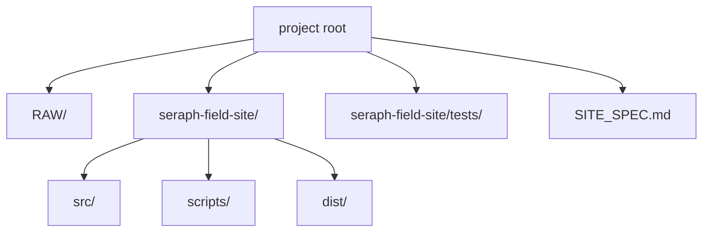
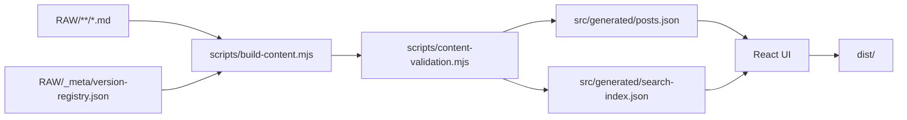
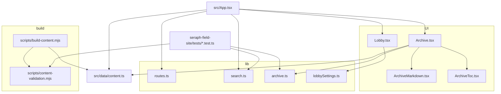
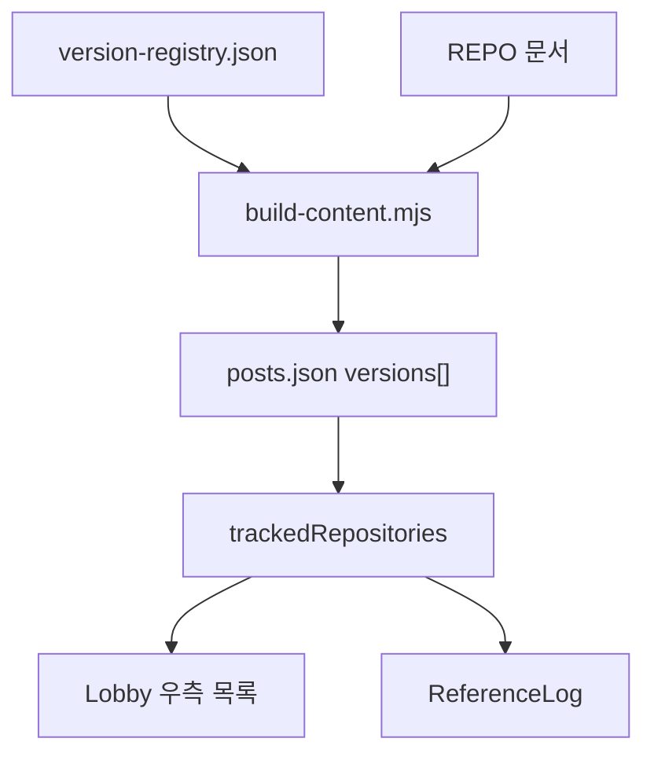

# Seraph Field 구조 및 사양

## 1. 디렉터리 구조

## 2. 콘텐츠 파이프라인

- `scripts/content-validation.mjs`에서 콘텐츠 검증을 먼저 수행한다.
- `src/generated`, `dist`는 수동 수정하지 않는다.

## 3. 핵심 변경 지점

- 화면 전환은 `App.tsx`
- 콘텐츠 공급은 `content.ts`
- 문서 표시 규칙은 `Archive.tsx` + `ArchiveMarkdown.tsx` + `ArchiveToc.tsx`
- 검색/라우팅/TOC 같은 교차 규칙은 `src/lib/*`
- 콘텐츠 빌드와 검증은 `scripts/*`

## 4. 라우팅

해시 라우팅만 사용한다.

- `#lobby`
- `#archive`
- `#archive/<slug>`
- `#search`
- `#search/<query>`
- `#references`
- `#profile`

## 5. 검색 규칙

- `#`가 없으면 키워드 검색
- `#tag1`은 태그 검색
- `#tag1, #tag2` 또는 `#tag1 and #tag2`는 교집합
- `#tag1 or #tag2`는 합집합

검색 대상:

- 제목
- 태그
- 요약
- 본문 평문 인덱스

## 6. 문서 렌더링 규칙

- Markdown의 첫 `h1`은 화면 헤더와 중복되므로 숨김
- `##`는 TOC 대상
- `post://slug` 내부 링크는 `#archive/<slug>`로 연결
- 외부 링크는 새 탭으로 열림
- display math는 별도 블록 스타일 적용

## 7. 반응형 레이아웃

- `Lobby.tsx`
  - 데스크톱은 좌측 HUD + 우측 패널
  - 모바일은 가로 스크롤 카테고리 메뉴 + 하단 스택 패널
- `Archive.tsx`
  - 데스크톱은 문서 목록 / 본문 / TOC 3열
  - 모바일은 상하 스택
- `SearchResults.tsx`, `ReferenceLog.tsx`, `ProfilePage.tsx`
  - 좁은 화면에서 세로 흐름으로 재배치
- `ReferenceLog.tsx`
  - 데스크톱은 표형
  - 모바일은 카드형

## 8. 리포지토리 버전 추적

- `REPO` 카테고리 문서의 버전 정보만 집계한다.

## 9. 배포

1. `RAW` 또는 프론트 코드 수정
2. `npm run build`
3. `dist/` 배포

- `vite.config.ts`는 GitHub Pages 호환을 위해 `base: './'`를 사용한다.

## 10. 수정 원칙

- 사이트 이름/설명 변경: `src/config/siteMeta.ts`
- 프로필 정보 변경: `src/config/siteProfile.ts`
- 카테고리 변경: `src/config/categories.ts`
- 검색 문법 변경: `src/lib/search.ts`
- 해시 규칙 변경: `src/lib/routes.ts`
- 아카이브 TOC/필터링 규칙 변경: `src/lib/archive.ts`
- 로비 UI 설정 기본값 변경: `src/lib/lobbySettings.ts`
- Markdown/수식/코드 블록 렌더링 변경: `src/components/ArchiveMarkdown.tsx`
- TOC 화면 구조 변경: `src/components/ArchiveToc.tsx`
- 콘텐츠 집계 변경: `src/data/content.ts`
- 콘텐츠 입력 검증 규칙 변경: `scripts/content-validation.mjs`
- 콘텐츠 빌드 규칙 변경: `scripts/build-content.mjs`
- 테스트 기준 갱신: `seraph-field-site/tests/*.test.ts`, `npm test`
