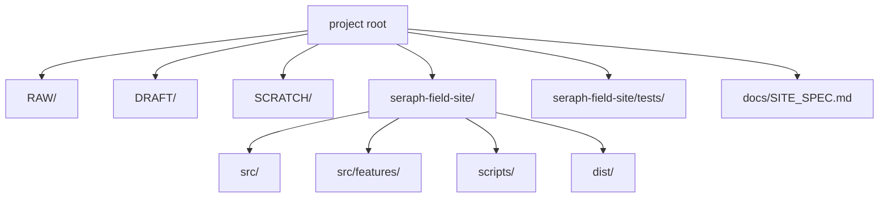
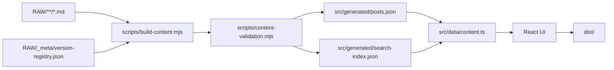
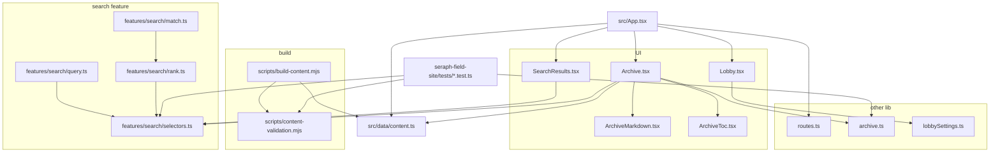
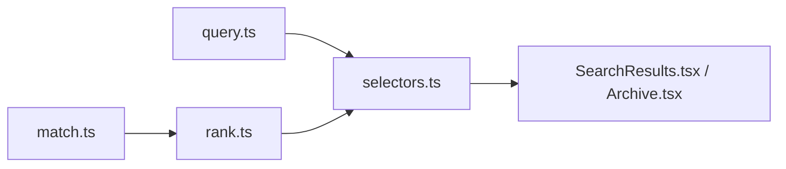
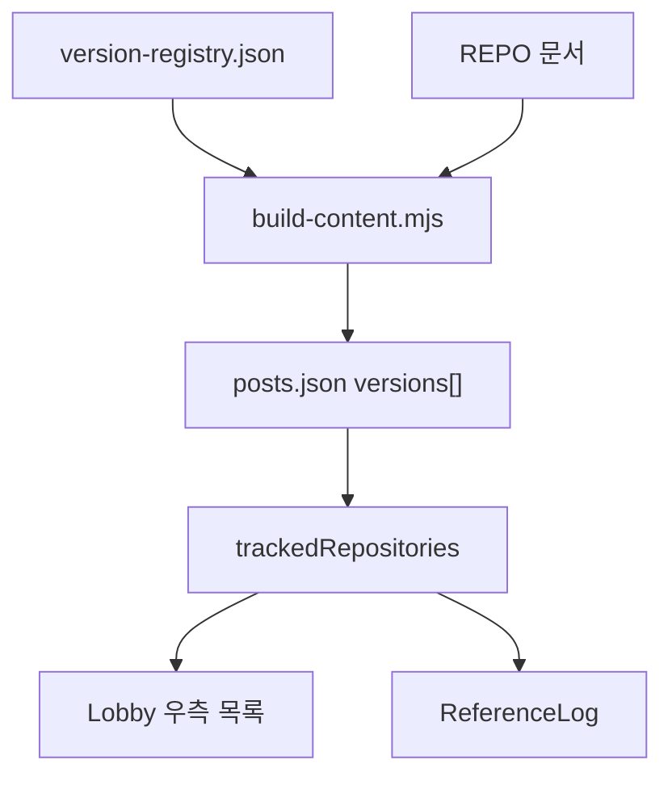

# Seraph Field 구조 및 사양

이 문서는 현재 사이트 구조, 콘텐츠 빌드 구조, 검색 구조, 라우팅, 렌더링, 수정 지점을 한 곳에 모아 둔 원본 사양 문서입니다.

## 1. 디렉터리 구조

## 2. 콘텐츠와 사이트 파이프라인

- `scripts/content-validation.mjs`에서 콘텐츠 검증을 먼저 수행합니다.
- `src/generated/`, `dist/`는 수동으로 수정하지 않습니다.

## 3. 핵심 코드 구조

- 화면 전환은 `App.tsx`
- 콘텐츠 공급은 `src/data/content.ts`
- 문서 렌더링은 `Archive.tsx`, `ArchiveMarkdown.tsx`, `ArchiveToc.tsx`
- 검색 규칙은 `src/features/search/`
- 콘텐츠 빌드와 검증은 `scripts/`

## 4. 라우팅

해시 라우팅만 사용합니다.

- `#lobby`
- `#archive`
- `#archive/<slug>`
- `#search`
- `#search/<query>`
- `#references`
- `#profile`

## 5. 검색 구조

기본 검색은 아래 항목을 함께 봅니다.

- 제목
- 요약
- 본문 평문 인덱스
- 태그
- 그룹
- 시리즈

필요하면 범위를 따로 좁힐 수 있습니다.

- `title:...`
- `body:...`
- `title-body:...`
- `group:...`
- `series:...`
- `#tag1 and #tag2`
- `#tag1 or #tag2`

현재 점수는 대략 아래 우선순위를 따릅니다.

- 제목 일치
- 그룹 일치
- 시리즈 일치
- 태그 일치
- 요약 일치
- 본문 일치

## 6. 문서 렌더링 규칙

- Markdown의 첫 `h1`은 화면 헤더와 중복되므로 숨깁니다.
- `##`는 TOC 대상입니다.
- `post://slug` 내부 링크는 `#archive/<slug>`로 연결합니다.
- 외부 링크는 새 탭으로 엽니다.
- 수식은 `remark-math`와 `rehype-katex`를 통해 렌더링합니다.
- Mermaid는 fenced `mermaid` 코드 블록만 지원합니다.

## 7. 반응형 레이아웃

- `Lobby.tsx`
  - 데스크톱은 좌측 HUD + 우측 패널
  - 모바일은 가로 스크롤 카테고리 메뉴 + 하단 스택 패널
- `Archive.tsx`
  - 데스크톱은 문서 목록 / 본문 / TOC 3열
  - 모바일은 상하 스택
- `SearchResults.tsx`, `ReferenceLog.tsx`, `ProfilePage.tsx`
  - 좁은 화면에서 세로 흐름으로 재배치
- `ReferenceLog.tsx`
  - 데스크톱은 표형
  - 모바일은 카드형

## 8. 리포지토리 버전 추적

- `REPO` 카테고리 문서의 버전 정보만 집계합니다.

## 9. 배포

1. `RAW` 또는 프론트 코드를 수정합니다.
2. `npm run build`를 실행합니다.
3. `dist/`를 GitHub Pages로 배포합니다.

- `vite.config.ts`는 GitHub Pages 호환을 위해 `base: './'`를 사용합니다.

## 10. 수정 지점

- 사이트 이름/설명 변경: `src/config/siteMeta.ts`
- 프로필 정보 변경: `src/config/siteProfile.ts`
- 카테고리 변경: `src/config/categories.ts`
- 검색 문법/검색 범위/점수 변경: `src/features/search/`
- 해시 규칙 변경: `src/lib/routes.ts`
- 아카이브 TOC/필터링 규칙 변경: `src/lib/archive.ts`
- 로비 UI 설정 기본값 변경: `src/lib/lobbySettings.ts`
- Markdown/수식/코드 블록 렌더링 변경: `src/components/ArchiveMarkdown.tsx`
- TOC 화면 구조 변경: `src/components/ArchiveToc.tsx`
- 콘텐츠 집계 변경: `src/data/content.ts`
- 콘텐츠 입력 검증 규칙 변경: `scripts/content-validation.mjs`
- 콘텐츠 빌드 규칙 변경: `scripts/build-content.mjs`
- 테스트 기준 갱신: `seraph-field-site/tests/*.test.ts`, `npm test`
