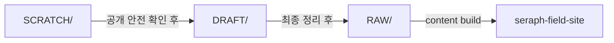

# 콘텐츠 파이프라인

이 프로젝트의 문서는 한 번에 `RAW/`로 바로 가지 않습니다. 거친 초안, Git으로 추적하는 작업중 문서, 최종 게시 원본을 나눠서 관리합니다.

## 저장 위치

- `SCRATCH/`
  - Git으로 추적하지 않는 private 초안
  - 메모, 조각난 생각, 공개하면 안 되는 임시 기록
- `DRAFT/`
  - Git으로 추적하는 작업중 문서
  - 공개 저장소에 push할 수 있어야 함
  - 아직 사이트에는 게시하지 않음
- `RAW/`
  - 사이트에 들어가는 최종 공개 원본

## 기본 흐름

1. 거친 초안은 `SCRATCH/`에서 시작합니다.
2. 개인식별 정보, 로컬 경로, private 메모를 지운 뒤 `DRAFT/`로 올립니다.
3. 문서가 충분히 정리되면 `RAW/`로 옮겨 사이트 빌드 대상에 넣습니다.
4. `RAW/` 변경은 사이트 빌드와 검증을 거쳐 배포합니다.

## 되돌려 작업할 때

이미 `RAW/`에 있는 문서도 바로 고치기보다 `DRAFT/`로 가져와 다시 정리한 뒤 재배포할 수 있습니다.

## 세부 판단 기준

이 문서는 흐름만 설명합니다. 아래 항목의 세부 규칙은 스킬을 직접 봅니다.

- 초안에서 `RAW/`까지의 판단 기준
  - `skills/scratch-to-raw-pipeline/SKILL.md`
- 게시 전 검증과 push, CI/CD 기준
  - `skills/publish-site-content-pipeline/SKILL.md`
- 수식 표기와 렌더링 기준
  - `skills/write-math-notation/SKILL.md`
