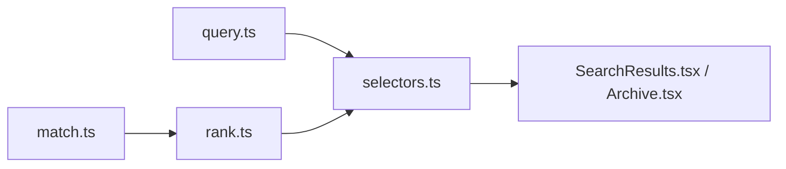

# 검색 구조

이 사이트의 검색은 화면 한 곳에서 끝나지 않습니다. 검색창은 `SearchResults.tsx`에 있지만, 실제 검색 규칙은 `src/features/search/` 아래에 따로 모아 두었습니다.

## 검색 범위

기본 검색은 아래 항목을 함께 봅니다.

- 제목
- 요약
- 본문 평문 인덱스
- 태그
- 그룹
- 시리즈

필요하면 범위를 따로 좁힐 수 있습니다.

- `title:...`
- `body:...`
- `title-body:...`
- `group:...`
- `series:...`
- `#tag1 and #tag2`
- `#tag1 or #tag2`

## 모듈 구조

## 파일 역할

- `src/features/search/query.ts`
  - 검색 문자열을 해석
  - 태그 검색, `group:`, `series:` 같은 접두사 처리
- `src/features/search/match.ts`
  - 어떤 필드가 검색어와 맞는지 판정
- `src/features/search/rank.ts`
  - 검색 결과 점수 계산
- `src/features/search/selectors.ts`
  - 화면에서 바로 쓰는 검색 진입점
- `src/features/search/index.ts`
  - 외부에서 가져다 쓰는 묶음 파일

## 결과 정렬

현재 점수는 대략 아래 우선순위를 따릅니다.

- 제목 일치
- 그룹 일치
- 시리즈 일치
- 태그 일치
- 요약 일치
- 본문 일치

즉 제목과 문서 묶음 정보가 본문보다 더 강하게 작동합니다.

## 그룹과 시리즈

- `groups`
  - 여러 개 가질 수 있는 주제 묶음
- `series`
  - 보통 하나의 읽기 순서를 가지는 묶음

검색에서는 둘 다 인덱스에 들어가고, 문서 카드에서도 바로 다시 눌러 들어갈 수 있습니다.
