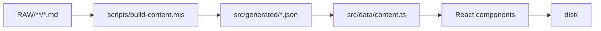

# 사이트 구조

이 사이트는 `RAW/**/*.md`를 바로 읽어 화면에 뿌리지 않습니다. 먼저 정적 JSON으로 바꾼 뒤, React 화면이 그 결과를 읽어 보여줍니다.

## 큰 흐름

## 폴더 역할

- `RAW/`
  - 사이트에 게시할 Markdown 원본
- `seraph-field-site/scripts/`
  - 콘텐츠 빌드와 검증
- `seraph-field-site/src/generated/`
  - 빌드 결과 JSON
- `seraph-field-site/src/data/`
  - 생성된 데이터를 앱에서 읽는 진입점
- `seraph-field-site/src/components/`
  - 화면 컴포넌트
- `seraph-field-site/src/features/search/`
  - 검색 전용 로직

## 화면 쪽 핵심 파일

- `src/components/Lobby.tsx`
  - 첫 화면
- `src/components/Archive.tsx`
  - 문서 목록과 본문 화면
- `src/components/ArchiveMarkdown.tsx`
  - Markdown 렌더링
- `src/components/ArchiveToc.tsx`
  - 문서 TOC
- `src/components/SearchResults.tsx`
  - 검색 화면

## 콘텐츠 빌드 쪽 핵심 파일

- `scripts/build-content.mjs`
  - `RAW/**/*.md`를 읽어 JSON 생성
- `scripts/content-validation.mjs`
  - frontmatter와 콘텐츠 형식 검증

## 수정할 때 기억할 점

- `src/generated/`는 수동으로 고치지 않습니다.
- `dist/`도 직접 수정하지 않습니다.
- 콘텐츠 구조를 바꾸면 `scripts/`와 `src/data/`를 같이 봅니다.
- 검색 규칙을 바꾸면 `src/features/search/`를 먼저 봅니다.
