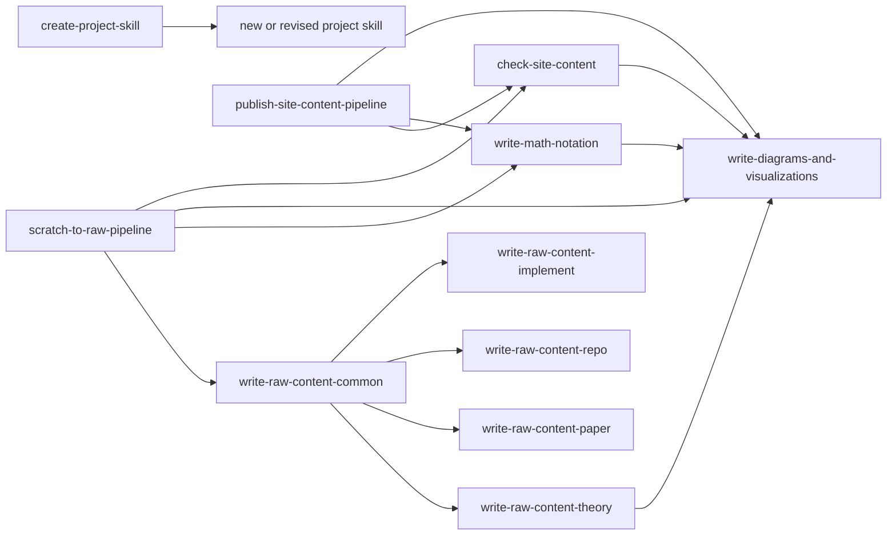
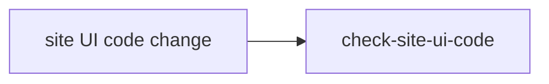

# 스킬 구조

이 문서는 이 프로젝트 안에서 직접 관리하는 스킬이 무엇이고, 어떤 순서와 관계로 쓰이는지 정리합니다.

## 직접 위임 구조

- 이 그림의 화살표는 한 스킬이 다른 스킬을 직접 참조하거나 직접 위임할 때만 그립니다.
- 작업 순서나 사람이 보통 밟는 흐름은 이 그림에 섞지 않습니다.

## 역할별 정리

### 1. 파이프라인 스킬

- `scratch-to-raw-pipeline`
  - 거친 초안에서 시작해 `SCRATCH/`, `DRAFT/`, `RAW/` 중 어디에 둘지 판단하고 최종 `RAW/**/*.md`까지 가는 흐름을 잡습니다.
- `publish-site-content-pipeline`
  - 최종 `RAW` 문서를 검증하고, Git push와 CI/CD 확인까지 이어집니다.

## 2. RAW 작성 스킬

- `write-raw-content-common`
  - `THEORY`, `PAPER`, `REPO`, `IMPLEMENT` 중 어떤 역할인지 나누고, 섞인 초안을 분리하는 공통 기준입니다.
- `write-raw-content-theory`
  - 이론 문서를 수학과 스타일에 맞게 쓰는 기준입니다.
- `write-raw-content-paper`
  - 특정 논문을 읽고 리뷰하는 문서 기준입니다.
- `write-raw-content-repo`
  - 외부 저장소와 남이 쓴 코드를 읽고 분석하는 문서 기준입니다.
- `write-raw-content-implement`
  - 사용자가 직접 구현하고 실험한 내용을 정리하는 문서 기준입니다.

## 3. 보조 스킬

- `write-math-notation`
  - 본문 수식과 표 셀 안 수학 표기를 어떻게 쓰는지 정리합니다.
- `write-diagrams-and-visualizations`
  - 다이어그램과 시각화의 공통 계약을 정하고, 어느 세부 스킬에서 구체 규칙을 봐야 하는지 안내합니다.
- `check-site-content`
  - `RAW/**/*.md`가 사이트에서 깨지지 않고 빌드되는지 확인합니다.
- `check-site-ui-code`
  - `seraph-field-site`의 UI 코드 변경 후 `lint`, `test`, `build`를 확인합니다.

## 4. 메타 스킬

- `create-project-skill`
  - 지금 같은 프로젝트 전용 스킬을 새로 만들거나 기존 스킬을 다듬을 때 씁니다.

## 자주 쓰는 흐름

### 콘텐츠 초안에서 게시까지

### 사이트 코드 수정

## 현재 기준에서 기억할 점

- `직접 위임 구조`와 `작업 흐름`은 다른 그림으로 봅니다.
- 한 그림 안에서는 직접 위임과 작업 순서를 섞지 않습니다.
- `THEORY`는 세부 기준이 가장 많이 정리된 상태입니다.
- `PAPER`, `REPO`, `IMPLEMENT`는 공통 골격은 있지만, `THEORY`만큼 세부 예시와 고정 규칙이 많지는 않습니다.
- 수식 표기 규칙은 `write-math-notation` 한 곳을 원본으로 보고, 다른 스킬에서는 필요할 때 그 스킬을 참조합니다.
- 다이어그램과 시각화는 `write-diagrams-and-visualizations`에서 공통 계약을 보고, Mermaid 세부 규칙은 해당 세부 스킬에서 봅니다.
- 사이트 렌더링 검사는 `check-site-content`, 사이트 UI 코드는 `check-site-ui-code`로 나눕니다.
