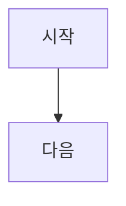

이 문서는 한국어 사용자용 안내 문서이며, 원칙적으로 [SKILL.md](/C:/Projects/YUKINET/skills/check-site-content/SKILL.md)와 같은 내용을 한국어로 설명합니다.

# Check Site Content

`SKILL.md`의 실질적인 지침이 바뀌면 이 문서도 함께 갱신합니다.

## 이 스킬을 쓰는 경우

- `RAW/**/*.md`가 사이트 콘텐츠로 올릴 준비가 됐는지 점검할 때
- frontmatter, 공개 안전, Markdown 문법, 렌더링 규칙을 함께 확인할 때
- 표, Mermaid, 수식, heading, `content:build` 문제를 같이 볼 때

## 콘텐츠 계약

이 스킬은 사이트 콘텐츠 쪽 점검용입니다.
즉 `RAW/**/*.md`를 바꿨을 때 아래를 함께 확인합니다.

- frontmatter와 메타데이터가 프로젝트 계약을 만족하는가
- 공개용 안전 규칙이 깨지지 않았는가
- Markdown 문법이 사이트 렌더러 동작과 맞는가
- `content:build`를 돌려야 하는가, 또는 왜 실패하는가

## 사이트 렌더러 구조

현재 아카이브 페이지는 대략 아래 계층으로 Markdown을 렌더링합니다.

- `react-markdown`
- `remark-gfm`
- `remark-math`
- `rehype-katex`
- fenced `mermaid` 코드 블록용 별도 Mermaid 렌더러
- 일부 fenced code language용 문법 하이라이터

즉 일반 Markdown 상식보다, 실제 `seraph-field-site`의 파서와 렌더러 동작을 기준으로 판단해야 합니다.

## 빌드 계약

콘텐츠 변경 시 아래 스크립트가 강제하는 규칙도 함께 봅니다.

- `seraph-field-site/scripts/content-validation.mjs`
- `seraph-field-site/scripts/build-content.mjs`

여기에는 아래 같은 항목이 포함됩니다.

- 필수 frontmatter 필드
- 유효한 `category`
- `REPO`에서만 허용되는 `tracked_versions`
- 단일 `#`로 시작하는 본문
- 공개 문서에서 금지되는 절대 로컬 경로

## 지원되는 작성 기능

### GFM

사이트는 `remark-gfm`을 통해 GitHub Flavored Markdown의 주요 문법을 지원합니다.

보통 써도 되는 것:

- 파이프 테이블
- 체크리스트
- 취소선
- 자동 링크
- 각주

표는 raw HTML보다 GFM 표 문법을 우선합니다.

### 수식

수식 표기와 렌더링의 세부 규칙은 `write-math-notation`을 같이 봅니다.

### Mermaid

Mermaid는 language가 정확히 `mermaid`인 fenced code block에서만 지원합니다.

사용 예:

````

````

쓰지 않는 것:

- 들여쓰기만 한 Mermaid 텍스트
- Mermaid를 raw HTML로 감싸는 방식
- `mermaid` fenced block이 아닌 다른 방식

## heading과 TOC 규칙

현재 사이트 TOC는 `##` heading을 기준으로 만들어집니다.

따라서 아래를 지킵니다.

- 본문 최상단 제목은 단일 `#`
- TOC에 꼭 보여야 하는 섹션은 `##`
- `###`는 섹션 내부의 하위 구조에만 사용
- `###` 이하 heading이 TOC에 잡힐 거라고 기대하지 않기

즉 TOC에 보여야 하는 항목은 `##`로 써야 합니다.

## 코드 블록 규칙

가능하면 fenced code block에 언어 라벨을 명시합니다.

현재 사이트에서 우선 지원되는 언어 라벨:

- `bash`
- `shell`
- `sh`
- `javascript`
- `js`
- `json`
- `markdown`
- `md`
- `python`
- `py`
- `typescript`
- `ts`
- `tsx`
- `mermaid`
- `text`

이 밖의 언어도 보일 수는 있지만, 스타일은 덜 안정적일 수 있습니다.

## raw HTML보다 Markdown 우선

가능하면 raw HTML 대신 표준 Markdown이나 GFM 문법을 사용합니다.

가급적 피할 것:

- `<table>`
- `<details>`
- 임의의 HTML 레이아웃 래퍼

동등한 Markdown 표현이 없고, 사용자가 분명히 원할 때만 raw HTML을 고려합니다.

## 렌더링 위험 점검표

조금 복잡한 Markdown을 저장하기 전에 아래를 확인합니다.

- frontmatter가 파서 계약과 맞는가?
- 다이어그램이 모두 ` ```mermaid ` fenced block인가?
- 표가 spacing 흉내가 아니라 GFM 표 문법인가?
- TOC에 보여야 하는 섹션이 `##`인가?
- 체크리스트가 GFM checkbox 문법인가?
- 문서에 수식이 있다면 `write-math-notation`을 적용했는가?
- raw HTML을 불필요하게 쓰지 않았는가?

## 렌더링 버그가 나면 보는 순서

1. 원문이 지원되는 Markdown 문법을 썼는지 확인합니다.
2. frontmatter와 콘텐츠 계약이 아직 통과하는지 확인합니다.
3. 렌더러 문제인지, 문서 작성 문제인지 먼저 구분합니다.
4. `seraph-field-site/src/components/ArchiveMarkdown.tsx`를 봅니다.
5. `seraph-field-site/src/index.css`를 봅니다.
6. 문법은 맞는데 문서 성격이 어긋난다면 `write-raw-content-common`과 해당 카테고리 skill로 돌아갑니다.

실제 원인이 미지원 문법인데, 그걸 다른 문서 종류로 몰래 고쳐서 덮지 않습니다.
