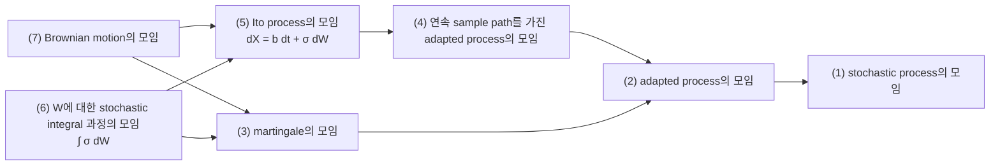
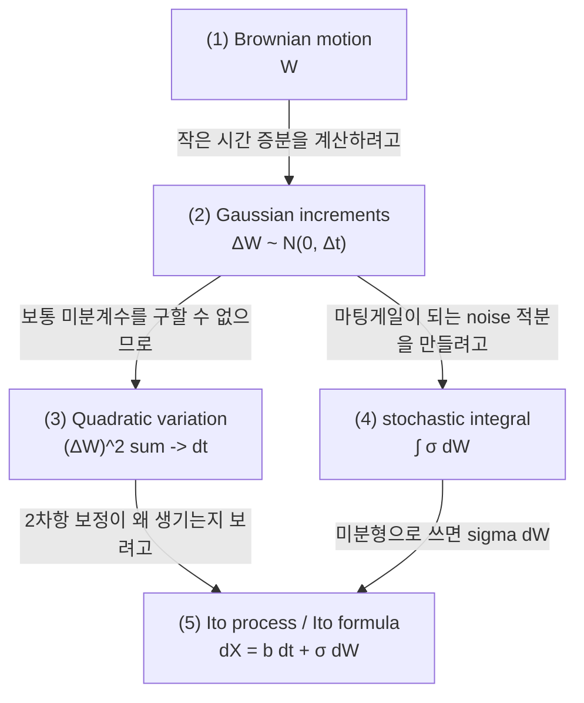
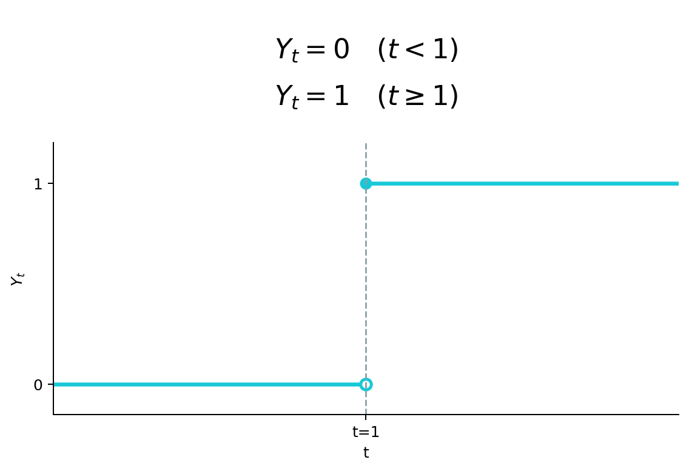

# Brownian Motion

## 전체상

화살표는 inclusion map으로 읽는다.

## 각 층의 분기 포인트

- `adapted process의 모임`
  - `(1)` 중에서, 그 시각까지 아는 정보만으로 값을 정할 수 있는 과정들만 모아 둔 층이다.
  - 예를 들어 동전을 두 번 던질 때, 첫 번째 순간의 값을 정하려는데 두 번째 던짐 결과를 보고 나서야 1인지 0인지 알 수 있다면 `(1)`에는 들어가도 `(2)`에는 들어오지 못한다.
- `martingale의 모임`
  - `(2)` 중에서, 지금까지의 정보를 기준으로 보면 미래 평균이 현재값과 같은 과정들만 모아 둔 층이다.
  - 예를 들어 공정한 동전 던짐 누적합은 `(3)`에 들어오지만, 일정한 drift를 더한 과정은 `(2)`에는 들어가도 `(3)`에는 들어오지 못한다.
- `연속 sample path를 가진 adapted process의 모임`
  - `(2)` 중에서, 시간이 흐를 때 값이 끊기지 않고 이어지는 과정들만 모아 둔 층이다.
  - 예를 들어 어느 순간 값이 갑자기 뛰는 과정은 `(2)`에는 들어가도 `(4)`에는 들어오지 못한다.
- `Brownian motion의 모임`
  - `(3)`과 `(5)`를 함께 만족하는 과정들 가운데, 짧은 시간 변화가 Gaussian이고 서로 겹치지 않는 구간의 변화가 독립인 것들만 모아 둔 층이다.
  - 예를 들어 $X_t=W_t^2-t$는 `(3)`과 `(4)`에는 들어가도 `(7)`에는 들어오지 못한다.
- `W에 대한 stochastic integral 과정의 모임`
  - `(5)` 중에서, drift 항 없이 고정한 Brownian motion $W$에 대한 stochastic integral 항만으로 주어지는 과정들만 모아 둔 층이다.
  - 예를 들어 drift 항이 따로 붙은 과정은 `(5)`에는 들어가도 `(6)`에는 들어오지 못한다.
- `Itô process의 모임`
  - `(4)` 중에서, drift 항과 Brownian motion $W$에 대한 stochastic integral 항을 함께 써서 나타낼 수 있는 과정들만 모아 둔 층이다.
  - 예를 들어 최고점을 새로 찍는 순간에만 값이 늘어나는 과정 $\left(M_t=\max_{0\le s\le t}W_s\right)$ 은 `(4)`에는 들어가도 `(5)`에는 들어오지 못한다.

## 문서 로드맵

$$
dX_t=b_t\,dt+\sigma_t\,dW_t
$$

그림의 흐름은 두 갈래다.

- 왼쪽 갈래:
  `(2)`에서는 Brownian motion $W$의 작은 시간 증분 $\Delta W$가 $\Delta W\sim N(0,\Delta t)$를 만족한다는 점을 잡는다.
  그다음 `(3)`에서는 $W$가 보통 함수처럼 미분되지 않더라도 제곱합이 남고, 그 효과가 `(5)`의 $dt$ 보정으로 나타난다는 점을 본다.
- 오른쪽 갈래:
  `(4)`에서는 Brownian motion의 증분으로 $\int \sigma\,dW$ 같은 stochastic integral을 만든다.
  여기서 martingale이 되는 것은 $dW$ 자체가 아니라, 적절한 조건 아래의 적분 과정
  $$
  M_t=\int_0^t \sigma_s\,dW_s
  $$
  이다.
  $dW$는 Brownian motion의 작은 증분을 가리키는 형식적 표기다.

이 두 갈래가 `(5)`에서 만나고, Brownian motion 바깥에서 주어진 drift 항 $b_t\,dt$를 함께 두면

$$
dX_t=b_t\,dt+\sigma_t\,dW_t
$$

꼴의 Itô process로 간다. 그 다음 단계가 Itô formula다.

## (1) Brownian Motion

$(\Omega,\mathcal F,(\mathcal F_t)_{t\ge 0},\mathbb P)$를 filtered probability space라 하자.

**정의 1.** $\mathbb R^d$-valued process $W=(W_t)_{t\ge 0}$가 다음을 만족하면 $(\mathcal F_t)$에 대한 Brownian motion이라 한다.

1. $W$는 $(\mathcal F_t)$-adapted이다.
2. $W_0=0$ almost surely.
3. 모든 $0\le s<t$에 대하여 $W_t-W_s$는 $\mathcal F_s$와 독립이고
   $$
   W_t-W_s\sim \mathcal N(0,(t-s)I_d).
   $$
4. sample path는 almost surely continuous이다.

### (1-a) 정의 1을 쉬운 말로 읽기

1. $W$는 $(\mathcal F_t)$-adapted이다.

   시각 $t$의 값 $W_t$는 그 시각까지 드러난 정보만 가지고 정해야 한다는 뜻이다.

   이 조건을 두는 이유는 각 시각의 값을 그 시각까지의 정보만으로 읽고, 미래 결과를 끌어오지 않은 채 과정을 해석하기 위해서다.

   이 조건이 없으면 지금 값을 말하면서 미래 결과를 슬쩍 섞은 과정도 함께 들어온다. 그러면 "지금까지 안 정보만으로 움직인다"는 설명이 깨지고, 현재와 미래를 구분해서 읽는 틀도 흐려진다.

   > 예시. 동전을 두 번 던진다고 하자.
   >
   > 가능한 경우는
   > $$
   > \Omega=\{HH,HT,TH,TT\}
   > $$
   > 이다.
   >
   > 첫 번째 시각에서는 첫 번째 던짐 결과만 안다고 생각한다.
   > 그러면 그때는 $HH$와 $HT$를 아직 구별하지 못하고, $TH$와 $TT$도 아직 구별하지 못한다.
   >
   > 그런데 첫 번째 시각의 값을 "둘째 던짐이 앞면이면 1, 뒷면이면 0"으로 정하면
   > $$
   > X_1(HH)=1,\quad X_1(HT)=0,\quad X_1(TH)=1,\quad X_1(TT)=0
   > $$
   > 이 된다.
   >
   > 이 값은 첫 번째 던짐만 알아서는 정할 수 없으므로 adapted 조건을 만족하지 못한다.

2. $W_0=0$ almost surely.

   시작점이 원점이라는 뜻이다.

   이 조건을 두는 이유는 출발점을 하나로 맞춰 식을 쓰고 그림을 그리며 서로 비교하기 쉽게 만들기 위해서다.

   이 조건이 없으면 각 구간의 증가량이 같더라도($X_t-X_s=W_t-W_s$, 같은 증분) 시작점이 다른 과정들이 한데 섞인다. 그래서 원점에서 시작하는 대표적인 경우를 따로 잡아 두는 것이다.

   > 예시. $W_t$가 원점에서 시작하는 Brownian motion이라고 하자.
   >
   > 그러면
   > $$
   > X_t=3+W_t
   > $$
   > 는 각 구간의 증가량이 같지만($X_t-X_s=W_t-W_s$, 같은 증분) 3에서 시작한다.
   >
   > 이 둘을 구분하지 않으면 "원점에서 시작하는 표준적인 경우"와 "시작점만 옮긴 경우"를 따로 보기가 어려워진다.

3. $W_t-W_s$는 $\mathcal F_s$와 독립이고 $\mathcal N(0,(t-s)I_d)$를 따른다.

   시간 구간 $[s,t]$에서 새로 생긴 변화량은 과거 정보에 끌려가지 않고 독립 증분이며, 가우시안 분포를 따른다는 뜻이다.

   이 조건을 두는 이유는 두 가지다.

   a. 짧은 시간 증분을 확률변수로 보고 그 분포를 계산하기 위해서다.

   b. 떨어진 시간 구간의 증분이 서로 영향을 주지 않는 독립적인 변화임을 보기 위해서다.

   이 조건이 없으면 앞 구간에서 생긴 변화가 뒤 구간 변화와 얽혀 함께 움직일 수 있고, 짧은 시간마다 생기는 변화의 분포도 일정하게 계산할 수 없다. 그러면 각 구간의 변화를 서로 독립인 잡음으로 읽을 수 없고, 작은 독립 변화가 시간에 따라 쌓인다는 그림도 무너진다.

   > 예시 1. $d=1$이라고 하자. 시간을
   > $$
   > [t,t+\Delta t],\qquad [t+\Delta t,t+2\Delta t]
   > $$
   > 처럼 짧은 두 구간으로 나눈다.
   >
   > 각 구간의 증분은
   > $$
   > W_{t+\Delta t}-W_t\sim \mathcal N(0,\Delta t),\qquad
   > W_{t+2\Delta t}-W_{t+\Delta t}\sim \mathcal N(0,\Delta t)
   > $$
   > 로 같은 분포를 따른다.
   >
   > Brownian motion에서는 이 두 증분이 수학적으로도 서로 독립이며
   > $$
   > W_{t+\Delta t}-W_t \;\perp\; W_{t+2\Delta t}-W_{t+\Delta t}
   > $$
   > 로 쓴다.
   >
   > 그래서 앞 구간의 변화와 뒤 구간의 변화를 같은 규칙으로 읽을 수 있고, 두 변화를 서로 영향을 주지 않는 독립적인 잡음으로 볼 수 있다.

   > 예시 2. 반대로 $\xi\sim \mathcal N(0,1)$를 한 번만 뽑아 두고
   > $$
   > X_t=t\xi
   > $$
   > 로 두자.
   >
   > 그러면 앞 구간과 뒤 구간의 증분은
   > $$
   > X_{t+\Delta t}-X_t=\Delta t\,\xi,\qquad
   > X_{t+2\Delta t}-X_{t+\Delta t}=\Delta t\,\xi
   > $$
   > 가 된다.
   >
   > 즉 두 증분이 아예 같은 확률변수이므로
   > $$
   > X_{t+\Delta t}-X_t = X_{t+2\Delta t}-X_{t+\Delta t}
   > $$
   > 가 almost surely 성립한다.
   >
   > 그래서 한쪽 변화가 정해지면 다른 쪽도 같이 정해져 버린다. 이런 경우 두 증분은 수학적으로 독립이 아니고, 두 구간에 각각 새로운 잡음이 들어온다고 읽을 수 없다.

4. sample path는 almost surely continuous이다.

   대부분의 경우 경로를 시간에 따라 그리면 선이 갑자기 뚝 끊기거나 점프하지 않는다는 뜻이다.

   이 조건을 두는 이유는 경로를 이어진 선처럼 따라가며 읽고(연속 경로), 점프로 움직이는 과정과 구분해서 다루기 위해서다.

   이 조건이 없으면 어느 순간 값이 갑자기 튀는 과정도 함께 들어온다. 그러면 바로 앞 값과 바로 뒤 값이 서로 가깝다고 기대할 수 없고, 곡선을 따라 움직이는 과정으로 읽는 해석도 함께 무너진다.

   예시는 아래 그림처럼 $t=1$에서 값이 갑자기 뛰는 jump process다.

   

## (2) Gaussian increments

아주 짧은 시간 $\Delta t$에서는

$$
\Delta W\sim \mathcal N(0,\Delta t)
$$

로 생각하면 된다. 예를 들어 $\Delta t=0.01$이면 분산 $0.01$의 centered Gaussian noise를 한 번 더하는 셈이다.

## (1-b) Brownian Motion의 Martingale 성질

**정의 2.** filtered probability space $(\Omega,\mathcal F,(\mathcal F_t)_{t\ge 0},\mathbb P)$ 위의 적분 가능한 adapted process $M=(M_t)_{t\ge 0}$가 모든 $s\le t$에 대해

$$
\mathbb E[M_t\mid\mathcal F_s]=M_s
$$

를 만족하면 martingale이라 한다.

**명제 1.** 표준 Brownian motion $W_t$는 filtration $(\mathcal F_t)$에 대한 martingale이다.

**증명 스케치.** $s\le t$일 때

$$
W_t=W_s+(W_t-W_s)
$$

로 쓸 수 있다. Brownian increment $W_t-W_s$는 평균이 0인 Gaussian이고, 과거 정보 $\mathcal F_s$와 독립이다. 따라서

$$
\mathbb E[W_t-W_s\mid\mathcal F_s]=0
$$

가 되고,

$$
\mathbb E[W_t\mid\mathcal F_s]
=
\mathbb E[W_s+(W_t-W_s)\mid\mathcal F_s]
=
W_s
$$

가 성립한다.

## (3) Quadratic Variation

Brownian path는 almost surely 미분 가능하지 않다. 그러나 quadratic variation은 존재한다.

partition $\Pi_n=\{0=t_0<\cdots<t_n=t\}$에 대해 mesh가 $0$으로 갈 때

$$
\sum_i |W_{t_{i+1}}-W_{t_i}|^2 \to t
$$

in probability가 성립한다. 이를

$$
[W]_t=t
$$

로 쓴다.

바로 이 성질 때문에 Itô 계산에서

$$
dW_t^2=dt
$$

라는 규칙이 나타난다. 즉 1차 미분은 없는데 2차 변화량은 남는다는 점이 ODE와 다른 핵심이다.

## (4) Stochastic Integral

적당한 adapted process $H_t$에 대해

$$
\int_0^t H_s\,dW_s
$$

를 Itô integral이라 한다. simple adapted process에서 먼저 정의한 뒤 $L^2$ completion으로 확장한다.

가장 중요한 등식은 Itô isometry다.

**정리 1.** simple adapted process에서 시작해 $L^2$ completion으로 확장한 Itô integral은

$$
\mathbb E\left[\left|\int_0^t H_s\,dW_s\right|^2\right]
=
\mathbb E\left[\int_0^t |H_s|^2\,ds\right]
$$

를 만족한다.

**증명 아이디어.** simple adapted process

$$
H_s=\sum_{k=0}^{n-1}\xi_k\,\mathbf 1_{(t_k,t_{k+1}]}(s)
$$

에서 적분을

$$
\int_0^t H_s\,dW_s=\sum_{k=0}^{n-1}\xi_k\bigl(W_{t_{k+1}}-W_{t_k}\bigr)
$$

로 정의한다. adaptedness 때문에 $\xi_k$는 과거 정보에만 의존하고, Brownian increment는 서로 직교하므로 제곱평균을 계산하면 우변이 정확히 나온다. 일반 $L^2$ process는 이 simple process들을 $L^2$에서 극한시켜 정의한다.

이 등식은 Itô 적분이 단순한 기호 조작이 아니라 $L^2$ 구조 안에서 안정적으로 정의된다는 것을 보여 준다.

## (5) Itô Process와 Itô Formula

과정 $X_t$가

$$
X_t=X_0+\int_0^t b_s\,ds+\int_0^t \sigma_s\,dW_s
$$

형태를 가지면 Itô process라 한다. 미분형으로는

$$
dX_t=b_t\,dt+\sigma_t\,dW_t
$$

라고 쓴다.

이제 $\varphi\in C^{1,2}$에 대해 Itô formula는

$$
d\varphi(t,X_t)
=
\partial_t\varphi(t,X_t)\,dt
+\nabla\varphi(t,X_t)\cdot dX_t
+\frac12 \operatorname{Tr}\!\bigl(a_t D^2\varphi(t,X_t)\bigr)\,dt
$$

를 준다. 여기서 $a_t=\sigma_t\sigma_t^\top$이다.

여기서 2차 항이 살아남는 이유는 Brownian motion의 quadratic variation 때문이다. 이 점이 ODE의 chain rule과 SDE의 chain rule을 갈라놓는다.

**정리 2 (one-dimensional Itô formula의 핵심 형태).** $X_t$가

$$
dX_t=b_t\,dt+\sigma_t\,dW_t
$$

를 만족하고, $\varphi\in C^{1,2}$라 하자. 그러면

$$
d\varphi(t,X_t)
=
\partial_t\varphi(t,X_t)\,dt
+\partial_x\varphi(t,X_t)\,dX_t
+\frac12 \sigma_t^2 \partial_{xx}\varphi(t,X_t)\,dt
$$

가 성립한다.

**증명 스케치.** 보통 Taylor 전개를 쓰면 2차항은 버려도 될 것처럼 보인다. 그러나 여기서는

$$
dX_t=b_t\,dt+\sigma_t\,dW_t
$$

이므로

$$
(dX_t)^2
=
b_t^2(dt)^2+2b_t\sigma_t\,dt\,dW_t+\sigma_t^2(dW_t)^2.
$$

Itô 계산 규칙에서는 $(dt)^2=0$, $dt\,dW_t=0$, $(dW_t)^2=dt$로 읽으므로 결국

$$
(dX_t)^2=\sigma_t^2\,dt
$$

만 남는다. 따라서 2차 Taylor 항

$$
\frac12 \partial_{xx}\varphi(t,X_t)(dX_t)^2
$$

이 실제로는 0이 아니라

$$
\frac12 \sigma_t^2 \partial_{xx}\varphi(t,X_t)\,dt
$$

로 살아남는다. 이것이 ODE의 chain rule과 SDE의 chain rule을 가르는 핵심이다.

## 관련 문서

- [[Conditional Probability, Conditional Expectation, and L2 Projection]]
- [[Probability Measures, Random Variables, Pushforward, and Convergence]]
- [[Sigma-Algebras, Measurable Maps, and What Measurable Means]]
- [[Semigroups, Generators, Adjoint Operators, and Kolmogorov Equations]]
